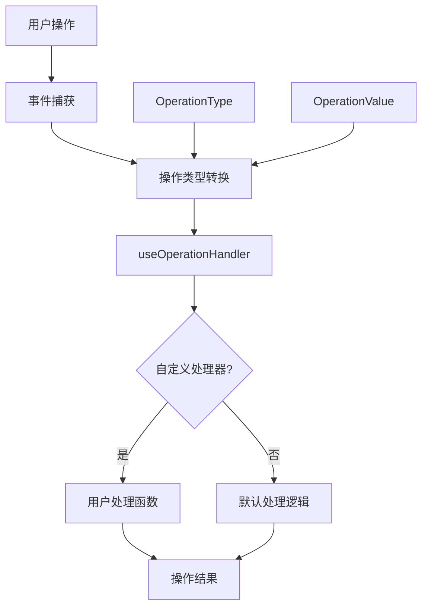
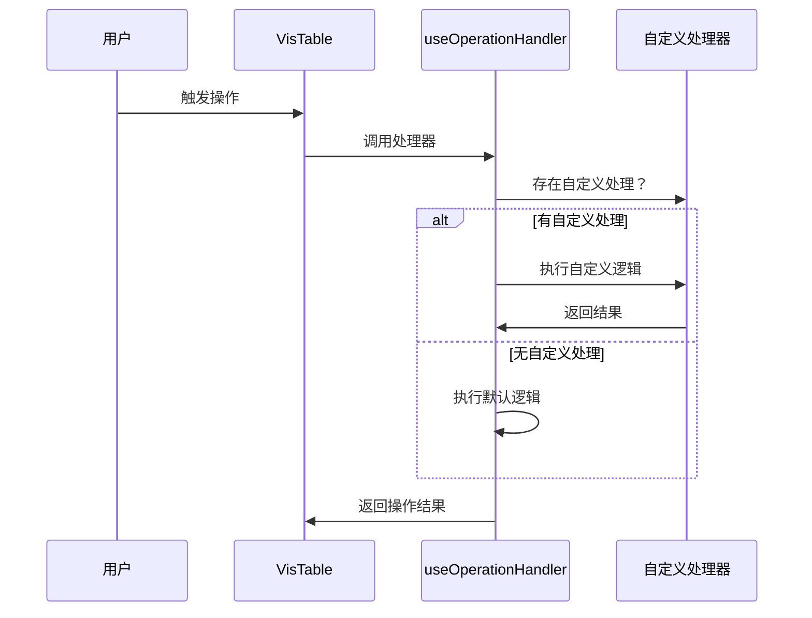

# VisTable 操作处理系统设计文档

## 概述
统一管理和处理表格操作的事件系统，通过枚举定义操作类型，提供标准化操作接口，支持自定义处理逻辑与默认实现。

## 系统架构



## 核心组件

### 1. 操作类型系统
- **OperationType**: 枚举定义所有表格操作
- **OperationValue**: 操作参数数据结构
- **OperationHandler**: 统一处理函数接口

### 2. 处理流程
1. **事件捕获** → 捕获表格原生事件
2. **类型转换** → 转换为标准操作类型
3. **处理器分发** → 优先使用自定义处理
4. **默认处理** → 提供基础操作实现

## 支持的操作类型

| 类别 | 操作 | 描述 |
|------|------|------|
| 数据操作 | SET_RECORDS | 设置表格数据 |
| | ADD_RECORD | 添加数据行 |
| | UPDATE_RECORD | 更新数据行 |
| 交互操作 | CELL_CLICK | 单元格点击 |
| | CELL_CHANGE | 单元格值变化 |
| | COLUMN_RESIZE | 列宽调整 |

## 接口定义

### 核心类型
```typescript
type OperationHandler = (operationType: OperationType, value: OperationValue) => void

interface VisTableProps {
  sheetId: number
  onOperation?: OperationHandler
}
```

### useOperationHandler Hook
```typescript
const handler = useOperationHandler(onOperation?, tableInstance?)
```

## 使用模式



## 典型用例
- **数据同步**: 监听数据变更并同步到后端
- **操作记录**: 记录用户操作用于审计
- **权限控制**: 在操作处理中添加权限验证
- **实时协作**: 将操作广播给其他用户

## 关联文件
- @see apps/ai-chat/src/components/VisTable/index.tsx
- @see apps/ai-chat/src/components/VisTable/hooks/useOperationHandler.ts
- @see [MultiTable design](../MultiTable/design.md)
