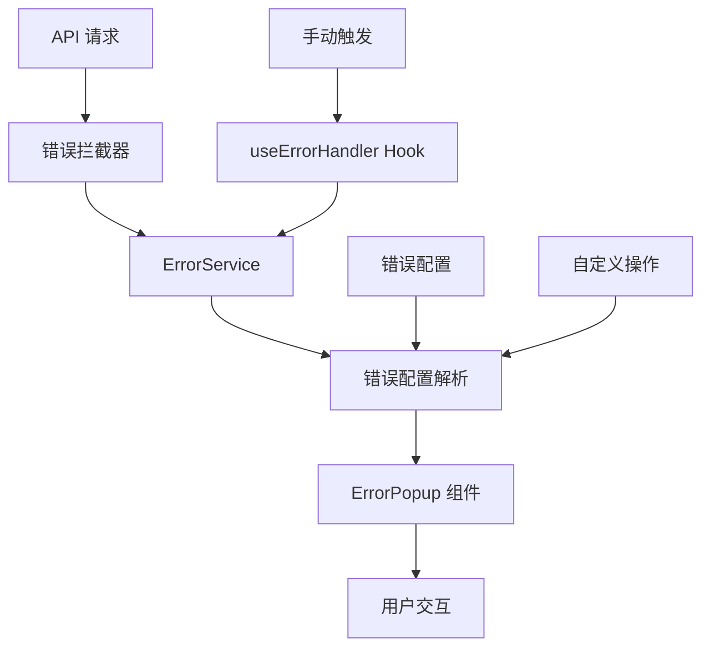
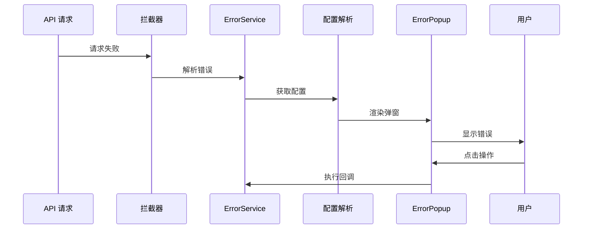

# API 错误处理系统设计文档

## 概述
统一的 API 错误处理系统，基于错误码配置管理错误展示，支持自定义操作按钮和交互逻辑，提供一致的用户体验。

## 系统架构



## 核心组件

### 1. 错误配置系统
- **错误码映射**: 统一的错误码到配置映射
- **UI 配置**: 标题、消息、类型、图标设置
- **操作配置**: 自定义按钮和交互逻辑
- **行为配置**: 自动关闭、手动关闭等

### 2. 错误处理流程


### 3. 错误类型支持
- **error**: 严重错误，需要用户关注
- **warning**: 警告信息，提示用户注意
- **info**: 信息提示，一般性通知
- **success**: 成功提示，操作完成反馈

## 接口定义

### ErrorConfig 核心配置
```typescript
interface ErrorConfig {
  title: string          // 错误标题
  message: string        // 错误消息
  type: 'error' | 'warning' | 'info' | 'success'
  showIcon: boolean      // 是否显示图标
  actions: ErrorAction[] // 操作按钮配置
  closable: boolean      // 是否可手动关闭
  duration?: number      // 自动关闭时间
}
```

## 使用模式

### 1. 自动错误处理
API 请求中的错误会被拦截器自动处理：
```typescript
// API 错误自动拦截并显示对应错误弹窗
const response = await requestRaw.get('/api/data')
// 无需手动处理错误
```

### 2. 手动错误触发
通过 useErrorHandler Hook 手动显示错误：
```typescript
const { displayError } = useErrorHandler()

// 显示预定义错误
displayError(100001) // 积分不足错误
```

### 3. 自定义错误配置
支持动态配置错误内容和操作：
```typescript
const { displayCustomError } = useErrorHandler()

displayCustomError(100001, {
  title: '自定义标题',
  actions: [/* 自定义操作按钮 */]
})
```

## 错误码配置

### 新增错误码步骤
1. 在 `ERROR_CONFIG_MAP` 中添加配置
2. 定义错误类型和操作
3. 配置国际化文本

### 配置示例
```typescript
ERROR_CONFIG_MAP[200001] = {
  title: '新错误标题',
  message: '新错误消息',
  type: 'warning',
  actions: [
    { type: 'confirm', text: '确认' },
    { type: 'cancel', text: '取消' }
  ]
}
```

## 设计原则

- **一致性**: 统一的错误展示和交互方式
- **可配置**: 灵活的错误配置和自定义支持
- **用户友好**: 清晰的错误描述和操作指引
- **开发者友好**: 简单的 API 和丰富的配置选项

## 关联文件
- @see apps/ai-chat/src/api/error/errorConfig.ts
- @see apps/ai-chat/src/hooks/useErrorHandler.ts
- @see apps/ai-chat/src/components/ErrorPopup.tsx
