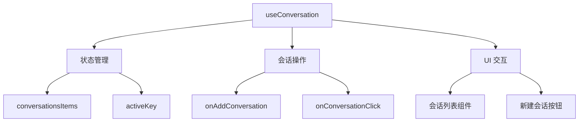
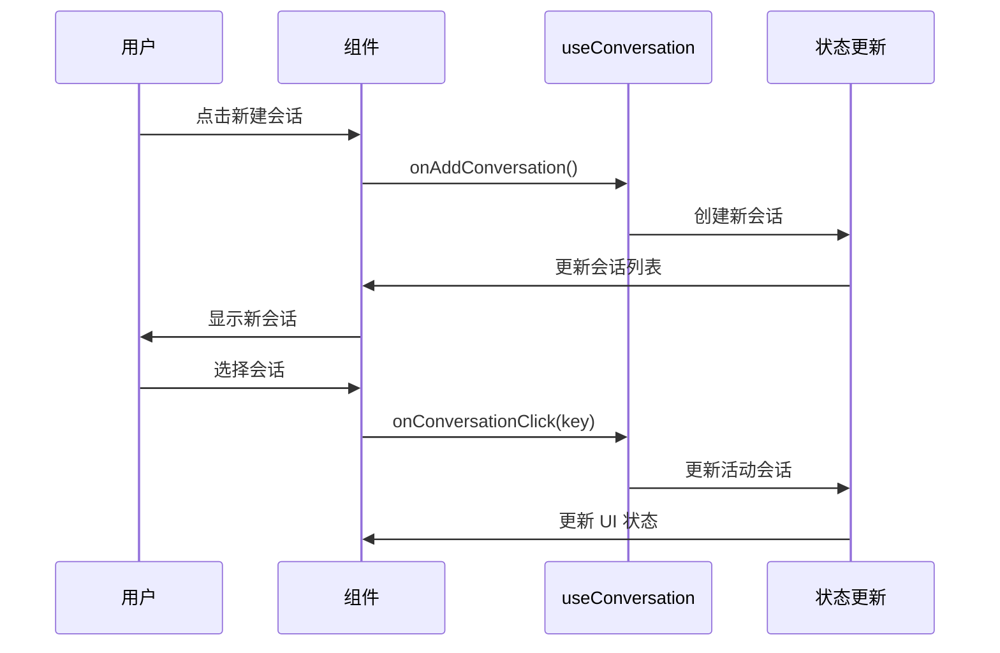

# useConversation Hook 设计文档

## 概述
管理聊天应用的会话列表状态和相关操作，提供创建新会话、切换会话等核心功能。

## 功能架构



## 核心功能
- ✅ **会话列表管理**: 维护会话数据状态
- ✅ **活动会话跟踪**: 记录当前活跃会话
- ✅ **会话创建**: 提供新建会话功能
- ✅ **会话切换**: 支持会话间切换

## 接口定义

### 返回值
| 属性 | 类型 | 描述 |
|------|------|------|
| `conversationsItems` | `ConversationItem[]` | 会话列表数据 |
| `activeKey` | `string` | 当前活动会话 ID |
| `onAddConversation` | `() => void` | 创建新会话 |
| `onConversationClick` | `(key: string) => void` | 切换到指定会话 |

### 数据结构
```typescript
interface ConversationItem {
  key: string
  title: string
  // ... 其他会话属性
}
```

## 使用流程



## 使用示例
```typescript
const ChatComponent = () => {
  const {
    conversationsItems,
    activeKey,
    onAddConversation,
    onConversationClick
  } = useConversation()

  return (
    <div>
      <button onClick={onAddConversation}>新建会话</button>
      <ConversationList
        items={conversationsItems}
        activeKey={activeKey}
        onActiveChange={onConversationClick}
      />
    </div>
  )
}
```

## 关联文件
- @see apps/ai-chat/src/hooks/useConversation.ts
- @see [hooks README](../README.md) 