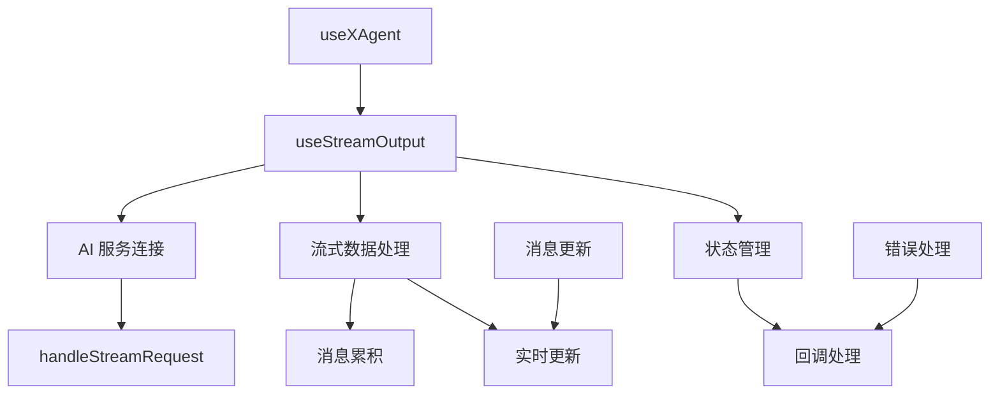
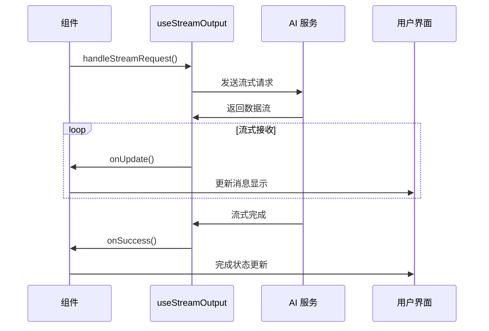

# useStreamOutput Hook 设计文档

## 概述
处理 AI 聊天应用中的流式输出逻辑，封装与 AI 服务的流式通信，管理消息的实时更新和状态。

## 流式架构



## 核心功能
- ✅ **AI 服务集成**: 配置和初始化 AI 服务连接
- ✅ **流式通信**: 处理流式请求的发送和接收
- ✅ **消息管理**: 管理消息内容的累积和更新
- ✅ **错误处理**: 提供完善的错误处理机制
- ✅ **回调支持**: 支持消息更新和完成回调

## 接口定义

### 主要方法
`handleStreamRequest(info: StreamInfo, callbacks: StreamCallbacks)`

#### 参数结构
| 参数 | 类型 | 描述 |
|------|------|------|
| `info.messages` | `LLMServiceMessage[]` | 消息历史列表 |
| `info.message` | `LLMServiceMessage` | 当前发送的消息 |
| `callbacks.onUpdate` | `(message) => void` | 消息更新回调 |
| `callbacks.onSuccess` | `(message) => void` | 消息完成回调 |

## 流式处理流程



## 使用模式
```typescript
const ChatComponent = () => {
  const { handleStreamRequest } = useStreamOutput()

  const [agent] = useXAgent<LLMServiceMessage>({
    request: handleStreamRequest,
  })

  const onSendMessage = (content: string) => {
    agent.request({
      message: { role: 'user', content },
    })
  }

  return <ChatInterface onSendMessage={onSendMessage} />
}
```

## 技术特点
- **实时响应**: 支持流式数据的实时处理
- **状态同步**: 确保消息状态与 UI 同步
- **错误恢复**: 提供流式传输错误处理
- **性能优化**: 避免不必要的重渲染

## 关联文件
- @see apps/ai-chat/src/hooks/useStreamOutput.ts
- @see [hooks README](../README.md) 