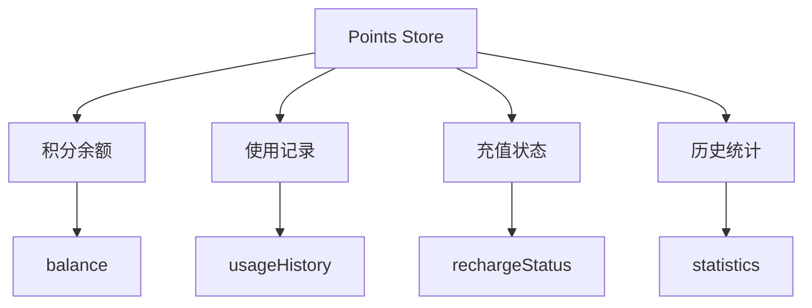

# Points Store 设计文档

## 概述
管理用户的积分系统，包括积分余额查询、使用记录和积分充值等功能。

## 状态架构



## 核心功能
- ✅ **余额管理**: 实时查询和更新积分余额
- ✅ **使用记录**: 记录积分使用明细
- ✅ **充值功能**: 支持积分充值操作
- ✅ **统计分析**: 提供使用统计和历史数据

## 状态结构
```typescript
interface PointsState {
  balance: number           // 当前积分余额
  usageHistory: UsageRecord[] // 使用记录
  rechargeStatus: RechargeStatus // 充值状态
  statistics: PointsStatistics // 统计数据
  isLoading: boolean       // 加载状态
  error: string | null     // 错误信息
}
```

## 主要 Actions
- `fetchPointsBalance()` - 获取积分余额
- `addUsageRecord(record)` - 添加使用记录
- `rechargePoints(amount)` - 积分充值
- `getUsageHistory()` - 获取使用历史

## 关联文件
- @see apps/ai-chat/src/store/points/pointsSlice.ts
- @see [store README](../README.md)
- @see [user store design](../user/design.md)