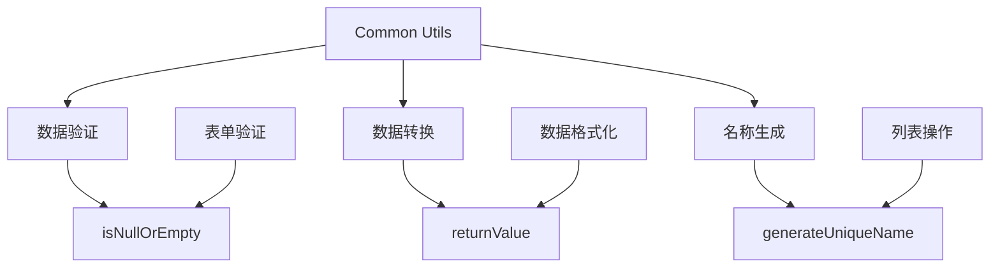

# 通用工具函数设计文档

## 概述
提供数据处理、空值判断、唯一名称生成等通用工具函数，提高代码复用性和可维护性。

## 功能架构



## 核心功能

### 1. 空值检测
- `isNullOrEmpty(value)` - 检测值是否为空
- 支持 `undefined`、`null`、空字符串（包括空格）
- 用于表单验证和数据校验

### 2. 值转换
- `returnValue(value)` - 统一转换为字符串
- 自动处理各种数据类型
- 去除首尾空格，处理空值情况

### 3. 唯一名称生成
- `generateUniqueName(options)` - 生成唯一名称
- 智能序号分配，避免名称冲突
- 支持自定义基础名称和列表项

## 接口定义

### isNullOrEmpty
```typescript
function isNullOrEmpty(value: unknown): boolean
```

### returnValue
```typescript
function returnValue(value: unknown): string
```

### generateUniqueName
```typescript
function generateUniqueName<T extends { name: string }>(options: {
  name?: string    // 基础名称，默认 "未命名"
  list?: T[]      // 现有列表项
}): string
```

## 使用场景

### 表单验证
```typescript
const validateField = (value: string) => {
  return isNullOrEmpty(value) ? '字段不能为空' : ''
}
```

### 数据格式化
```typescript
const formatDisplay = (value: unknown) => {
  return returnValue(value) || '暂无数据'
}
```

### 列表操作
```typescript
const addNewItem = (items: Item[]) => {
  const uniqueName = generateUniqueName({
    name: '新项目',
    list: items
  })
  return { name: uniqueName }
}
```

## 技术特点
- **类型安全**: 完整的 TypeScript 支持
- **性能优化**: 纯函数设计，无副作用
- **边界处理**: 完善的边界条件处理
- **易于测试**: 单一职责，便于单元测试

## 关联文件
- @see apps/ai-chat/src/utils/common/data.ts
- @see [utils README](../README.md)
