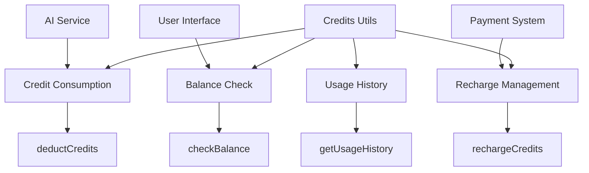

# Credits Utilities Design

## Overview
Utility functions for credit consumption, balance checking, and recharge management, supporting credit deduction in AI services.

## Architecture



## Core Features
- ✅ **Credit Deduction**: Support credit consumption for various AI services
- ✅ **Balance Query**: Real-time user credit balance checking
- ✅ **Recharge Management**: Handle credit recharge and arrival
- ✅ **Usage Records**: Record credit usage details and statistics
- ✅ **Balance Validation**: Check sufficient balance before consumption

## Interface Definitions

### Credit Deduction
```typescript
function deductCredits(amount: number, reason: string): Promise<{
  success: boolean
  newBalance?: number
  error?: string
}>
```

### Balance Check
```typescript
function checkBalance(): Promise<number>
function isBalanceSufficient(required: number): Promise<boolean>
```

### Recharge Management
```typescript
function rechargeCredits(amount: number): Promise<{
  success: boolean
  newBalance?: number
  transactionId?: string
}>
```

## Usage Scenarios

### AI Service Consumption
```typescript
// Check balance before AI call
const canUseAI = await isBalanceSufficient(requiredCredits)
if (!canUseAI) {
  showRechargeMessage()
  return
}

// Deduct credits and use service
const result = await deductCredits(requiredCredits, 'AI conversation')
if (result.success) {
  await callAIService()
}
```

### Balance Display
```typescript
const balance = await checkBalance()
updateBalanceDisplay(balance)
```

## Related Files
- @see apps/ai-chat/src/utils/credits/index.ts
- @see [store README](../../store/README.md)
- @see [user store design](../../store/user/design.md)