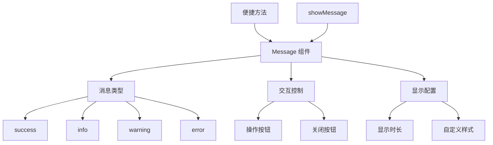

# Message 消息组件设计文档

## 概述
基于 `@wind/wind-ui` 的灵活消息提示组件，支持自定义按钮、关闭按钮等功能，提供统一的消息提示接口。

## 组件架构



## 核心功能
- ✅ **多种消息类型**: 支持成功、信息、警告、错误
- ✅ **自定义交互**: 可配置操作按钮和关闭按钮
- ✅ **灵活控制**: 支持自定义显示时长和回调
- ✅ **便捷方法**: 提供预设的快捷调用方式
- ✅ **向后兼容**: 保持与旧版本 API 的兼容性

## 接口定义

### CustomMessageOptions
| 参数 | 类型 | 默认值 | 描述 |
|------|------|--------|------|
| `content` | `React.ReactNode` | - | 消息内容 |
| `type` | `'success' \| 'info' \| 'warning' \| 'error'` | `'info'` | 消息类型 |
| `duration` | `number` | `3` | 自动关闭时间（秒） |
| `showActionButton` | `boolean` | `false` | 是否显示操作按钮 |
| `actionButtonText` | `string` | `'确定'` | 操作按钮文案 |
| `onActionClick` | `() => void` | - | 操作按钮回调 |
| `showCloseButton` | `boolean` | `true` | 是否显示关闭按钮 |
| `onClose` | `() => void` | - | 关闭按钮回调 |

## 便捷方法

```typescript
// 基础方法
showMessage(options)

// 快捷方法
showSuccessMessage(content, options?)
showErrorMessage(content, options?)
showWarningMessage(content, options?)
showInfoMessage(content, options?)

// 兼容方法
showRechargeMessage(content, callback?)
```

## 使用模式

### 基础消息
```typescript
showMessage({
  content: '操作成功',
  type: 'success',
  duration: 2
})
```

### 交互式消息
```typescript
showMessage({
  content: '是否保存更改？',
  type: 'warning',
  showActionButton: true,
  actionButtonText: '保存',
  onActionClick: handleSave
})
```

### 持久化消息
```typescript
showMessage({
  content: '重要通知',
  type: 'info',
  duration: 0, // 不自动关闭
  showActionButton: true,
  actionButtonText: '我知道了'
})
```

## 样式系统
- `.messageContainer` - 消息容器
- `.messageContent` - 消息内容
- `.messageActions` - 操作区域
- `.actionButton` - 操作按钮
- `.closeButton` - 关闭按钮

## 关联文件
- @see apps/ai-chat/src/utils/message/index.tsx
- @see [utils README](../README.md)
