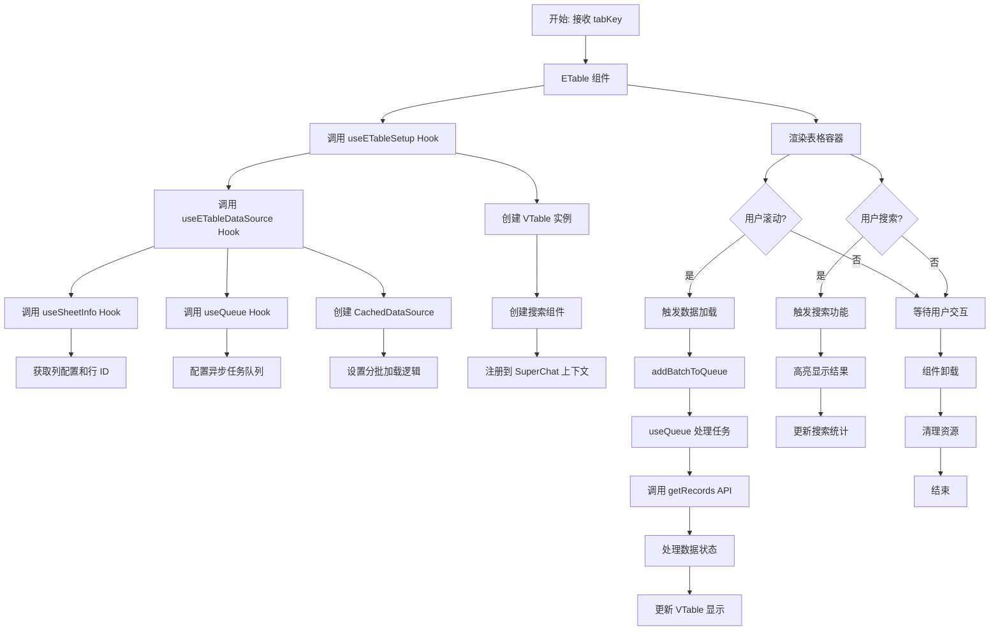

## ETable 组件

**作者:** [开发团队](mailto:dev@company.com)

**创建日期:** 2024年12月01日

**更新日期:** 2025年01月21日

`ETable` 是一个基于 `@visactor/vtable` 构建的高性能表格组件，专为处理大量数据而设计。它通过虚拟滚动、分批加载和智能缓存机制，提供了卓越的性能表现。该组件采用 Hooks 组合架构，实现了关注点分离和高度的可复用性，同时集成了实时搜索功能，为用户提供了优秀的交互体验。

### 核心设计

1. **关注点分离 (Separation of Concerns)**: 通过多个专职 Hooks 实现职责分离，每个 Hook 负责特定的功能领域，提高了代码的可维护性和可测试性。
2. **高性能数据处理 (High-Performance Data Processing)**: 采用虚拟滚动 + 分批加载 + 智能缓存的三重优化策略，能够流畅处理大规模数据集。
3. **异步任务队列 (Asynchronous Task Queue)**: 通过自定义的 `useQueue` Hook 实现智能任务调度，支持并发控制和任务取消，确保最佳的用户体验。
4. **生命周期管理 (Lifecycle Management)**: 完善的组件挂载、卸载和资源清理机制，防止内存泄漏和性能问题。
5. **状态管理集成 (State Management Integration)**: 与 SuperChat 上下文深度集成，支持多标签页状态管理和版本控制。
6. **可扩展架构 (Extensible Architecture)**: 模块化设计使得组件易于扩展和定制，支持自定义主题和搜索功能。
7. **类型安全 (Type Safety)**: 完整的 TypeScript 类型定义，确保开发时的类型安全和代码提示。

### 关键特性详解

#### 智能缓存数据源 (`CachedDataSource`)

`ETable` 的核心性能优化来自于 `VTable.data.CachedDataSource` 的使用，该机制实现了按需加载和智能缓存：

- **按需加载**: 只有当用户滚动到特定区域时，才会加载对应的数据批次
- **批次管理**: 默认批次大小为 100 条记录，可根据实际需求调整
- **缓存策略**: 已加载的数据会被缓存，避免重复请求
- **Promise 池**: 通过 `batchRequestPromises` 管理异步请求，确保数据一致性

```typescript
const dataSource = new VTable.data.CachedDataSource({
  get(index) {
    const batchSize = DEFAULT_BATCH_SIZE
    const batchIndex = Math.floor(index / batchSize)
    // 智能缓存和批次加载逻辑
    return loadedData.current[batchIndex].then((batchData) => batchData[index - batchStartIndex] || DEFAULT_CELL_INFO)
  },
  length: currentrowIds.length,
})
```

#### 异步任务队列系统 (`useQueue`)

`useQueue` Hook 提供了一个通用的异步任务处理解决方案，具有以下特性：

- **并发控制**: 默认最大并发数为 3，防止请求过载
- **任务取消**: 支持 `AbortController`，可以取消进行中的任务
- **状态管理**: 实时跟踪队列状态、运行状态和结果
- **错误处理**: 统一的错误处理机制，区分取消和失败

```typescript
const { add, clear, isLoading, results } = useQueue<BatchTask, BatchResult>({
  processor: async ({ batchIndex, rowIds }, signal) => {
    const records = await getRecords(rowIds, signal)
    return { batchIndex, records }
  },
  maxConcurrency: DEFAULT_MAX_CONCURRENCY,
})
```

#### 实时搜索功能

集成的搜索组件基于 `@visactor/vtable-search`，提供了强大的搜索体验：

- **实时搜索**: 输入即搜索，无需点击搜索按钮
- **结果导航**: 支持上一个/下一个结果跳转
- **高亮显示**: 搜索结果会在表格中高亮显示
- **结果统计**: 实时显示搜索结果数量和当前位置

#### 数据状态处理

`ETable` 智能处理不同状态的单元格数据，包括：

- **运行中状态**: 显示 "生成中..." 提示
- **成功/失败状态**: 根据数据源类型进行相应处理
- **空值处理**: 自动将空值或 0 值显示为 "--"
- **元数据支持**: 处理包含状态信息的 `CellMetadata`

### 目录结构与功能说明

```
ETable/
├── README.md                           # 组件说明文档
├── 评审.md                            # 代码评审记录
├── ETable.tsx                          # 核心入口：组装表格组件和搜索功能
├── index.tsx                           # 组件出口文件
├── hooks/                              # 自定义 Hooks 目录
│   ├── useETableSetup.ts               # 视图与生命周期管理 Hook
│   ├── useETableDataSource.ts          # 核心数据处理 Hook
│   ├── useGetRecords.ts                # 记录获取逻辑 Hook
│   ├── useQueue.ts                     # 异步任务队列 Hook
│   └── useSheetInfo.ts                 # 表格信息获取 Hook
├── theme/                              # 主题配置目录
│   ├── index.ts                        # 主题导出文件
│   └── default.ts                      # 默认主题配置
├── Search/                             # 搜索组件目录
│   └── index.tsx                       # 搜索组件实现
└── utils/                              # 工具函数目录 (待扩展)
```

### Hook 职责说明

#### `useETableSetup` - 视图与生命周期管理

- **职责**: 管理 VTable 实例的创建、注册和销毁
- **功能**: 处理容器引用、搜索实例创建、版本控制
- **生命周期**: 组件挂载时创建实例，卸载时清理资源

#### `useETableDataSource` - 核心数据处理

- **职责**: 处理所有与数据相关的逻辑
- **功能**: 配置缓存数据源、管理批次请求、处理队列结果
- **优化**: 实现分批加载和智能缓存机制

#### `useGetRecords` - 记录获取逻辑

- **职责**: 封装数据获取 API 调用
- **功能**: 处理数据请求、状态转换、错误处理
- **特性**: 支持请求取消和数据格式化

#### `useQueue` - 异步任务队列

- **职责**: 提供通用的异步任务处理能力
- **功能**: 队列管理、并发控制、结果收集
- **特性**: 支持任务取消和状态跟踪

#### `useSheetInfo` - 表格信息获取

- **职责**: 获取表格元数据信息
- **功能**: 获取列配置和行 ID 列表
- **特性**: 支持加载状态和错误处理

### `ETable` 工作流程图



### 性能特性

#### 数据加载优化

- **虚拟滚动**: 只渲染可见区域的数据
- **分批加载**: 按需加载数据，默认批次大小 100
- **智能缓存**: 缓存已加载数据，避免重复请求
- **并发控制**: 最大并发数 3，防止请求过载

#### 内存管理

- **资源清理**: 组件卸载时自动清理 VTable 实例
- **请求取消**: 支持 AbortController 取消进行中的请求
- **状态重置**: 切换标签页时重置队列和缓存状态

#### 用户体验优化

- **加载状态**: 提供加载状态反馈
- **错误处理**: 完善的错误处理和用户提示
- **实时搜索**: 即时搜索反馈和结果导航
- **响应式设计**: 自适应容器大小

---

`ETable` 组件通过先进的架构设计和性能优化策略，为大数据量表格展示提供了卓越的解决方案。其模块化的设计使得组件易于维护和扩展，是处理企业级数据表格的理想选择。
