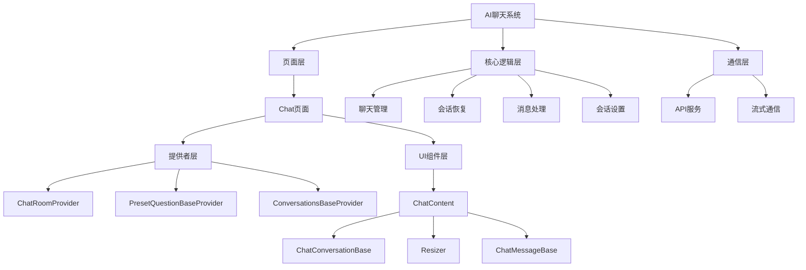
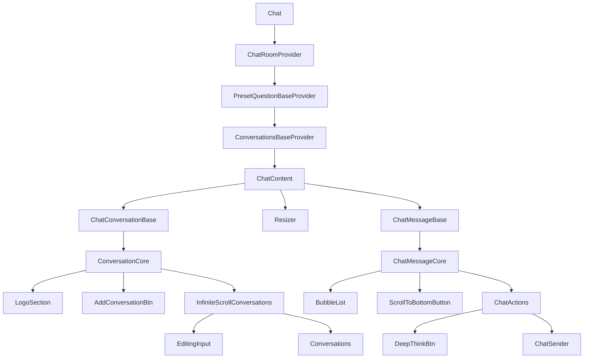
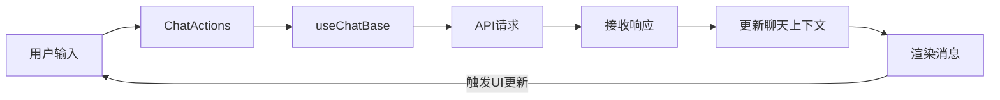
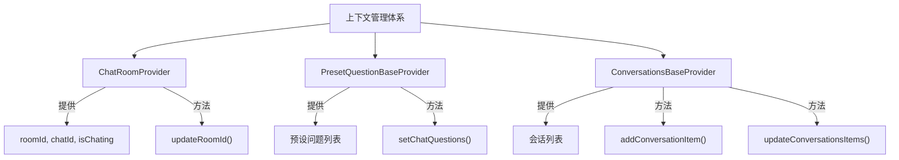
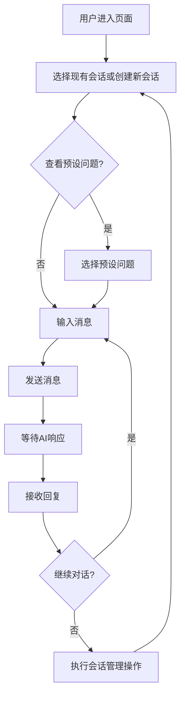

# AI聊天（Chat）页面详细设计文档

## 1. 概述

AI聊天页面是一个交互式AI对话平台，允许用户与AI助手进行实时对话。该系统采用先进的前端架构，包括React上下文管理、组件懒加载和流式响应处理，为用户提供高性能、响应迅速的AI交互体验。

## 2. 系统架构

### 2.1 整体架构图

```
AI聊天系统
├── 页面层
│   └── Chat页面
│       ├── 提供者层（Context Providers）
│       │   ├── ChatRoomProvider
│       │   ├── PresetQuestionBaseProvider
│       │   └── ConversationsBaseProvider
│       └── UI组件层
│           ├── ChatContent
│           │   ├── ChatConversationBase（左侧会话列表）
│           │   ├── Resizer（分隔调整器）
│           │   └── ChatMessageBase（右侧消息区域）
├── 核心逻辑层
│   ├── 聊天管理（useChat）
│   ├── 会话恢复（useChatRestore）
│   ├── 消息处理（XChatParser）
│   └── 会话设置（useConversationSetup）
└── 通信层
    ├── API服务（requestToChat）
    └── 流式通信（ChatStream）
```

使用Mermaid流程图表示：



### 2.2 组件层次结构

```
Chat
├── ChatRoomProvider              // 聊天房间上下文提供者
│   ├── PresetQuestionBaseProvider  // 预设问题上下文提供者
│   │   ├── ConversationsBaseProvider  // 会话列表上下文提供者
│   │   │   └── ChatContent           // 主内容区
│   │   │       ├── ChatConversationBase  // 左侧会话列表
│   │   │       │   └── ConversationCore   // 会话核心组件
│   │   │       │       ├── LogoSection     // 徽标区域
│   │   │       │       ├── AddConversationBtn  // 添加会话按钮
│   │   │       │       └── InfiniteScrollConversations  // 无限滚动会话列表
│   │   │       │           ├── EditingInput   // 编辑会话名称输入框
│   │   │       │           └── Conversations   // 会话项列表
│   │   │       ├── Resizer              // 分栏调整器（可选）
│   │   │       └── ChatMessageBase      // 右侧消息区域
│   │   │           └── ChatMessageCore   // 消息核心组件
│   │   │               ├── BubbleList     // 气泡消息列表
│   │   │               ├── ScrollToBottomButton  // 滚动到底部按钮
│   │   │               └── ChatActions    // 聊天操作区
│   │   │                   ├── DeepThinkBtn  // 深度思考按钮
│   │   │                   └── ChatSender    // 消息发送器
```

组件层次的Mermaid表示：



## 3. 数据流与状态管理

### 3.1 数据流动图

```
用户输入 → ChatActions → useChatBase → API请求 → 接收响应 → 更新聊天上下文 → 渲染消息
│                                                                          │
└──────────────────────────────────← 更新UI ←──────────────────────────────┘
```

使用Mermaid表示数据流：



### 3.2 上下文管理体系

#### 3.2.1 ChatRoomProvider

- 管理房间状态：`roomId`, `chatId`, `isChating`
- 提供房间ID更新功能：`updateRoomId`
- 职责：维护聊天房间的核心状态，协调整个聊天流程

#### 3.2.2 PresetQuestionBaseProvider

- 管理预设问题列表状态
- 提供问题列表设置方法：`setChatQuestions`
- 职责：提供智能建议和预设问题功能

#### 3.2.3 ConversationsBaseProvider

- 管理会话列表的状态
- 提供会话列表操作方法：`addConversationItem`, `updateConversationsItems`
- 职责：管理用户历史会话数据

上下文管理的Mermaid表示：



## 4. 详细组件设计

### 4.1 ChatContent

#### 职责：

- 作为主内容容器，组织布局结构
- 管理懒加载组件
- 处理分栏调整逻辑

#### 主要功能：

- 布局管理：使用Flex布局实现响应式设计
- 组件懒加载：使用React.lazy提高性能
- 用户交互埋点：记录用户的分栏调整行为

### 4.2 ChatConversationBase

#### 职责：

- 管理会话列表显示
- 处理会话切换、删除和重命名
- 支持无限滚动加载更多会话

#### 主要功能：

- 会话列表展示：将API返回的会话数据转换为可视化列表
- 会话管理：支持创建、切换、重命名和删除会话
- 无限滚动：通过`useIntersectionObserver`实现高效的数据加载
- 错误处理：当操作失败时提供友好的错误提示

#### 实现细节：

- 使用`InfiniteScrollConversations`组件实现高效滚动
- 会话数据处理：通过`processConversations`函数将原始数据转换为UI组件需要的格式
- 会话重命名：通过编辑模式和确认流程安全地更新会话名称

### 4.3 ChatMessageBase

#### 职责：

- 显示并管理当前对话的消息列表
- 处理消息发送和接收
- 管理历史消息的恢复
- 支持高级功能如深度思考模式

#### 主要功能：

- 消息渲染：将解析后的消息转换为气泡列表显示
- 消息恢复：通过`useChatRestore`钩子恢复历史会话
- 用户输入处理：通过`ChatActions`组件处理用户输入
- 自动滚动：在新消息到达时自动滚动到底部

#### 实现细节：

- 使用`ChatMessageCore`作为渲染核心
- 通过`useChatBase`钩子管理聊天状态和API请求
- 支持URL参数传递初始消息，实现跨页面通信
- 错误处理：在请求失败时提供友好的错误提示

### 4.4 ChatMessageCore

#### 职责：

- 作为消息区域的渲染核心
- 处理消息显示、滚动逻辑和用户输入
- 提供自定义角色和占位组件支持

#### 主要功能：

- 消息列表渲染：使用`BubbleList`组件显示会话内容
- 自动滚动控制：通过`useScrollToBottom`钩子管理滚动行为
- 深度思考模式：支持高级AI思考模式切换
- 初始消息处理：支持通过URL参数传入初始消息

#### 实现细节：

- 使用`useBubbleItems`钩子生成气泡列表项
- 通过`useEffect`管理初始消息的一次性发送
- 实现滚动到底部按钮，增强用户体验
- 提供多语言支持和错误提示

### 4.5 ChatActions

#### 职责：

- 管理用户输入和消息发送界面
- 提供额外功能按钮如深度思考模式

#### 主要功能：

- 用户输入处理：通过`Input`组件捕获用户输入
- 消息发送：处理消息发送按钮点击事件
- 深度思考切换：允许用户切换AI的思考模式
- 工作流程控制：提供新旧工作流切换功能

#### 实现细节：

- 使用Flex布局组织操作区域组件
- 通过状态控制输入区域的禁用状态
- 提供嵌入模式支持，适应不同使用场景

## 5. 核心钩子（Hooks）详解

### 5.1 useChatBase

#### 职责：

- 作为聊天功能的核心实现
- 管理消息状态、请求发送和响应处理
- 协调各组件之间的状态同步

#### 主要功能：

- 消息处理：管理消息列表的创建、更新和解析
- API交互：处理聊天请求的发送和响应处理
- 会话管理：处理新会话创建和现有会话更新
- 错误处理：管理请求错误和重试逻辑

#### 实现细节：

- 使用`useXChat`和自定义解析器处理消息格式化
- 通过`AbortController`实现请求取消功能
- 管理会话状态和ID的同步更新
- 支持流式和非流式请求模式

### 5.2 useChatRestore

#### 职责：

- 恢复历史会话消息
- 管理消息加载状态
- 转换API返回的数据为组件可用格式

#### 主要功能：

- 历史消息获取：基于会话ID请求历史消息
- 数据转换：将API返回的数据转换为消息格式
- 加载状态管理：提供加载指示器状态
- 手动恢复：支持手动触发消息恢复

#### 实现细节：

- 使用`useRequest`进行API请求管理
- 通过`transformChatRestoreToRawMessages`函数转换数据格式
- 实现智能加载控制，避免不必要的请求

### 5.3 useBubbleItems

#### 职责：

- 生成消息气泡列表项
- 处理占位内容逻辑
- 提供消息格式转换功能

#### 主要功能：

- 气泡项生成：将原始消息转换为气泡组件项
- 空状态处理：当无消息时提供占位内容
- 格式化：统一处理不同消息类型的显示逻辑

#### 实现细节：

- 使用`createBubbleItemsByParsedMessages`转换消息格式
- 提供占位气泡生成功能
- 实现条件渲染逻辑，根据状态决定显示内容

## 6. API交互设计

### 6.1 API请求函数

Chat页面使用以下API端点进行数据交互：

| 功能         | API端点                  | 说明                         |
| ------------ | ------------------------ | ---------------------------- |
| 获取预设问题 | getQuestion              | 获取AI可回答的预设问题列表   |
| 发送消息     | chatStream               | 以流式方式发送消息并接收回复 |
| 获取历史会话 | selectChatAIConversation | 获取用户历史会话列表         |
| 恢复消息历史 | selectChatAIRecord       | 根据会话ID获取历史消息       |
| 删除会话     | delChatGroup             | 删除指定会话                 |
| 重命名会话   | updateChatGroup          | 更新会话的名称               |

### 6.2 流式响应处理

Chat页面使用流式响应技术，实现打字机效果：

- 使用`AbortController`支持请求取消
- 通过解析器实时处理流式数据
- 支持增量渲染，提升用户体验

## 7. 用户交互设计

### 7.1 聊天交互流程

```
用户进入页面
  ↓
选择现有会话或创建新会话
  ↓
[可选] 查看预设问题
  ↓
输入消息并发送
  ↓
等待AI响应（显示加载状态）
  ↓
接收回复（带打字机效果）
  ↓
[可选] 继续对话或执行会话管理操作
```

聊天交互流程Mermaid图：



### 7.2 会话管理交互

```
会话列表查看
  ↓
会话操作选择
  ├── 切换会话：点击会话项
  ├── 创建会话：点击"+"按钮
  ├── 重命名会话：右键菜单 → 重命名 → 输入新名称 → 确认
  └── 删除会话：右键菜单 → 删除 → 确认
```

会话管理Mermaid图：

```mermaid
flowchart TD
    A[会话列表查看] --> B{操作选择}
    B -- 切换 --> C[点击会话项]
    B -- 创建 --> D[点击"+"按钮]
    B -- 重命名 --> E[右键菜单]
    B -- 删除 --> F[右键菜单]

    E --> E1[选择"重命名"]
    E1 --> E2[输入新名称]
    E2 --> E3[确认]

    F --> F1[选择"删除"]
    F1 --> F2[确认删除]

    C --> G[加载选中会话]
    D --> H[创建新会话]
    E3 --> I[更新会话名称]
    F2 --> J[删除会话]

    G --> A
    H --> A
    I --> A
    J --> A
```

### 7.3 高级功能

- **深度思考模式**：启用AI的更深层次分析能力
- **滚动控制**：自动滚动与手动滚动到底部功能
- **分栏调整**：允许用户调整左右面板比例

## 8. 性能优化策略

### 8.1 代码分割与懒加载

Chat页面使用React的`lazy`和`Suspense`实现组件懒加载：

```jsx
const ChatMessageBase = lazy(() =>
  import('@/components/ChatBase/ChatMessage').then((module) => ({ default: module.ChatMessageBase }))
)
```

### 8.2 无限滚动优化

会话列表使用`InfiniteScroll`组件结合`useIntersection`钩子实现高效的数据加载：

- 仅在需要时加载更多数据
- 使用`IntersectionObserver`监测滚动位置
- 批量处理数据更新，减少渲染次数

### 8.3 状态管理优化

- 使用`useCallback`和`useMemo`减少不必要的渲染
- 通过引用管理避免闭包问题
- 使用状态提升和上下文隔离，优化状态更新范围

## 9. 错误处理与容错设计

### 9.1 错误处理机制

- API错误处理：统一的错误码处理和友好提示
- 请求超时处理：设置超时限制和重试策略
- 空状态处理：当无数据时显示适当的占位内容

### 9.2 用户反馈机制

- 加载状态指示：使用`Spin`组件显示加载过程
- 错误提示：使用`message`组件显示友好的错误信息
- 操作确认：重要操作前提供确认步骤

## 10. 国际化支持

Chat页面使用`intl`和`t`函数支持多语言：

```jsx
placeholder={intl('421515', '有什么可以帮你?')}
```

支持的文本项包括：

- 界面元素文本
- 错误提示信息
- 操作按钮文本
- 占位符文本

## 11. 样式设计

### 11.1 布局设计

- 使用Flex布局实现响应式设计
- 支持动态调整分栏比例
- 适应不同屏幕大小的自适应布局

### 11.2 主题设计

- 遵循设计系统规范
- 使用`classNames`实现条件样式
- 支持自定义主题通过`XProvider`

### 11.3 CSS模块化

- 使用Less模块化CSS
- 遵循BEM命名约定
- 实现样式隔离，避免全局污染

## 12. 可扩展性设计

### 12.1 组件设计

- 使用组合模式构建组件
- 通过props注入实现灵活配置
- 核心逻辑与UI表现分离

### 12.2 钩子设计

- 自定义钩子封装通用逻辑
- 支持参数配置和行为覆盖
- 提供回调函数实现扩展点

### 12.3 未来扩展方向

- 支持更多消息类型：图片、文件、音频等
- 增强AI能力：代码生成、数据分析等专业功能
- 集成第三方服务：知识库连接、数据源集成

## 13. 埋点与数据分析

Chat页面集成了用户行为埋点功能：

| 行为         | 埋点代码     | 触发时机           |
| ------------ | ------------ | ------------------ |
| 会话列表折叠 | 922610370018 | 用户折叠会话列表时 |
| 会话列表展开 | 922610370019 | 用户展开会话列表时 |
| 切换会话     | 922610370016 | 用户点击切换会话时 |
| 添加新会话   | 922610370017 | 用户创建新会话时   |

## 14. 技术栈总结

- **前端框架**：React函数组件
- **状态管理**：React Context + Hooks
- **UI组件**：Ant Design + Wind UI
- **样式处理**：Less模块 + CSS-in-JS
- **网络请求**：自定义API + ahooks
- **性能优化**：代码分割 + 懒加载 + 虚拟列表
- **工具库**：classnames + gel-util

## 15. 开发与维护指南

### 15.1 添加新功能流程

1. 评估功能对应的组件或钩子位置
2. 实现逻辑层代码，添加必要的钩子或方法
3. 实现UI组件，注意保持样式一致性
4. 更新上下文提供者，确保状态正确传递
5. 添加必要的测试和文档

### 15.2 调试与问题排查

- 使用控制台日志查看状态变化
- 检查网络请求和响应数据
- 验证组件渲染和生命周期
- 分析性能瓶颈和优化空间

### 15.3 常见问题解决方案

- 会话加载问题：检查API参数和响应格式
- 消息发送失败：验证网络连接和请求格式
- 样式问题：检查样式模块导入和类名应用
- 性能问题：分析渲染次数和状态更新逻辑

## 16. 结论

AI聊天（Chat）页面是一个复杂而完整的AI对话系统，通过精心设计的组件结构、状态管理和交互逻辑，提供了流畅的用户体验。该系统采用现代前端技术栈，实现了高性能、可扩展的架构，支持多种高级功能和优化策略。通过本文档的详细阐述，开发者可以全面了解系统设计和实现细节，为后续开发和维护提供有力支持。
