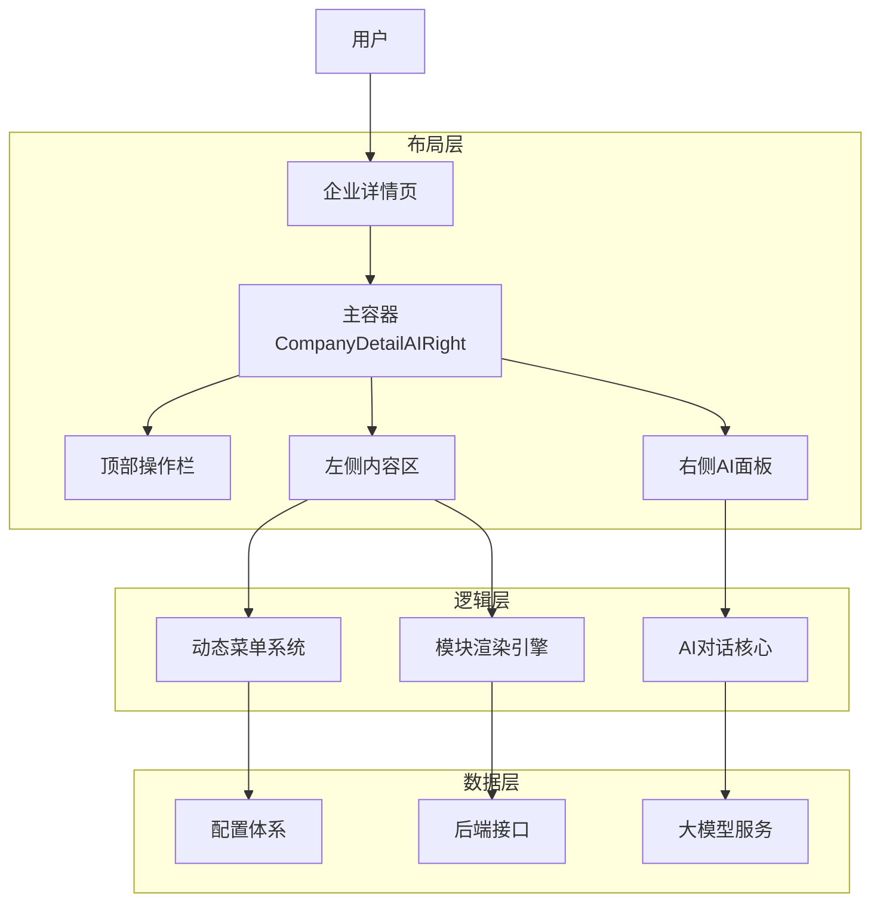

# 企业详情页（AI增强版）设计文档

## 概览

企业详情页AI增强版在传统企业详情展示基础上，集成右侧AI智能对话面板，形成上左右三区域布局。它采用了 **响应式三栏架构** 和 **数据驱动的配置系统**，支持灵活的业务扩展。

**功能边界**：企业信息展示 + AI智能问答
**目标人群**：企业尽调人员、投资分析师、风控专员
**关键场景**：企业基础信息查询、财务数据分析、AI智能问答、报告导出

## 总体架构



## 核心设计原则

1.  **配置驱动**：菜单和内容完全由数据和配置决定，支持快速适配不同类型的企业（如 IPO、基金、个体户）。
2.  **响应式布局**：自动适配桌面端、平板和移动端，AI 面板可动态收起。
3.  **状态提升**：核心状态（如 AI 面板可见性）提升至主容器管理，实现跨区域通信。
4.  **性能优化**：采用懒加载、虚拟滚动和 memo 缓存，确保大数据量下的流畅体验。

## 子文档索引

| 文档 | 说明 | 核心关注点 |
| :--- | :--- | :--- |
| [主容器布局](./layout-container.md) | 顶层布局管理 | 响应式适配、状态提升、区域协调 |
| [左侧区域设计](./layout-left.md) | 菜单导航系统 | 动态菜单生成、三层过滤架构 |
| [核心业务设计](./layout-middle.md) | 内容渲染引擎 | 模块渲染、滚动同步、白名单过滤 |
| [配置体系设计](./layout-config.md) | 数据驱动核心 | 菜单配置、内容配置、类型适配逻辑 |
| [顶部操作栏](./layout-header.md) | 全局操作入口 | 收藏、导出、AI 开关交互 |
| [右侧AI面板](./layout-right.md) | 智能助手 | 对话交互、上下文感知 (待补充) |

## 组件层级总览

```
CompanyDetailAIRight @see apps/company/src/views/CompanyDetailAIRight/index.tsx
├── LayoutHeader (布局组件)
│   └── OperatorHeader @see apps/company/src/views/CompanyDetailAIRight/comp/OperatorHeader/index.tsx
├── Left (左侧容器)
│   └── CompanyDetail @see apps/company/src/views/CompanyDetailAIRight/CompanyDetail.tsx
│       ├── CorpDetailMenu @see apps/company/src/views/Company/comp/menu/index.tsx
│       ├── CompanyIntroduction
│       └── CompanyBase (模块渲染)
└── Right (右侧容器)
    └── ChatMessageCore @see apps/company/src/views/CompanyDetailAIRight/comp/ChatMessageCore/ChatMessageCore.tsx
```

## 关键数据流

1.  **初始化**：加载 `basicNum` -> 生成菜单配置 -> 渲染左侧菜单 -> 渲染中间内容。
2.  **交互**：点击菜单 -> 滚动中间内容 -> 更新 URL 参数。
3.  **AI**：点击 AI 图标 -> 展开右侧面板 -> 发送当前企业上下文 -> 获取回答。

## 扩展性设计

*   **新增模块**：只需在 `layoutConfig` 中添加配置，并在 `menus.ts` 中注册菜单项，无需修改核心渲染逻辑。
*   **新企业类型**：在 `createCorpDetailMenus` 中添加新的过滤规则即可。

## 相关资源

- [Spec: 菜单重构](../../specs/2025-11/2025-11-24-menu-refactor/README.md)
- [前端开发规范](../../../docs/rule/frontend-baseline.md)