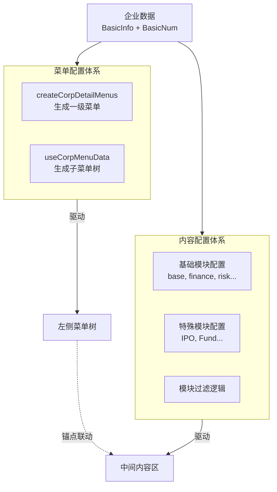

# 企业详情页配置体系设计

## 概览

配置体系是企业详情页的核心驱动力，负责连接**企业数据**与**界面渲染**。它采用 **“三层过滤 + 两阶段构建”** 架构，根据企业类型、地区、统计数据动态生成菜单和内容模块。

**功能边界**：

- 菜单结构定义（层级、名称、图标）
- 模块渲染控制（显示/隐藏、懒加载）
- 业务规则适配（IPO、基金、特殊企业）

**关键场景**：

1. **类型适配**：为“个体工商户”隐藏不适用的金融模块。
2. **数据驱动**：仅在有“IPO数据”时显示相关菜单和图表。
3. **地区本地化**：为海外企业调整菜单名称（如“工商信息” -> “基本信息”）。

## 信息架构

配置体系分为 **菜单配置** 和 **内容配置** 两部分，通过 `moduleKey` 进行关联。



## 详细配置结构

### 1. 菜单配置 (`CorpMenuCfg`)

定义在 `apps/company/src/views/Company/menu/type.ts`。

| 字段       | 类型                  | 说明         | 示例                                |
| :--------- | :-------------------- | :----------- | :---------------------------------- |
| `title`    | `string`              | 一级菜单标题 | "工商信息"                          |
| `children` | `CorpMenuModuleCfg[]` | 子菜单列表   | `[{ showModule: 'baseInfo', ... }]` |
| `hide`     | `boolean`             | 是否隐藏整块 | `true` (个体户隐藏金融)             |

**子菜单项配置**：

| 字段          | 类型      | 说明                                   |
| :------------ | :-------- | :------------------------------------- |
| `showModule`  | `string`  | 模块唯一标识，对应内容区的 `moduleKey` |
| `showName`    | `string`  | 菜单显示名称                           |
| `countKey`    | `string`  | 统计数据字段名，用于显示数字           |
| `hideMenuNum` | `boolean` | 是否强制隐藏统计数字                   |

### 2. 内容配置 (`listRowConfig`)

定义在各业务模块文件中（如 `apps/company/src/components/company/layoutConfig/business.ts`）。

| 字段        | 说明     | 用途                                     |
| :---------- | :------- | :--------------------------------------- |
| `moduleKey` | 模块标识 | 与菜单的 `showModule` 对应，用于锚点定位 |
| `cmd`       | API命令  | 用于获取该模块的详细数据                 |
| `modelNum`  | 统计字段 | 用于判断模块是否有数据（无数据则不渲染） |
| `component` | 渲染组件 | 该模块对应的 React 组件                  |

## 动态适配逻辑

### 1. 企业类型适配 (`createCorpDetailMenus`)

位于 `apps/company/src/views/Company/menu/menus.ts`。

- **个体工商户**：移除 `financing` (金融), `qualifications` (资质), `risk` (司法), `businessRisk` (经营风险)。
- **海外用户**：移除 `risk`, `businessRisk`。
- **海外企业**：`overview` 模块名称调整为“基本信息”。

### 2. 特殊业务适配

- **IPO 企业**：检测到 `ipoNum > 0` 时，动态插入 `IpoBusinessData` 模块。
- **公募/私募基金**：检测到相关统计数据时，插入 `PublishFundData` 或 `PrivateFundData`。

### 3. 内容渲染过滤

位于 `apps/company/src/views/CompanyDetailAIRight/CompanyDetail.tsx` (或 `CompanyBase`)。

为了支持特殊企业（如政府机构、社会组织）的精确展示，采用了**白名单过滤机制**：

1.  **检查标记**：如果 `basicNum.__specialcorp > 0`，视为特殊企业。
2.  **获取白名单**：从生成的菜单配置中提取所有 `showModule`。
3.  **过滤内容**：遍历所有内容模块，仅渲染在白名单中的模块。

```typescript
// 伪代码逻辑
const validModules = getAllMenuKeys(menuConfig)
const modulesToRender = allContentModules.filter((mod) => {
  if (isSpecialCorp) {
    return validModules.includes(mod.moduleKey)
  }
  return true // 普通企业渲染所有
})
```

### 4. 特殊节点处理

部分菜单节点需要特殊的配置逻辑来适配业务需求，主要涉及**统计数字隐藏**和**动态插入**。

#### 统计数字隐藏 (`hideMenuNum: true`)

某些模块虽然有数据（`modelNum > 0`），但在菜单上不展示具体的统计数字。这通常用于：

1.  **非列表型数据**：如“公司资料”（`HKCorpInfo`），仅展示文本信息，数字无意义。
2.  **核心基础信息**：如“股东信息”、“主要人员”，为了界面简洁或强调入口而非数量，可能会隐藏数字。

**典型案例：香港未上市企业 - 公司资料**

```typescript
// apps/company/src/components/company/layoutConfig/overview.ts
if (includeHK) {
  children.push({
    countKey: 'hkUnlisted', // 用于判断是否有数据 (hasData)
    showModule: 'HKCorpInfo',
    showName: intl(414513, '公司资料'),
    hideMenuNum: true, // 强制隐藏数字，即使 countKey > 0
  })
}
```

#### 动态插入逻辑

部分节点仅在满足特定条件时才会插入到菜单配置中（而非仅仅是显示/隐藏）。

- **HKCorpInfo**: 仅当 `hkUnlisted` 统计数据存在时 (`includeHK`) 才会添加到菜单 children 数组中。

### 5. 无数据节点禁用

- 菜单生成保留全部配置项，不因 `modelNum` 为 0 而过滤；为每个子菜单计算 `hasData` 与 `disabled`（当 `!hasData` 时禁用）。
- 数字显示遵循 `hideMenuNum`：隐藏时保持空；否则无数据显示 `0` 且为灰态（由 `CorpMenuNum` 负责渲染）。
- 搜索与滚动联动仅面向可点击节点：禁用节点不参与选中、滚动同步与埋点，仅用于结构展示。
- 数据输出拆分：`treeDatas`（含禁用节点，供渲染）、`allTreeDatas`（仅可点击节点，供搜索与默认选中）、`allTreeDataObj`（仅索引可点击节点，供滚动定位）。
- @see `apps/company/src/views/Company/menu/useCorpMenuData.ts`、`apps/company/src/views/Company/menu/handleCorpDetailMenu.tsx`、`apps/company/src/components/company/detail/comp/CorpNum.tsx`

## 组件复用与代码引用

### 核心配置函数

- **菜单生成器**：`createCorpDetailMenus`
  - @see `apps/company/src/views/Company/menu/menus.ts`
- **基础菜单定义**：`createOverviewMenu` 等
  - @see `apps/company/src/components/company/layoutConfig/overview.ts`
- **类型定义**：`CorpMenuCfg`
  - @see `apps/company/src/views/Company/menu/type.ts`

### 核心配置 Hook

- **配置获取**：`useCorpMenuByType`
  - @see `apps/company/src/views/Company/menu/useCorpMenuByType.ts`

## 扩展指南

### 新增一个业务模块

1.  **定义内容配置**：在 `apps/company/src/components/company/layoutConfig/` 下创建或修改配置文件，定义 `moduleKey` 和组件。
2.  **定义菜单配置**：在 `menus.ts` 或对应分类文件中添加菜单项，指定 `showModule` 和 `countKey`。
3.  **更新类型**：如果涉及新的统计字段，更新 `CorpBasicNumFront` 类型。

## 相关文档

- [左侧区域设计](./layout-left.md) - 菜单的渲染与交互
- [核心业务设计](./layout-middle.md) - 内容模块的渲染
- [Spec: 菜单重构](../../specs/2025-11/2025-11-24-menu-refactor/README.md)
