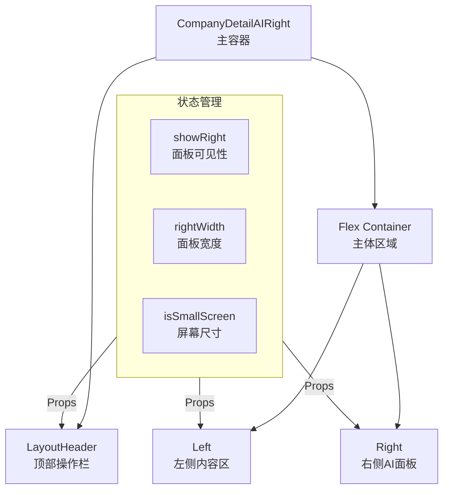
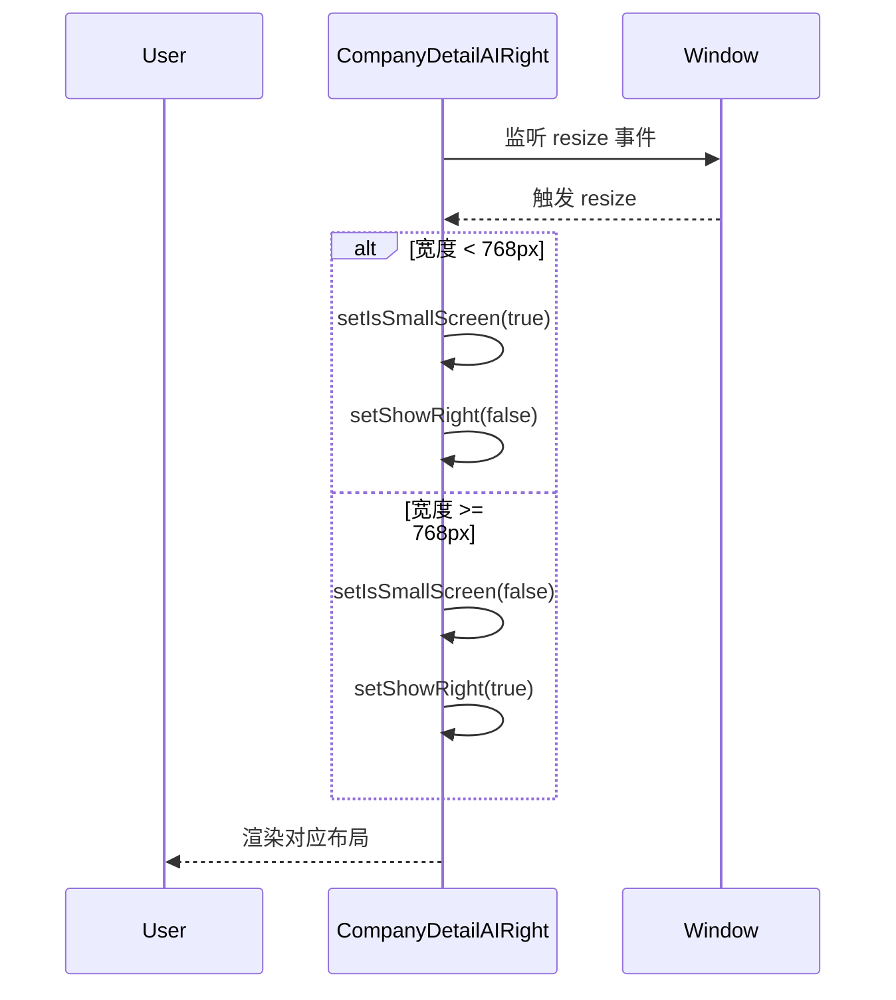

# 企业详情页主容器布局设计

## 概览

主容器 (`CompanyDetailAIRight`) 是企业详情页的顶层组件，负责协调 **顶部操作栏**、**左侧内容区** 和 **右侧AI面板** 的布局与交互。它实现了响应式布局适配、状态提升与分发，以及 AI 面板的动态显示控制。

**功能边界**：
- 布局管理（三栏/单栏切换、宽度调节）
- 状态提升（AI面板可见性、企业信息共享）
- 响应式适配（监听屏幕尺寸变化）

**关键场景**：
1. **布局初始化**：根据屏幕宽度自动决定是否显示 AI 面板。
2. **AI 面板交互**：用户点击切换按钮，动态展开/收起右侧面板。
3. **宽度调节**：用户调整 AI 面板宽度（25% / 50%），左侧内容区自适应。

## 信息架构

采用 **Flex 布局** 实现左右分栏，通过状态控制各区域的渲染与尺寸。

## 页面蓝图

| 区域 | 组件 | 职责 | 布局行为 | 可见条件 |
| :--- | :--- | :--- | :--- | :--- |
| **顶部** | `LayoutHeader` | 企业信息、操作按钮 | 固定高度，宽度自适应 | 始终可见 |
| **左侧** | `Left` | 详情内容、菜单导航 | `flex: 1`，自适应宽度 | 始终可见 |
| **右侧** | `Right` | AI 对话、面板控制 | 固定宽度 / 隐藏 | `showRight` 为 true |

### 响应式策略

| 屏幕宽度 | 模式 | AI 面板默认状态 | 布局行为 |
| :--- | :--- | :--- | :--- |
| **> 1200px** | 大屏 | 显示 | 左侧自适应，右侧 25% |
| **768px - 1200px** | 中屏 | 显示 | 左侧自适应，右侧 30% |
| **< 768px** | 小屏 (F9) | 隐藏 | 左侧 100%，右侧隐藏（覆盖式） |

## 任务流程

### 布局初始化与响应

### AI 面板切换

1.  **用户点击**：顶部栏 AI 图标或右侧面板关闭按钮。
2.  **状态更新**：`setShowRight(!showRight)`。
3.  **布局重绘**：
    *   `showRight = true`：右侧面板挂载，左侧宽度减小。
    *   `showRight = false`：右侧面板卸载，左侧占满容器。

## 数据与状态

### 核心状态 (State)

| 状态名 | 类型 | 默认值 | 说明 |
| :--- | :--- | :--- | :--- |
| `showRight` | `boolean` | `true` (大屏) | 控制 AI 面板的显示/隐藏 |
| `rightWidth` | `string` | `'25%'` | AI 面板的宽度百分比 |
| `isSmallScreen` | `boolean` | `false` | 是否为移动端/小屏模式 |

### 共享上下文 (Context/Props)

主容器将状态通过 Props 传递给子组件：

*   **LayoutHeader**: 接收 `showRight`, `setShowRight` 用于控制按钮状态。
*   **Left**: 接收 `showRight` 用于调整内部布局（如菜单样式）。
*   **Right**: 接收 `setShowRight` 用于关闭面板。

## 组件复用与代码引用

### 核心组件

*   **主容器**：`CompanyDetailAIRight`
    *   职责：布局协调、状态管理。
    *   @see `apps/company/src/views/CompanyDetailAIRight/index.tsx`
*   **顶部栏包装**：`LayoutHeader` (注意：这是容器内的布局组件，非全局 Header)
    *   职责：包装 `OperatorHeader`，处理布局样式。
    *   @see `apps/company/src/views/CompanyDetailAIRight/Left.tsx` (通常与 Left 同文件或独立)
*   **左侧容器**：`Left`
    *   职责：渲染 `CompanyDetail`。
    *   @see `apps/company/src/views/CompanyDetailAIRight/Left.tsx`
*   **右侧容器**：`Right`
    *   职责：渲染 `ChatMessageCore`。
    *   @see `apps/company/src/views/CompanyDetailAIRight/Right.tsx`

## 错误处理

*   **布局计算异常**：使用 CSS Flexbox 的自适应特性作为兜底，避免使用绝对定位计算宽度。
*   **组件崩溃**：各子区域应包含 `ErrorBoundary`，防止局部错误导致整个页面白屏。

## 相关文档

- [总体设计](./design.md)
- [顶部操作栏设计](./layout-header.md)
- [左侧区域设计](./layout-left.md)
- [右侧AI面板设计](./layout-right.md)