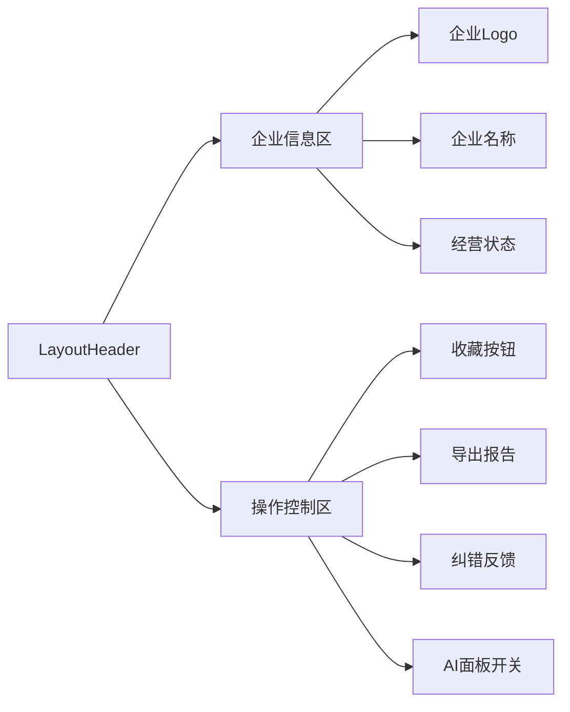
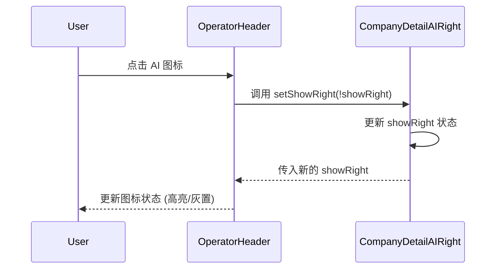

# 企业详情页顶部操作栏设计

## 概览

顶部操作栏 (`LayoutHeader`) 位于左侧内容区的顶部，提供企业信息展示、全局操作（收藏、导出）以及 AI 面板的控制入口。

**功能边界**：
- 企业基本信息展示（Logo、名称、状态标签）
- 核心操作（收藏、导出报告、纠错）
- AI 面板控制（展开/收起）

**关键场景**：
1. **信息浏览**：用户确认当前查看的企业名称和状态（如“存续”）。
2. **AI 交互**：用户点击 AI 图标，展开右侧面板进行提问。
3. **收藏管理**：用户点击星号图标收藏该企业。

## 信息架构

## 页面蓝图

| 区域 | 组件 | 展示数据 | 可交互动作 | 可见条件 |
| :--- | :--- | :--- | :--- | :--- |
| **企业信息** | `OperatorHeader` | `entityName`, `manageState` | 无 | 始终可见 |
| **收藏** | `Collect` | `collectState` | 点击收藏/取消 | 始终可见 |
| **导出** | `CompanyReportModal` | 无 | 点击打开导出弹窗 | 数据加载完成 |
| **AI 开关** | `AiSwitch` | `showRight` | 点击切换面板状态 | 始终可见 |

## 任务流程

### AI 面板切换流程

### 收藏流程

1.  **检查状态**：组件初始化时获取当前企业的收藏状态。
2.  **点击收藏**：
    *   未收藏 -> 弹出收藏夹选择弹窗 -> 确认 -> 调用 API -> 更新状态为已收藏。
    *   已收藏 -> 直接调用取消 API -> 更新状态为未收藏。
3.  **反馈**：操作成功后显示 Toast 提示。

## 数据与状态

### 组件契约 (Props)

`OperatorHeader` 组件接收以下 Props：

| 属性名 | 类型 | 说明 | 来源 |
| :--- | :--- | :--- | :--- |
| `showRight` | `boolean` | AI 面板当前是否显示 | 主容器 State |
| `setShowRight` | `(v: boolean) => void` | 切换 AI 面板显示状态的回调 | 主容器 State |
| `entityName` | `string` | 企业名称 | Redux / API |
| `companyCode` | `string` | 企业唯一标识 | URL 参数 |

### 内部状态

*   **收藏状态**：由 `Collect` 组件内部管理，通过 API 同步。
*   **导出弹窗**：`visible` 状态控制弹窗显示。

## 组件复用与代码引用

### 核心组件

*   **顶部栏容器**：`LayoutHeader` (在 `Left.tsx` 中定义)
    *   职责：布局容器，处理样式。
    *   @see `apps/company/src/views/CompanyDetailAIRight/Left.tsx`
*   **业务逻辑组件**：`OperatorHeader`
    *   职责：实现具体交互逻辑。
    *   @see `apps/company/src/views/CompanyDetailAIRight/comp/OperatorHeader/index.tsx`
*   **收藏组件**：`Collect`
    *   职责：处理收藏逻辑。
    *   @see `apps/company/src/components/company/detail/comp/Collect.tsx` (假设路径)

## 错误处理

*   **API 失败**：收藏或导出接口失败时，显示全局 Message 错误提示。
*   **数据缺失**：如果企业名称未加载，显示骨架屏或占位符。

## 相关文档

- [主容器布局设计](./layout-container.md) - 状态来源
- [总体设计](./design.md)