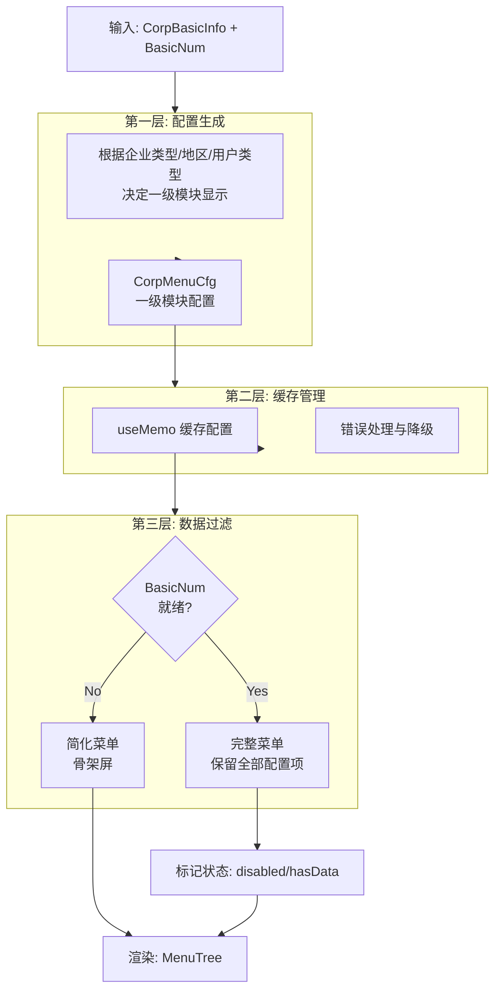

# 企业详情页左侧内容区设计

## 概览

左侧内容区负责企业信息展示与导航，核心是**动态菜单系统**，支持根据企业类型、地区、统计数据动态生成导航结构。

**功能边界**：

- 企业基本信息展示（Logo、名称、状态）
- 动态菜单导航（搜索、展开/折叠、选中联动）
- 模块数据概览（统计数字显示）

**关键场景**：

1. **快速导航**：用户通过左侧树形菜单快速定位到右侧具体业务模块。
2. **数据概览**：通过菜单项后的统计数字（如“股东信息 (5)”）快速了解数据体量。
3. **类型适配**：不同类型企业（如个体户 vs 上市公司）看到差异化的菜单结构。

## 信息架构

菜单生成采用 **“三层过滤 + 两阶段构建”** 架构，确保灵活性与性能。

## 页面蓝图

| 区域         | 内容                 | 展示数据        | 可交互动作          | 可见条件       |
| :----------- | :------------------- | :-------------- | :------------------ | :------------- |
| **顶部信息** | 企业Logo、名称、状态 | `corpBasicInfo` | 收藏、导出、切换AI  | 始终可见       |
| **搜索框**   | 菜单搜索             | `allTreeDatas`  | 输入关键词过滤菜单  | 菜单项 > 5     |
| **菜单树**   | 树形导航结构         | `treeDatas`     | 点击跳转、展开/折叠 | 始终可见       |
| **统计数字** | 菜单项后的数字       | `basicNum`      | 无                  | `basicNum` > 0 |

## 无数据节点设计

为保持菜单结构的稳定性，避免用户在不同企业间切换时菜单跳变，采用了**保留无数据节点**的设计策略：

1.  **展示策略**：
    - **有数据节点**：正常显示，字体黑色，显示统计数字（如配置开启）。
    - **无数据节点**：**置灰显示 (Disabled)**，不显示统计数字（或显示0），不可点击。
2.  **交互限制**：
    - **点击**：禁用，无响应。
    - **搜索**：仅“有数据”的节点可被搜索到。
    - **展开/折叠**：父节点若无数据（且无有数据子节点），整体置灰。

### 展开/收起行为

- 展开全部菜单：显示禁用节点（`showDisabled = true`），并展开所有非叶子节点。
- 仅展开有数据菜单：隐藏禁用节点（`showDisabled = false`），仅展开 `hasData` 的非叶子节点。
- 收起：在当前显示模式基础上收起（清空 `expandedKeys`），不改变 `showDisabled`。
- 搜索：仅返回启用项；禁用项用于展示但不触发选中或滚动联动。

@see `apps/company/src/views/Company/comp/menu/index.ts`
@see `apps/company/src/views/Company/menu/useCorpMenuData.ts`

## 任务流程

### 菜单加载流程

1.  **初始化**：加载企业基本信息 (`corpBasicInfo`)。
2.  **第一阶段（骨架）**：
    - `basicNum` 尚未完全加载。
    - 生成**简化菜单**：仅显示一级菜单 + Overview 第一个子菜单。
    - 目的：避免首屏白屏，提供视觉占位。
3.  **第二阶段（完整）**：
    - `basicNum` 加载完成（字段数 ≥ 5）。
    - 生成**完整菜单**：
      - 过滤掉无数据的子菜单项。
      - 添加统计数字组件 (`CorpMenuNum`)。
      - 自动展开 `overview` 节点。
    - 触发 `onMenuReady` 回调，通知父组件。

### 菜单联动流程

1.  **点击菜单**：更新 `selectedKeys` -> 滚动右侧容器至对应锚点。
2.  **滚动右侧**：监听滚动位置 -> 计算当前可见模块 -> 更新 `selectedKeys`。
3.  **搜索菜单**：输入关键词 -> 过滤 `allTreeDatas` -> 展开匹配节点的父级 -> 高亮匹配项。

## 数据与状态

### 核心数据结构

由 `useCorpMenuData` Hook 统一管理三份数据，避免冗余计算：

| 变量名           | 类型                   | 用途                                   | 来源                    |
| :--------------- | :--------------------- | :------------------------------------- | :---------------------- |
| `treeDatas`      | `CorpMenuData[]`       | **渲染**：Antd Tree 组件的数据源       | `buildCompleteMenuTree` |
| `allTreeDatas`   | `CorpMenuData[]`       | **搜索**：扁平化数组，用于搜索过滤     | `buildCompleteMenuTree` |
| `allTreeDataObj` | `Record<string, Data>` | **查找**：Key-Value 映射，用于滚动定位 | `buildCompleteMenuTree` |

### 状态管理

| 状态               | 描述               | 更新策略                             |
| :----------------- | :----------------- | :----------------------------------- |
| `expandedKeys`     | 展开的菜单节点 Key | 用户点击 / 搜索匹配 / 初始化自动展开 |
| `selectedKeys`     | 选中的菜单节点 Key | 用户点击 / 右侧滚动监听              |
| `autoExpandParent` | 是否自动展开父节点 | 搜索时置为 true                      |

## 组件复用与代码引用

### 核心 Hook 与函数

- **配置生成**：`createCorpDetailMenus`
  - 职责：处理企业类型（个体户/公司）、地区（国内/海外）、特殊模块（IPO/基金）的差异。
  - @see `apps/company/src/views/Company/menu/menus.ts`
- **缓存管理**：`useCorpMenuByType`
  - 职责：缓存配置，异常兜底。
  - @see `apps/company/src/views/Company/menu/useCorpMenuByType.ts`
- **数据管理**：`useCorpMenuData`
  - 职责：实现两阶段构建，生成三种数据结构，管理展开/选中状态。
  - @see `apps/company/src/views/Company/menu/useCorpMenuData.ts`
- **树构建**：`buildCompleteMenuTree`
  - 职责：纯函数，根据统计数据过滤节点，组装树结构。
  - @see `apps/company/src/views/Company/menu/handleCorpDetailMenu.tsx`

### UI 组件

- **菜单容器**：`CorpDetailMenu`
  - @see `apps/company/src/views/Company/menu/index.ts`
- **统计数字**：`CorpMenuNum`
  - @see `apps/company/src/components/company/detail/comp/CorpNum.tsx`

## 错误处理

- **配置生成失败**：`useCorpMenuByType` 捕获异常，降级返回默认菜单配置，避免页面崩溃。
- **数据加载失败**：`basicNum` 缺失时，保持简化菜单显示，不阻塞页面。
- **无数据模块**：自动过滤隐藏，不显示空模块。

## 相关文档

- [总体设计](./design.md)
- [核心业务设计](./layout-middle.md)
- [菜单与滚动交互](./menu-scroll-interaction.md) - **New!** 菜单点击与滚动同步机制详解
- [Spec: 菜单重构](../../specs/2025-11/2025-11-24-menu-refactor/README.md)
