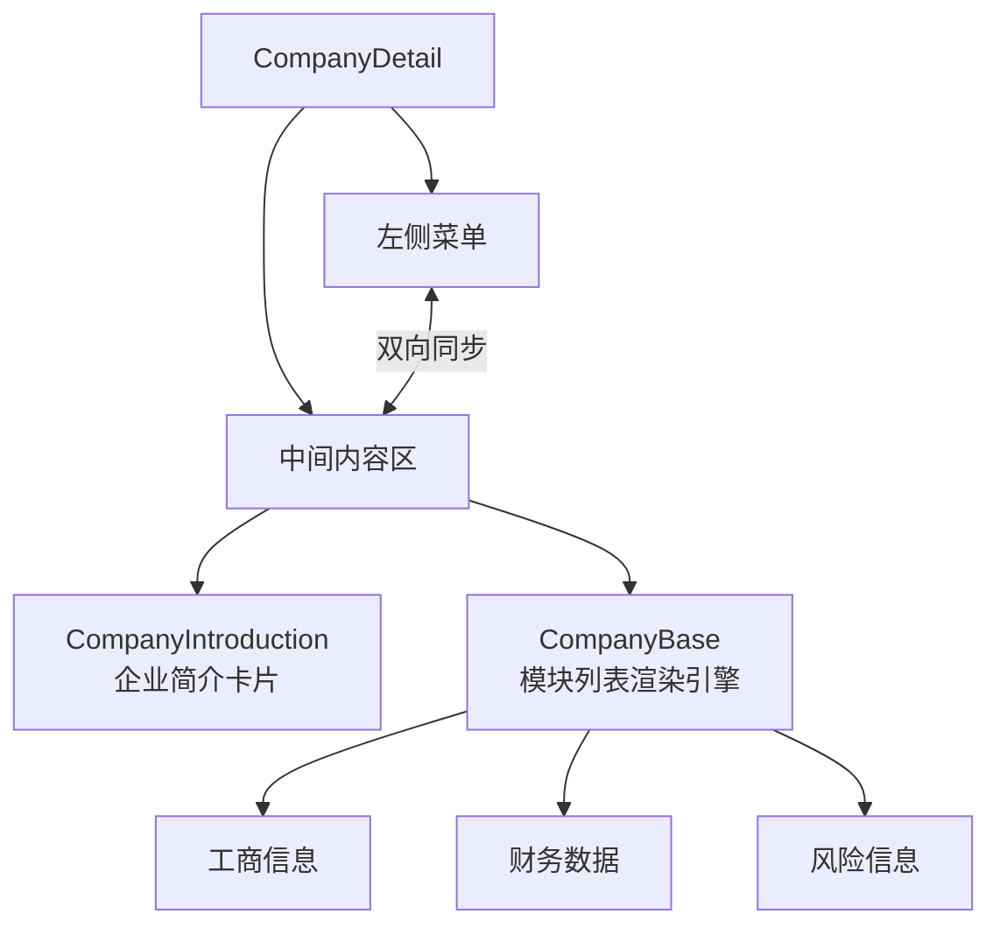
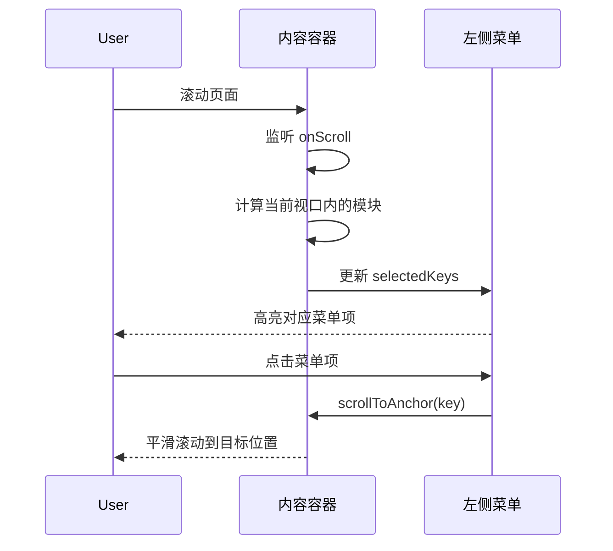

# 企业详情页核心业务设计

## 概览

核心业务区域（中间内容区）是企业详情页的数据展示主体。它负责根据配置渲染各个业务模块（如工商信息、财务数据），并实现与左侧菜单的**双向滚动同步**。

**功能边界**：
- 模块渲染（基础信息、业务数据、风险信息）
- 滚动同步（内容滚动 -> 菜单高亮）
- 锚点定位（菜单点击 -> 内容滚动）

**关键场景**：
1. **模块浏览**：用户向下滚动页面，左侧菜单自动更新选中项。
2. **快速定位**：用户点击左侧“知识产权”菜单，页面平滑滚动到对应区域。
3. **数据展示**：渲染复杂的业务数据表格、图表和标签页。

## 信息架构

## 页面蓝图

| 区域 | 组件 | 展示数据 | 可交互动作 | 可见条件 |
| :--- | :--- | :--- | :--- | :--- |
| **企业简介** | `CompanyIntroduction` | Logo, 简介, 标签 | 展开/收起简介 | 始终可见 |
| **模块列表** | `CompanyBase` | 各模块业务数据 | 表格筛选/翻页 | 根据配置动态渲染 |
| **空状态** | `Empty` | 无 | 无 | 无任何模块数据时 |

## 任务流程

### 模块渲染流程

1.  **获取配置**：从 `useCorpMenuByType` 获取菜单配置 (`allMenuDataObj`)。
2.  **获取数据**：加载 `basicNum` 统计数据。
3.  **过滤模块**：
    *   遍历所有可能的业务模块 (`listRowConfig`)。
    *   **白名单检查**：如果模块 Key 存在于 `allMenuDataObj` 中，则保留。
    *   **特殊企业检查**：如果是特殊企业 (`basicNum.__specialcorp > 0`)，严格按白名单过滤。
4.  **渲染**：遍历过滤后的模块列表，动态加载并渲染对应组件。

### 滚动同步流程

## 数据与状态

### 核心数据

| 字段 | 来源 | 用途 |
| :--- | :--- | :--- |
| `allMenuDataObj` | `useCorpMenuByType` | **渲染白名单**：决定哪些模块应该显示 |
| `basicNum` | Redux | **特殊企业判断**：`__specialcorp` 字段 |
| `listRowConfig` | 静态配置 | **全量模块源**：包含所有模块的组件映射 |

### 滚动状态

*   **滚动容器**：`id="company-detail-content"` 的 `div` 元素。
*   **锚点机制**：每个模块外层包裹 `
`。

## 组件复用与代码引用

### 核心组件

*   **业务容器**：`CompanyDetail`
    *   职责：管理滚动监听、锚点跳转。
    *   @see `apps/company/src/views/CompanyDetailAIRight/CompanyDetail.tsx`
*   **渲染引擎**：`CompanyBase` (或直接在 `CompanyDetail` 中实现)
    *   职责：根据配置列表渲染模块。
    *   @see `apps/company/src/components/company/CompanyBase` (假设路径)
*   **简介卡片**：`CompanyIntroduction`
    *   @see `apps/company/src/views/Company/comp/CompanyIntroduction.tsx`

## 错误处理

*   **模块报错**：单个模块内部使用 `ErrorBoundary`，防止拖累整个页面。
*   **滚动失效**：确保容器高度和 `overflow-y` 设置正确，否则 `onScroll` 不会触发。

## 相关文档

- [配置设计](./layout-config.md) - 模块配置详情
- [左侧区域设计](./layout-left.md) - 菜单联动
- [Spec: 菜单重构](../../specs/2025-11/2025-11-24-menu-refactor/README.md)
