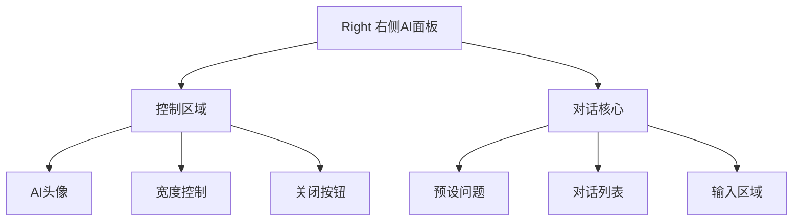
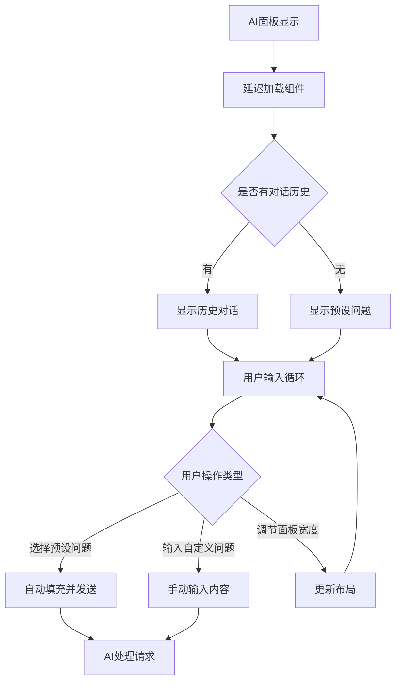

# 企业详情页右侧AI面板设计

## 概述

右侧AI面板为企业详情页提供智能对话功能，支持企业相关的智能问答、数据分析和信息查询，通过企业上下文信息提供针对性的AI服务。

**功能边界**：AI智能对话、企业上下文集成、面板控制
**目标人群**：企业尽调人员、投资分析师、业务用户
**关键场景**：企业信息问答、数据分析、智能推荐、报告生成

## 信息架构



## 页面蓝图

| 区域 | 显示内容 | 可交互动作 | 可见条件 |
|------|----------|------------|----------|
| **AI控制区** | AI头像、标题、控制按钮 | 调节宽度、关闭面板 | AI面板显示时 |
| **预设问题区** | 企业相关的预设问题列表 | 点击发送预设问题 | 首次进入或无对话历史时 |
| **对话列表区** | AI对话历史消息 | 查看历史、滚动操作 | 有对话内容时 |
| **输入区域** | 文本输入框、发送按钮 | 输入问题、发送消息 | 始终显示 |

## 任务流程



## 数据与状态

### 核心数据字段

| 字段 | 来源 | 用途 | 刷新策略 |
|------|------|------|----------|
| `entityName` | 主容器传递 | AI上下文企业名称 | 企业切换时 |
| `entityType` | 主容器传递 | 实体类型标识 | 企业类型变更 |
| `messages` | 对话状态 | 对话历史记录 | 会话级保持 |
| `showRight` | 主容器状态 | 面板显示控制 | 用户操作 |

### 缓存策略

- **对话历史**：组件状态缓存，消息发送/接收时更新
- **预设问题**：按需生成，企业类型变化时重新加载
- **企业上下文**：属性传递，页面刷新时更新

## 组件复用

### 核心组件结构

```
Right @see apps/company/src/views/CompanyDetailAIRight/Right.tsx
├── ChatMessageCore @see apps/company/src/views/CompanyDetailAIRight/comp/ChatMessageCore/ChatMessageCore.tsx
├── VirtualBubbleList @see apps/company/src/views/CompanyDetailAIRight/comp/VirtualBubbleList
└── PresetQuestions @see apps/company/src/views/CompanyDetailAIRight/comp/PresetQuestions
```

### 组件边界

- **Right**：AI面板容器、宽度控制、显示状态管理
- **ChatMessageCore**：AI对话核心、消息渲染、状态管理
- **VirtualBubbleList**：虚拟滚动对话列表、性能优化
- **PresetQuestions**：预设问题生成、企业上下文集成

## 错误处理

| 错误类型 | 处理方式 | 用户反馈 |
|----------|----------|----------|
| **AI服务异常** | 显示错误提示，提供重试 | "AI服务暂时不可用" |
| **网络异常** | 显示网络错误，支持离线模式 | "网络连接异常" |
| **组件加载失败** | 显示简化版本 | "功能加载受限" |
| **上下文缺失** | 显示通用帮助 | "企业信息获取失败" |

## 相关文档

- [总体设计文档](./design.md) - 整体架构
- [主容器布局设计](./layout-container.md) - 布局管理
- [左侧区域设计](./layout-left.md) - 企业数据展示
- [顶部操作栏设计](./layout-header.md) - 操作控制

## 检查清单

- [x] 功能区域职责明确
- [x] AI对话流程完整
- [x] 企业上下文集成清晰
- [x] 错误处理机制完善
- [x] 文档长度控制在1页内