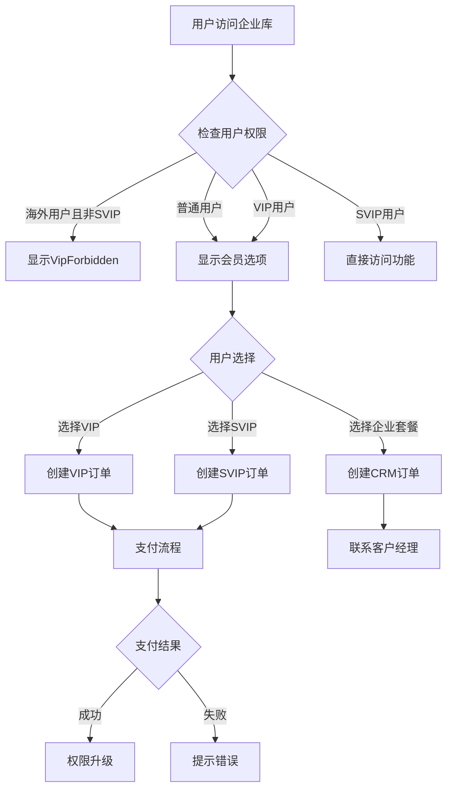

# 会员权限与用户交互设计文档

## 概览

VipModuleNew 是企业库会员购买模块组件，用于处理用户权限升级和会员购买流程。该组件根据用户当前权限状态，提供不同的交互路径和权限升级选项。

## 权限体系

企业库采用三级会员权限体系，不同权限对应不同的功能访问范围：

1. **普通用户** - 基础功能访问，遇到高级功能时触发权限升级提示
2. **VIP** - 年费398元，解锁基础付费功能
3. **SVIP** - 年费1980元，解锁全部高级功能，支持活动优惠
4. **企业套餐(EP)** - 定制化企业解决方案，需联系客户经理

## 用户权限判断逻辑

## 用户交互流程

### 权限受限场景

当用户尝试访问需要高级权限的功能时：

1. **触发条件**：用户点击需要高级权限的功能
2. **响应行为**：显示VipModuleNew组件，展示可升级的会员选项
3. **用户选择**：用户可选择VIP、SVIP或企业套餐
4. **后续流程**：根据用户选择进入相应的购买或联系流程

### 会员购买流程

1. **套餐选择**：用户点击感兴趣的会员套餐
2. **协议确认**：用户需勾选同意用户协议和隐私政策
3. **支付处理**：
   - VIP/SVIP：跳转支付页面，创建支付订单
   - 企业套餐：创建CRM订单，等待客户经理联系
4. **状态轮询**：支付过程中定期查询订单状态
5. **结果处理**：支付成功后刷新页面，失败则提示错误信息

### 特殊用户群体处理

1. **海外用户**：

   - 非SVIP海外用户显示VipForbidden组件
   - 提示用户当前地区不支持购买服务

2. **活动用户**：

   - 显示特殊活动标签（如"买一年送3个月"）
   - 活动期间购买SVIP享受额外优惠

3. **特定终端用户**：
   - 某些终端类型可能不支持购买功能
   - 显示相应的限制提示

## 权限状态与交互差异

| 用户状态         | 显示内容         | 可交互操作     | 特殊处理     |
| ---------------- | ---------------- | -------------- | ------------ |
| 普通用户         | 三种会员套餐选项 | 选择套餐、购买 | 无           |
| VIP用户          | 三种会员套餐选项 | 选择套餐、购买 | 无           |
| SVIP用户         | 不显示购买模块   | 直接访问功能   | 无           |
| 海外用户(非SVIP) | VipForbidden组件 | 无             | 限制购买     |
| 活动用户         | 带活动标签的套餐 | 选择套餐、购买 | 显示优惠信息 |

## 异常场景处理

1. **支付商品信息获取失败**：显示提示信息并重新获取商品列表
2. **支付创建失败**：根据错误码显示不同提示信息
3. **支付轮询超时**：超过10分钟自动停止轮询，提示用户并刷新页面
4. **用户协议未同意**：阻止支付流程并提示用户先同意协议
5. **网络异常**：显示网络错误提示，提供重试选项

## 开发环境特殊功能

开发环境下提供以下特殊功能：

- 切换活动用户状态的按钮，便于测试不同用户群体的交互流程

## 实现细节

详细的实现逻辑和代码结构请参考组件源代码：

- @see ../../src/components/company/VipModuleNew.tsx
