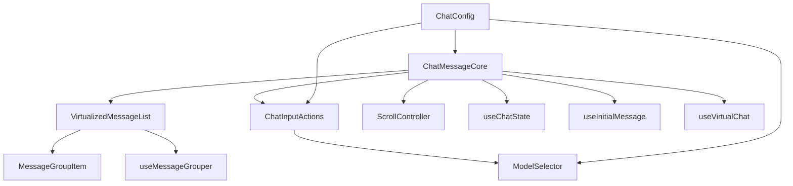

# ChatMessageCore 组件重构实现方案 v1

> ⬆️ [返回任务总览](./README.md)

## 任务概览

| 项目 | 内容 |
|------|------|
| **任务名称** | ChatMessageCore 组件重构 |
| **所属阶段** | 实现 |
| **版本** | v1.0 |
| **负责人** | TODO |
| **关联 Issue** | TODO |
| **关联 PR** | TODO |
| **预计交付时间** | TODO |

## 背景与上下文

### 当前组件现状
- **ChatMessageCore.tsx**: 719行代码，承担过多职责
- **index.tsx**: 255行代码，作为容器组件
- **主要问题**: 单一职责原则违反、代码复用性差、测试困难

### 重构目标
1. **单一职责原则**: 每个组件只负责一个明确的功能
2. **可复用性**: 提取的组件可以在其他地方复用
3. **可测试性**: 小组件更容易进行单元测试
4. **可维护性**: 逻辑清晰，便于理解和修改
5. **性能保持**: 保持现有的性能优化

## 需求提炼

### 功能性需求
| 需求项 | 优先级 | 来源 | 验收标准 |
|--------|--------|------|----------|
| 消息虚拟滚动 | P0 | 现有功能 | 保持现有性能和用户体验 |
| 用户输入交互 | P0 | 现有功能 | 输入框、发送按钮、模型选择功能正常 |
| 滚动控制 | P0 | 现有功能 | 自动滚动、滚动到底部按钮功能正常 |
| 深度思考模式 | P1 | 现有功能 | 模式切换和状态保持正常 |
| 模型选择 | P1 | 现有功能 | 模型切换功能正常 |

### 非功能性需求
| 需求项 | 要求 | 测量指标 |
|--------|------|----------|
| 代码行数 | 主组件减少到 200-300 行 | 行数统计 |
| 组件职责 | 每个组件单一职责 | 代码审查 |
| 测试覆盖率 | 提升到 80% 以上 | 单元测试统计 |
| 性能 | 保持现有性能指标 | 性能测试对比 |
| 兼容性 | 对外接口保持不变 | 接口测试 |

## 方案设计

### 组件拆分架构



### 目录结构设计

```
ChatMessageCore/
├── index.tsx                    # 容器组件（简化后）
├── ChatMessageCore.tsx          # 主组件（简化后）
├── components/
│   ├── VirtualizedMessageList/
│   │   ├── index.tsx
│   │   └── VirtualizedMessageList.module.less
│   ├── MessageGroupItem/
│   │   ├── index.tsx
│   │   └── MessageGroupItem.module.less
│   ├── ChatInputActions/
│   │   ├── index.tsx
│   │   └── ChatInputActions.module.less
│   ├── ModelSelector/
│   │   ├── index.tsx
│   │   └── ModelSelector.module.less
│   └── ScrollController/
│       ├── index.tsx
│       └── ScrollController.module.less
├── hooks/
│   ├── useMessageGrouper.ts
│   ├── useChatState.ts
│   ├── useInitialMessage.ts
│   └── useVirtualChat.ts          # 已存在
├── config/
│   └── chatConfig.ts
├── utils/
│   └── chatUtils.ts
└── ChatMessageCore.module.less
```

### 组件职责划分

| 组件 | 职责 | 接口设计 |
|------|------|----------|
| **VirtualizedMessageList** | 虚拟滚动消息列表核心渲染 | `messages: Message[]`, `onScroll?: (event) => void` |
| **MessageGroupItem** | 单个消息分组渲染 | `group: MessageGroup`, `onMessageClick?: (message) => void` |
| **ChatInputActions** | 聊天输入区域 | `onSend: (message) => void`, `disabled?: boolean` |
| **ModelSelector** | 模型选择器 | `selectedModel: string`, `onModelChange: (model) => void` |
| **ScrollController** | 滚动行为控制 | `autoScroll: boolean`, `showScrollButton: boolean` |
| **useMessageGrouper** | 消息分组逻辑 | `messages: Message[]` → `MessageGroup[]` |
| **useChatState** | 聊天状态管理 | `deepThinkingMode`, `modelType` 状态 |
| **useInitialMessage** | 初始消息处理 | URL 参数解析和自动发送 |

## 实施拆解

### 阶段 1: 配置和工具提取（预计 1 天）
| 子任务 | 负责人 | 关联代码 | 预计交付时间 |
|--------|--------|----------|--------------|
| 创建 chatConfig.ts | TODO | 提取国际化文本和模型配置 | Day 1 |
| 创建 chatUtils.ts | TODO | 提取通用工具函数 | Day 1 |

### 阶段 2: Hook 提取（预计 2 天）
| 子任务 | 负责人 | 关联代码 | 预计交付时间 |
|--------|--------|----------|--------------|
| 创建 useMessageGrouper | TODO | 提取消息分组逻辑 | Day 2 |
| 创建 useChatState | TODO | 提取状态管理逻辑 | Day 2 |
| 创建 useInitialMessage | TODO | 提取初始消息处理逻辑 | Day 3 |

### 阶段 3: UI 组件拆分（预计 3 天）
| 子任务 | 负责人 | 关联代码 | 预计交付时间 |
|--------|--------|----------|--------------|
| 创建 ModelSelector | TODO | 模型选择下拉框 | Day 4 |
| 创建 ChatInputActions | TODO | 输入框和发送按钮 | Day 4 |
| 创建 MessageGroupItem | TODO | 消息分组渲染 | Day 5 |
| 创建 VirtualizedMessageList | TODO | 虚拟滚动列表 | Day 5 |
| 创建 ScrollController | TODO | 滚动控制逻辑 | Day 6 |

### 阶段 4: 主组件重构（预计 2 天）
| 子任务 | 负责人 | 关联代码 | 预计交付时间 |
|--------|--------|----------|--------------|
| 重构 ChatMessageCore.tsx | TODO | 使用新组件和 hooks | Day 7 |
| 更新类型定义 | TODO | 优化 props 传递 | Day 7 |
| 更新 index.tsx | TODO | 简化容器组件 | Day 8 |

### 阶段 5: 测试和优化（预计 2 天）
| 子任务 | 负责人 | 关联代码 | 预计交付时间 |
|--------|--------|----------|--------------|
| 编写单元测试 | TODO | 覆盖新组件和 hooks | Day 9 |
| 性能测试对比 | TODO | 确保性能不下降 | Day 9 |
| 集成测试 | TODO | 端到端功能测试 | Day 10 |
| 文档更新 | TODO | 更新组件文档 | Day 10 |

## 验证与风险

### 测试策略
| 测试类型 | 测试内容 | 覆盖率要求 |
|----------|----------|------------|
| **单元测试** | 各组件和 Hook 的独立功能 | ≥ 80% |
| **集成测试** | 组件间协作和数据流 | 主要流程覆盖 |
| **性能测试** | 渲染性能、内存使用、滚动流畅度 | 对比基准 |
| **回归测试** | 现有功能完整性 | 100% |

### 监控指标
| 指标 | 基准值 | 目标值 | 监控方式 |
|------|--------|--------|----------|
| 首屏渲染时间 | 当前值 | ≤ 当前值 | Performance API |
| 滚动帧率 | 当前值 | ≥ 55fps | Frame Timing |
| 内存使用 | 当前值 | ≤ 当前值 * 1.1 | Memory API |
| 组件渲染次数 | 当前值 | ≤ 当前值 | React DevTools |

### 已识别风险
| 风险 | 概率 | 影响 | 缓解措施 |
|------|------|------|----------|
| 性能下降 | 中 | 高 | 分阶段性能测试，及时优化 |
| 接口兼容性问题 | 低 | 高 | 保持对外接口不变，充分测试 |
| 代码复杂度增加 | 高 | 中 | 良好的代码组织和文档 |
| 测试覆盖不足 | 中 | 中 | 强制测试覆盖率要求 |

### 降级方案
1. **渐进式重构**: 分阶段进行，每个阶段都可以独立回滚
2. **功能开关**: 新组件使用功能开关控制，可随时切换回旧实现
3. **监控告警**: 关键指标异常时自动告警

## 实现说明

### 关键技术决策
1. **组件拆分原则**: 按功能职责而非视觉表现拆分
2. **状态管理**: 使用 React Hooks 进行本地状态管理
3. **性能优化**: 保持现有的虚拟滚动和缓存策略
4. **类型安全**: 使用 TypeScript 确保类型安全

### 主要 PR 列表
TODO (实施过程中补充)

### 验收结果
TODO (上线后补充)

## 更新记录

| 日期 | 修改人 | 更新内容 |
|------|--------|----------|
| 2024-01-XX | XXXX | 创建实现方案 v1 文档 |
|  |  |  |

---

*⬆️ [返回任务总览](./README.md)*