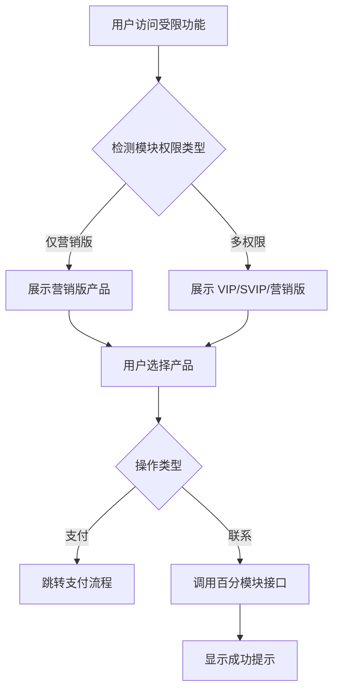

# 企业库会员权限弹窗优化 - 需求提炼

[← 返回任务概览](/apps/company/docs/specs/vip-permission-popup-optimization/README.md)

## 功能概览

优化会员权限弹窗体验，提升用户对产品的理解和转化率。核心用户为企业库使用者，触发场景为访问受限功能时。

**关联参考**：@see /apps/company/docs/auth/membership-permissions-interaction.md

## 核心需求

| 需求项       | 当前状态                 | 目标状态               | 优先级 |
| ------------ | ------------------------ | ---------------------- | ------ |
| 产品名称     | 企业套餐                 | 营销版（百分企业）     | P0     |
| 产品说明     | 联系客户经理             | 联系客户经理咨询采购   | P0     |
| 第三方文案   | 显示"该数据由第三方提供" | 移除                   | P0     |
| 权限展示     | 固定展示 3 个产品        | 根据模块类型动态展示   | P0     |
| 表格遮罩     | 完全覆盖                 | 保留列头，仅遮罩数据行 | P0     |
| 服务说明链接 | 固定跳转                 | 根据选中产品动态跳转   | P1     |
| 联系接口     | 原有接口                 | 切换至百分模块接口     | P1     |

## 用户流程

## 数据与规则

### 产品配置

| 产品   | 名称               | 说明文案             | 操作按钮 | 服务说明链接          |
| ------ | ------------------ | -------------------- | -------- | --------------------- |
| VIP    | VIP                | 基础功能描述         | 立即开通 | /vip-service          |
| SVIP   | SVIP               | 高级功能描述         | 立即开通 | /vip-service          |
| 营销版 | 营销版（百分企业） | 联系客户经理咨询采购 | 立即联系 | /baifenqi/vip-service |

### 遮罩策略

| 内容类型 | 遮罩范围 | 保留元素 |
| -------- | -------- | -------- |
| 表格     | 数据行   | 列头     |
| 文本     | 全部内容 | 无       |
| 图表     | 全部内容 | 无       |

## 反馈与异常

| 场景       | 用户感知                                                         |
| ---------- | ---------------------------------------------------------------- |
| 联系成功   | 全局提示："专属客户经理已收到开通需求，将在一个工作日内同您联系" |
| 联系失败   | 全局提示："提交失败，请稍后重试"                                 |
| 权限加载中 | 弹窗显示加载状态                                                 |
| 无可用产品 | 不展示弹窗，直接提示联系管理员                                   |

## 验收标准

详见 @see /apps/company/docs/specs/vip-permission-popup-optimization/spec-verification-v1.md

@see /apps/company/docs/specs/vip-permission-popup-optimization/spec-design-v1.md
@see /apps/company/docs/specs/vip-permission-popup-optimization/implementation-plan.json
