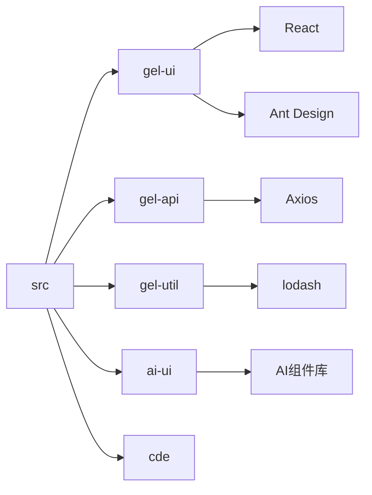

# src - 企业管理系统源代码

企业信息查询和数据可视化应用的核心源代码目录，包含企业信息展示、智能问答和数据分析功能的前端实现。

## 目录树

```
src/
├── actions/                  # Redux Actions 定义 (状态管理操作)
│   ├── actionTypes.ts        # 所有 Action 类型常量定义
│   ├── company.tsx           # 企业相关 Action
│   ├── global.ts             # 全局状态 Action
│   └── ...                   # 其他业务模块 Action
├── api/                      # API 接口层 (后端服务调用)
│   ├── corp/                 # 企业相关 API
│   ├── chartApi.ts           # 图表数据 API
│   ├── homeApi.ts            # 首页数据 API
│   ├── request.ts            # 请求封装
│   └── ...                   # 其他业务 API
├── assets/                   # 静态资源文件
│   ├── common/               # 通用图标和图片
│   ├── fcon/                 # 金融相关图标
│   ├── icons/                # UI 图标
│   └── imgs/                 # 应用图片资源
├── components/               # React 组件库
│   ├── company/              # 企业相关组件
│   ├── charts/               # 图表组件
│   ├── common/               # 通用组件
│   ├── layout/               # 布局组件
│   └── ...                   # 其他业务组件
├── config/                   # 应用配置
├── context/                  # React Context (状态共享)
├── hook/                     # 自定义 Hooks
├── hooks/                    # 自定义 Hooks (新版本)
├── lib/                      # 第三方库封装
├── locales/                  # 国际化资源
├── reducers/                 # Redux Reducers (状态管理)
├── store/                    # Redux Store 配置
├── styles/                   # 全局样式
├── types/                    # TypeScript 类型定义
├── utils/                    # 工具函数
├── views/                    # 页面级组件
│   ├── CompanyDetail/        # 企业详情页
│   ├── Home/                 # 首页
│   ├── SearchList/           # 搜索结果页
│   └── ...                   # 其他页面组件
├── App.tsx                   # 应用根组件
├── app.less                  # 应用全局样式
├── index.js                  # 应用入口文件
└── index.less                # 入口样式文件
```

## 关键文件说明

| 文件 | 作用 |
|------|------|
| `App.tsx` | 应用根组件，负责路由配置和全局状态初始化 |
| `actions/actionTypes.ts` | 定义所有 Redux Action 类型常量 |
| `api/request.ts` | HTTP 请求封装，处理拦截器和错误处理 |
| `components/company/` | 企业信息展示相关组件集合 |
| `views/CompanyDetail/index.tsx` | 企业详情页面组件 |
| `store/store.ts` | Redux Store 配置，整合所有 reducers |
| `utils/intl.ts` | 国际化工具函数 |

## 依赖示意



## 相关文档

- [架构设计](../architecture.md) - 系统架构和设计决策
- [企业详情页文档](../docs/CorpDetail/README.md) - 企业详情页设计文档
- [开发规范](../../../docs/rule/) - TypeScript、React、样式等开发规范
- [API 接口文档](../docs/api/) - 后端接口文档