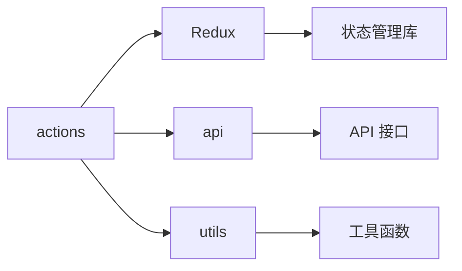

# actions - Redux Actions

企业管理系统的 Redux Actions，定义所有状态变更操作，负责与后端 API 交互并触发状态更新。

## 目录树

```
actions/
├── actionTypes.ts             # 所有 Action 类型常量定义
├── company.tsx               # 企业相关 Action
├── config.js                 # 配置相关 Action
├── filterRes.js              # 筛选结果 Action
├── findCustomer.js           # 找客户 Action
├── global.ts                 # 全局状态 Action
├── group.js                  # 集团 Action
├── home.ts                   # 首页 Action
├── login.js                  # 登录 Action
├── myCollection.js           # 我的收藏 Action
├── rankingList.ts            # 榜单 Action
├── searchList.ts             # 搜索列表 Action
├── settings.js               # 设置 Action
└── template.js               # 模板 Action
```

## 关键文件说明

| 文件 | 作用 |
|------|------|
| `actionTypes.ts` | 定义所有 Action 类型常量，确保类型安全 |
| `company.tsx` | 企业相关 Action，处理企业数据的获取和更新 |
| `global.ts` | 全局状态 Action，处理语言、主题等全局设置 |
| `home.ts` | 首页 Action，处理首页数据的获取和更新 |
| `searchList.ts` | 搜索列表 Action，处理搜索结果数据 |
| `login.js` | 登录 Action，处理用户登录和认证 |
| `rankingList.ts` | 榜单 Action，处理榜单数据获取和更新 |

## 依赖示意



## 相关文档

- [Redux Actions 文档](https://redux.js.org/tutorials/fundamentals/part-2-concepts-data-flow#actions) - Redux Actions 官方文档
- [API 请求规范](../../../docs/rule/code-api-client-rule.md) - API 调用规范
- [TypeScript 规范](../../../docs/rule/code-typescript-style-rule.md) - TypeScript Action 定义规范
