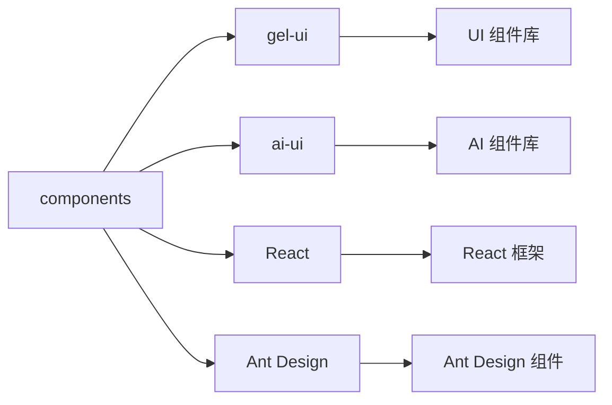

# components - React 组件库

企业管理系统的 React 组件库，包含可复用的 UI 组件和业务组件，支持企业信息展示、数据可视化和用户交互。

## 目录树

```
components/
├── AIBitmapAnimation/        # AI 位图动画组件
├── AppIntlProvider.tsx       # 国际化提供者组件
├── BreadCrumbT/              # 面包屑导航组件
├── CardList/                 # 卡片列表组件
├── CorpPreSearch/            # 企业预搜索组件
├── HeaderHasUser/            # 带用户信息的头部组件
│   ├── ActionModal.jsx       # 操作弹窗
│   ├── TopSearch/            # 顶部搜索
│   └── UserInfoMenu/         # 用户信息菜单
├── Home/                     # 首页组件
│   └── AllMenus/             # 所有菜单组件
├── Icon.tsx                  # 图标组件
├── IframeComponent/          # Iframe 嵌入组件
├── Image.jsx                 # 图片组件
├── InnerHtml/                # HTML 内容渲染组件
├── LimitNotice.js            # 限制通知组件
├── LongTxtLabel.tsx          # 长文本标签组件
├── MenuComponent/            # 菜单组件
├── Result/                   # 结果展示组件
├── SpaceTagInput/            # 空格标签输入组件
├── StickyBox/                # 粘性盒子组件
├── Subscribe.js              # 订阅组件
├── WCBChartComp.jsx          # WCB 图表组件
├── breadCrumb/               # 面包屑组件
├── charts/                   # 图表组件库
│   ├── LineChart.jsx         # 折线图
│   ├── RadarCanvas.tsx       # 雷达图画布
│   ├── RadarChart.jsx        # 雷达图
│   └── empty/                # 空状态图表
├── common/                   # 通用组件库
│   ├── Avatar/               # 头像组件
│   ├── CopyContainer/        # 复制容器
│   ├── Done.jsx              # 完成状态组件
│   ├── Icon/                 # 图标组件
│   ├── RightGotoLink/        # 右转链接
│   ├── Transform.jsx         # 转换组件
│   ├── Vip.jsx               # VIP 组件
│   ├── btn/                  # 按钮组件
│   ├── captcha/              # 验证码组件
│   ├── card/                 # 卡片组件
│   ├── expandable/           # 可展开组件
│   ├── exportDoc/            # 文档导出
│   ├── extraLinks/           # 额外链接
│   ├── floatBar/             # 浮动栏
│   ├── links/                # 链接组件
│   ├── modal/                # 模态框组件
│   ├── noData/               # 无数据组件
│   ├── search/               # 搜索组件
│   ├── updateTime/           # 更新时间
│   └── vip/                  # VIP 相关组件
├── company/                  # 企业相关组件
│   ├── CompanyBase.tsx       # 企业基础信息
│   ├── CompanyConfigMapItem.jsx # 企业配置地图项
│   ├── CompanyConfigMapList.jsx # 企业配置地图列表
│   ├── CompanyContact.js     # 企业联系方式
│   ├── CompanyFloatingWindow.tsx # 企业悬浮窗
│   ├── CompanyIntroduction.tsx # 企业介绍
│   ├── CompanyLink.tsx       # 企业链接
│   ├── CompanyNews.tsx       # 企业新闻
│   ├── CompanyTable.tsx      # 企业表格
│   ├── ContactManager/       # 联系人管理
│   ├── HKCorp/               # 港股企业组件
│   ├── IpoBusinessData.tsx   # IPO 业务数据
│   ├── PrivateFundData.tsx   # 私募基金数据
│   ├── PublishFundData.tsx   # 公募基金数据
│   ├── RelationChart.jsx     # 关系图表
│   ├── ShareAndInvest.tsx    # 股权和投资
│   ├── StatisticalChart.tsx  # 统计图表
│   ├── VipModule.jsx         # VIP 模块
│   ├── VipModuleNew.tsx      # 新版 VIP 模块
│   ├── WcbChartDiv.jsx       # WCB 图表容器
│   ├── buss/                 # 业务组件
│   ├── commonComp/           # 通用企业组件
│   ├── comp/                 # 企业组件
│   ├── context/              # 企业上下文
│   ├── corpCompMisc.tsx      # 企业杂项组件
│   ├── corpConfig.js         # 企业配置
│   ├── data/                 # 企业数据
│   ├── detail/               # 企业详情
│   ├── feedback/             # 反馈组件
│   ├── handle/               # 企业处理
│   ├── info/                 # 企业信息
│   ├── intro/                # 企业介绍
│   ├── layoutConfig/         # 布局配置
│   ├── link/                 # 企业链接
│   ├── listDetailConfig.tsx  # 列表详情配置
│   ├── listRowConfig.tsx     # 列表行配置
│   ├── style/                # 企业样式
│   ├── table/                # 企业表格
│   ├── tablesGel.tsx         # GEL 表格
│   ├── techScore/            # 技术评分
│   ├── type/                 # 企业类型
│   └── useRenderTableDom.tsx # 表格 DOM 渲染
├── configurable/             # 可配置组件
├── custom/                   # 自定义组件
├── detail/                   # 详情组件
├── developer/                # 开发者组件
├── filterOptions/            # 筛选选项组件
├── filterRes/                # 筛选结果组件
├── hotItems/                 # 热门项目组件
├── icons/                    # 图标组件
├── lawDetail/                # 法律详情组件
├── layout/                   # 布局组件
│   ├── LayoutNavAndScrollContent.tsx # 导航和滚动内容布局
│   ├── SideMenuLayout/       # 侧边菜单布局
│   ├── TreeNodeTitle/        # 树节点标题
│   ├── container/            # 布局容器
│   ├── ctx.tsx               # 布局上下文
│   ├── layoutScrollContent/  # 滚动内容布局
│   ├── navMenu.tsx           # 导航菜单
│   ├── renderItem.tsx        # 渲染项
│   └── styles/               # 布局样式
├── map/                      # 地图组件
├── markdown/                 # Markdown 组件
├── message/                  # 消息组件
├── misc/                     # 杂项组件
├── modal/                    # 模态框组件
├── myCascader/               # 级联选择器
├── pay/                      # 支付组件
├── rankingList/              # 榜单列表组件
├── relationshipMap/          # 关系图谱组件
├── restructFilter/           # 重构筛选组件
├── searchForm/               # 搜索表单组件
├── searchListComponents/     # 搜索列表组件
├── selectbleTag/             # 可选择标签组件
├── singleSearch/             # 单项搜索组件
├── specialAppFilterTab/      # 特殊应用筛选标签
├── specialAppNav/            # 特殊应用导航
├── table/                    # 表格组件
├── toolsBar/                 # 工具栏组件
├── user/                     # 用户相关组件
├── windUISafe/               # Wind UI 安全组件
└── wind/                     # Wind 相关组件
```

## 关键文件说明

| 文件 | 作用 |
|------|------|
| `AppIntlProvider.tsx` | 国际化提供者，为应用提供多语言支持 |
| `company/CompanyBase.tsx` | 企业基础信息展示组件 |
| `company/CompanyIntroduction.tsx` | 企业介绍组件 |
| `charts/LineChart.jsx` | 折线图组件，用于数据可视化 |
| `common/modal/` | 模态框组件集合，提供各种弹窗功能 |
| `layout/` | 布局组件集合，提供页面布局结构 |
| `HeaderHasUser/` | 带用户信息的头部组件，包含搜索和用户菜单 |
| `Result/` | 结果展示组件，用于展示搜索或操作结果 |

## 依赖示意



## 相关文档

- [组件设计规范](../../../docs/rule/code-react-component-rule.md) - React 组件开发规范
- [样式规范](../../../docs/rule/code-style-less-bem-rule.md) - 组件样式编写规范
- [UI 组件库文档](../../../packages/gel-ui/README.md) - gel-ui 组件库文档
