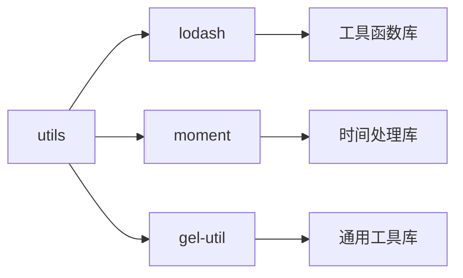

# utils - 工具函数库

企业管理系统的工具函数库，提供通用工具函数、格式化方法、国际化支持和业务辅助功能。

## 目录树

```
utils/
├── TooltipUtil.ts            # 提示框工具
├── WFTCommonWithType/        # Wind 金融终端通用工具
├── api/                      # API 相关工具
├── areaTree.tsx              # 地区树工具
├── browser.ts                # 浏览器工具
├── cache.js                  # 缓存工具
├── clientFunc.ts             # 客户端函数工具
├── common.ts                 # 通用工具函数
├── config/                   # 配置工具
│   ├── electronEconomyTree.ts # 电子经济树
│   ├── lowCarbonTree.ts      # 低碳树
│   ├── strategicEmergingIndustryTree.ts # 战略新兴产业树
│   └── index.ts              # 配置入口
├── constant/                 # 常量定义
│   └── session.ts            # 会话常量
├── enum/                     # 枚举定义
│   └── index.ts              # 枚举入口
├── env/                      # 环境工具
│   ├── baifen.ts             # 百分环境
│   ├── index.ts              # 环境入口
│   ├── misc.ts               # 杂项环境
│   └── terminal.ts           # 终端环境
├── format/                   # 格式化工具
│   ├── currency.ts           # 货币格式化
│   ├── percentage.ts         # 百分比格式化
│   └── time.ts               # 时间格式化
├── heartbeat.js              # 心跳工具
├── hooks.ts                  # Hooks 工具
├── iframe/                   # iframe 工具
├── index.js                  # 工具入口
├── industryOfNationalEconomyTree.tsx # 国民经济行业树
├── info.js                   # 信息工具
├── intl/                     # 国际化工具
│   ├── complexHtml.ts        # 复杂 HTML 国际化
│   ├── pureTranslateService.ts # 纯翻译服务
│   ├── translateDivHtml.ts   # Div HTML 翻译
│   ├── translateHtml.ts      # HTML 翻译
│   ├── translateLoadManager.ts # 翻译加载管理
│   ├── translateService.ts   # 翻译服务
│   ├── translateTabHtml.ts   # Tab HTML 翻译
│   ├── translateTable.ts     # 表格翻译
│   └── zh2enFlattened.ts     # 中英文扁平化
├── links/                    # 链接工具
│   ├── index.ts              # 链接入口
│   └── url.ts                # URL 工具
├── misc/                     # 杂项工具
│   └── polling.ts            # 轮询工具
├── renderLogo.tsx            # Logo 渲染工具
├── resource/                 # 资源工具
├── scroll.js                 # 滚动工具
├── storage/                  # 存储工具
├── table.ts                  # 表格工具
├── treeUtils.ts              # 树工具
├── useAsync.jsx              # 异步 Hook
├── user/                     # 用户工具
│   ├── index.js              # 用户工具入口
│   └── oversea.js            # 海外用户工具
├── utils.tsx                 # 通用工具
├── worker.js                 # Worker 工具
└── workerMessage.js          # Worker 消息工具
```

## 关键文件说明

| 文件 | 作用 |
|------|------|
| `intl/index.ts` | 国际化工具，提供多语言支持 |
| `format/` | 格式化工具集合，处理货币、百分比、时间等格式化 |
| `storage/index.ts` | 存储工具，封装 localStorage 和 sessionStorage |
| `env/index.ts` | 环境工具，处理不同环境的配置和判断 |
| `common.ts` | 通用工具函数，提供常用的辅助方法 |
| `browser.ts` | 浏览器工具，处理浏览器兼容性和特性检测 |
| `api/index.ts` | API 工具，提供 API 请求相关辅助函数 |

## 依赖示意



## 相关文档

- [工具函数规范](../../../docs/rule/code-typescript-style-rule.md) - TypeScript 工具函数编写规范
- [国际化文档](../../../docs/intl/) - 国际化实现文档
- [存储规范](../../../docs/rule/code-api-client-rule.md) - 数据存储规范
