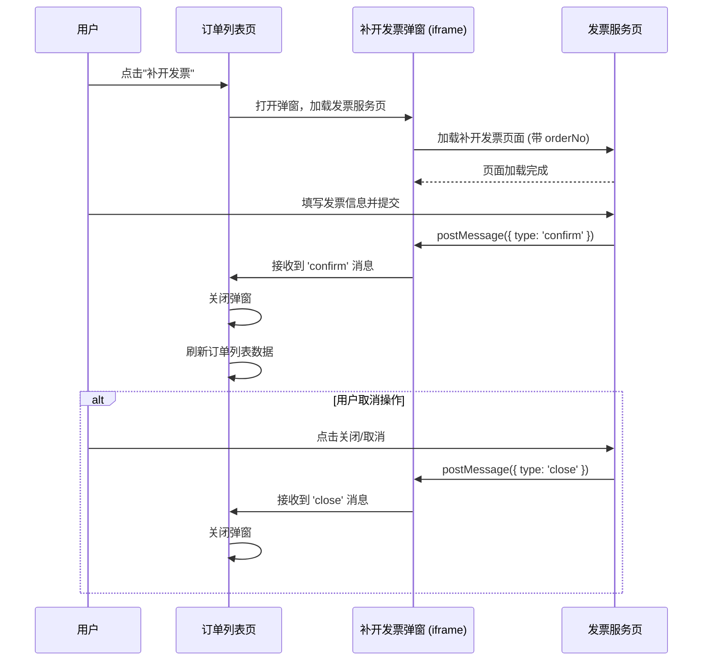

# 支付补开发票功能 - 技术设计文档

## 1. 需求背景

在"我的订单"页面，用户可能需要为已支付但未开具发票的订单申请开具发票。为了提升用户体验，本项目需要新增"补开发票"功能，允许用户在线完成发票信息的填写和申请。

## 2. 功能目标

- **订单列表**:
  - 对于"未开票"状态的订单，在"操作"列中提供"补开发票"入口。
  - 对于"已开票"状态的订单，保留原有的"发票信息"查看功能。
- **补开票流程**:
  - 点击"补开发票"后，以 `Modal` 弹窗的形式，通过 `iframe` 嵌入独立的补开发票页面。
  - 用户在 `iframe` 页面内完成发票信息填写并提交。
- **交互反馈**:
  - 用户提交成功后，`iframe` 页面通知父页面。父页面关闭 `Modal` 弹窗并刷新订单列表，以更新订单的发票状态。
  - 用户在 `iframe` 页面点击"关闭"或"取消"，`iframe` 页面通知父页面。父页面仅关闭 `Modal` 弹窗，不刷新数据。

## 3. 技术设计方案

### 3.1 方案概览

本次需求将涉及前端 `company` 项目的订单列表页面。核心改动点是在 `MyOrder` 页面中增加 `Modal` 和 `iframe` 通信逻辑，并修改 `orderColumns.tsx` 中的列表项渲染逻辑。通过 `window.postMessage` API 实现 `iframe` 与主应用之间的安全跨域通信。

### 3.2 交互流程

### 3.3. 组件设计

#### 3.3.1. `MyOrder` 视图组件 (或其父组件)

`MyOrder` 视图将作为本次功能的主容器，负责：

1.  **状态管理**:
    - 维护补开发票弹窗的 `visible` 状态。
    - 维护当前操作的 `orderId`，用于生成 `iframe` 的 `URL`。
2.  **`iframe` 通信**:
    - 在组件挂载时，通过 `useEffect` 监听 `message` 事件。
    - 根据 `message` 的 `type` ('confirm' 或 'close') 执行相应操作（关闭弹窗、刷新数据）。
    - 在组件卸载时，移除事件监听器以防止内存泄漏。
3.  **数据刷新**:
    - 提供一个刷新订单列表数据的方法，在收到 'confirm' 消息后调用。

#### 3.3.2. `useOrderColumns` Hook

`orderColumns.tsx` 中 `useOrderColumns` Hook 的"操作"列渲染逻辑需要更新：

- **条件渲染**: 根据 `applyInvoice` 字段的值来决定显示"补开发票"还是"发票信息"。
- **事件绑定**:
  - "补开发票"按钮的 `onClick` 事件将触发 `MyOrder` 组件中的方法，以 `orderId` 为参数，打开 `Modal` 弹窗。
  - "发票信息"的逻辑保持不变。

#### 3.3.3. 补开发票 `Modal`

这是一个新的 `React` 组件，负责展示 `iframe`：

- 接收 `visible`, `onClose`, `url` 等 `props`。
- `Modal` 内部渲染一个 `iframe` 元素，其 `src` 属性由 `url` prop 决定。

### 3.4. 接口与通信

#### 3.4.1. URL 生成

`iframe` 的 `URL` 通过 `packages/gel-util` 包中的 `getPayWebLink` 方法生成。

- **方法**: `getPayWebLink(PayWebModule.CHECK, { orderNo: string, invoiceMode: 'append' })`
- **参数**: 需要传入 `PayWebModule.CHECK` 模块标识和包含 `orderNo` 的参数对象。

#### 3.4.2. `iframe` 与父页面通信

通信基于 `window.postMessage` API。

- **从 `iframe` 到父页面**:
  - **确认**: `window.parent.postMessage({ type: 'confirm' }, '*')`
  - **关闭**: `window.parent.postMessage({ type: 'close' }, '*')`
- **父页面**: 监听 `message` 事件，并检查 `event.data.type` 来处理逻辑。
