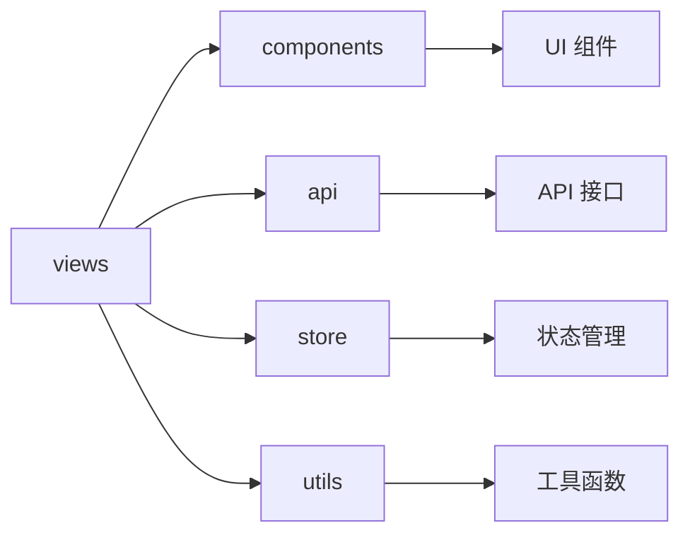

# views - 页面级组件

企业管理系统的页面级组件集合，包含各个功能页面的实现，负责企业信息展示、数据可视化和用户交互。

## 目录树

```
views/
├── 404.tsx                   # 404 错误页面
├── AICharts/                 # AI 图表页面
│   ├── comp/                 # 图表组件
│   ├── context/              # 图表上下文
│   ├── hooks/                # 图表 Hooks
│   ├── store/                # 图表状态管理
│   ├── types/                # 图表类型定义
│   └── utils.ts              # 图表工具函数
├── AnnualReportDetail/       # 年报详情页面
├── AtlasPlatform.js          # 图谱平台页面
├── AuthCheck/                # 权限检查页面
├── BankingWorkbench.tsx      # 银行工作台页面
├── BidHistoryFocus/          # 投标历史关注页面
├── BidSearch/                # 投标搜索页面
├── BiddingDetail/            # 投标详情页面
├── BusinessComponent/        # 业务组件页面
├── Character/                # 人物页面
├── Chart/                    # 图表页面
├── Charts/                   # 图表集合页面
│   ├── CompanyMap/           # 企业地图
│   ├── SingleGraph/          # 单一图表
│   ├── comp/                 # 图表组件
│   ├── types/                # 图表类型
│   └── utils.js              # 图表工具
├── CompanyDetailAIRight/     # 企业详情 AI 右侧页面
├── CompanyDetailEntry/       # 企业详情入口页面
├── CompanyDetail/            # 企业详情页面
├── CompanyDynamic/           # 企业动态页面
├── CompanyHome.js            # 企业首页
├── Company/                  # 企业页面
│   ├── comp/                 # 企业组件
│   ├── handle/               # 企业处理
│   ├── menu/                 # 企业菜单
│   └── style/                # 企业样式
├── Customer/                 # 客户页面
│   ├── MyAccount/            # 我的账户
│   ├── MyList/               # 我的列表
│   ├── MyOrder/              # 我的订单
│   ├── UserNote/             # 用户备注
│   ├── handle/               # 客户处理
│   └── myMenu.jsx            # 客户菜单
├── Dev/                      # 开发页面
├── EvaluationDetail/         # 评估详情页面
├── FeaturedCompany/          # 特色企业页面
├── Fetured/                  # 特色页面
├── FilterRes.js              # 筛选结果页面
├── FindCustomer/             # 找客户页面
├── GameapprovalDetail.js     # 游戏审批详情页面
├── GlobalSearch/             # 全局搜索页面
├── GlobalSearchPlatform.tsx  # 全局搜索平台页面
├── Group/                    # 集团页面
├── HistoryFocusList/         # 历史关注列表页面
├── Home.tsx                  # 首页
├── HomeAI/                   # AI 首页
├── IcLayout/                 # IC 布局页面
├── IntellectualSearch/       # 知识产权搜索页面
├── Job/                      # 职位页面
├── LogoDetail/               # Logo 详情页面
├── ProdDetail/               # 产品详情页面
├── ProductDetail.tsx         # 产品详情页面
├── Qualifications/           # 资质页面
├── QueryDetailEnterpriseInOneSentence/ # 一句话查询企业详情
├── QueryEnterpriseInOneSentence/ # 一句话查询企业
├── RankingList.tsx           # 榜单列表页面
├── RankingListDetail.tsx      # 榜单详情页面
├── RankingListTree.tsx       # 榜单树页面
├── RelatedLinks/             # 相关链接页面
├── Report/                   # 报告页面
├── SearchBidNew/             # 新投标搜索页面
├── SearchBrand.tsx           # 品牌搜索页面
├── SearchFetured.tsx         # 特色搜索页面
├── SearchFunc/               # 搜索功能页面
├── SearchGroupDepartment.tsx # 搜索集团部门页面
├── SearchJob/                # 搜索职位页面
├── SearchList/               # 搜索列表页面
├── SearchPatent.tsx          # 专利搜索页面
├── SearchPlatform.tsx        # 搜索平台页面
├── SingleCompanyDynamic/     # 单一企业动态页面
├── SpecialAppList.tsx        # 特殊应用列表页面
├── StandardInfoDetail/       # 标准信息详情页面
├── VersionPriceDomestic.ts   # 国内版本价格页面
├── VersionPriceOversea.ts    # 海外版本价格页面
├── VersionPrice/             # 版本价格页面
├── commonSearchFunc.tsx      # 通用搜索功能
├── groupSearchList.tsx       # 集团搜索列表
├── lawDetail.tsx             # 法律详情页面
├── personSearchList.tsx      # 人物搜索列表
├── sepcialCorpList/          # 特殊企业列表
└── singleDetail/             # 单一详情页面
```

## 关键文件说明

| 文件 | 作用 |
|------|------|
| `Home.tsx` | 应用首页，展示主要功能入口和热点信息 |
| `CompanyDetail/index.tsx` | 企业详情页，展示企业全面信息 |
| `SearchList/index.tsx` | 搜索结果页，展示搜索结果列表 |
| `CompanyDetailAIRight/index.tsx` | 企业详情 AI 右侧页面，提供 AI 分析功能 |
| `Charts/index.tsx` | 图表页面，提供企业数据可视化 |
| `GlobalSearch/index.tsx` | 全局搜索页面，提供跨模块搜索功能 |
| `FindCustomer/index.tsx` | 找客户页面，提供客户发现功能 |
| `RankingList/index.tsx` | 榜单列表页面，展示各类企业榜单 |

## 依赖示意



## 相关文档

- [企业详情页文档](../../docs/CorpDetail/README.md) - 企业详情页设计文档
- [页面路由配置](../config/routes.js) - 页面路由配置
- [React 规范](../../../docs/rule/code-react-component-rule.md) - React 组件开发规范
