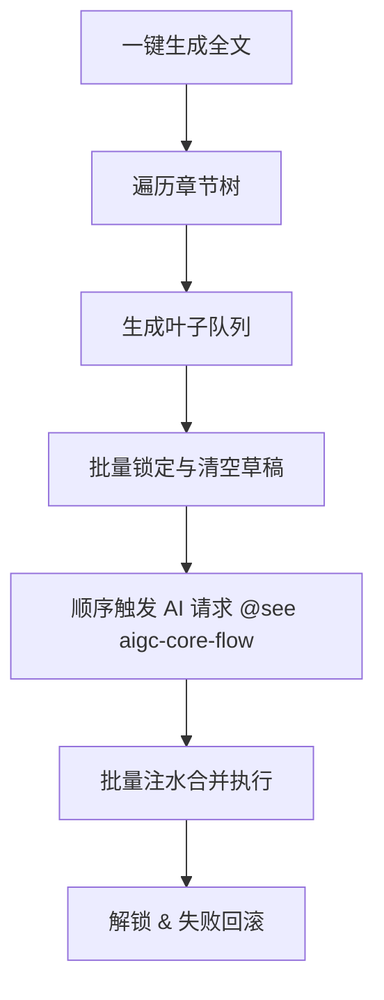

# 全文生成场景（纵向手册）

> 顶部“一键生成全文”入口会触发本流程：自动遍历全部叶子章节，批量调度 AI 请求并合并注水任务，是多章节能力的基线实现。

## 概览
- **范围**：全量章节筛选、全局队列与进度、批量注水
- **目标用户**：前端开发者、大纲初稿阶段的运营人员
- **关键任务**：
  1. 自动构建叶子章节队列并锁定全部章节
  2. 顺序调度生成并聚合多维度进度
  3. 在注水后恢复编辑器，支持失败章节回滚

## 信息架构

## 页面蓝图
| 区域 | 显示内容 | 可操作 | 可见条件 |
| --- | --- | --- | --- |
| 进度抬头 | 总进度百分比、剩余时间估算 | 暂停 / 恢复 / 取消 | `globalOperation=full_generation` |
| 队列列表 | 所有叶子章节状态（待处理/进行中/完成/失败） | 查看日志 | 始终显示 |
| 批量操作区 | 重试失败章节、导出日志 | 批量操作 | `progress.failed>0` |

## 任务流程
| 阶段 | 触发条件 | 关键状态 | 核心动作 | 反馈 |
| --- | --- | --- | --- | --- |
| 队列构建 | 用户点击全文生成 | `generationQueue` | 遍历章节树 → 过滤叶子 → 记录原始顺序 | Loading 与队列预览 |
| 批量初始化 | 队列非空 | `globalOperation=full_generation` | 锁定全部目标章节、清空草稿、准备注水任务 | 所有章节进入 Loading |
| 顺序调度 | 队列有剩余 | `progress.currentIndex` | 串行触发 AI 请求并追踪关联 ID | 进度条更新、当前章节高亮 |
| 收尾 | 队列为空 | `progress.completed===progress.total` | 执行批量注水、解锁、统计失败集合 | 成功提示或失败列表 |

## 状态与数据
| 名称 | 类型 | 说明/限制 | 来源 |
| --- | --- | --- | --- |
| `generationQueue` | `string[]` | 全部叶子章节 ID，保持树 traversal 顺序 | 章节树遍历 |
| `globalOperation` | `'full_generation' \| 'idle'` | 控制全局按钮与守卫逻辑 | `ReportContentStore` |
| `progress` | `{ total; currentIndex; completed; failed; percent; eta }` | 驱动顶部进度与剩余时间 | `useFullGeneration` Hook |
| `hydrationTasks` | `HydrationTask[]` | 合并后的批量注水任务 | `hydrationQueueService` |

## 批量特性
- 叶子筛选：保证不会重复生成父章节，且遵循章节树的自然顺序。
- 注水合并：相邻章节共用一次注水调用，失败时降级为单章节注水重试。
- 批量回滚：失败章节恢复初始内容，同时提示用户改用 [单章节流程](./single-chapter-aigc-flow.md) 重新生成。

## 与其他流程的关系
| 能力 | 全文生成 | 多章节顺序 | 单章节 |
| --- | --- | --- | --- |
| 入口 | 顶栏按钮 | 章节多选面板 | 章节右键菜单 |
| 队列来源 | 自动遍历全部叶子 | 用户勾选 | 用户单选 |
| 进度维度 | 总量、当前索引、失败数、ETA | 复用全文进度 | 线性 0-100% |
| 失败策略 | 默认保留失败列表，需用户重试 | 默认不中断，收尾重试 | 原位重试 |

## 复用节点
- `@see ../../../src/store/reportContentStore/hooks/useFullGeneration.ts` – 队列构建与进度聚合。
- `@see ../../../src/store/reportContentStore/HYDRATION.md` – 批量注水任务说明。
- `@see ./multi-chapter-sequential-aigc-flow.md` – 顺序队列如何基于此流程裁剪。

## 相关文档
- [AIGC 核心流程](./aigc-core-flow.md) – 前置校验、Streaming 通道。
- [单章节 AIGC 场景](./single-chapter-aigc-flow.md) – 失败回退的降级方案。
- [多章节顺序 AIGC 场景](./multi-chapter-sequential-aigc-flow.md) – 定向批量场景。
