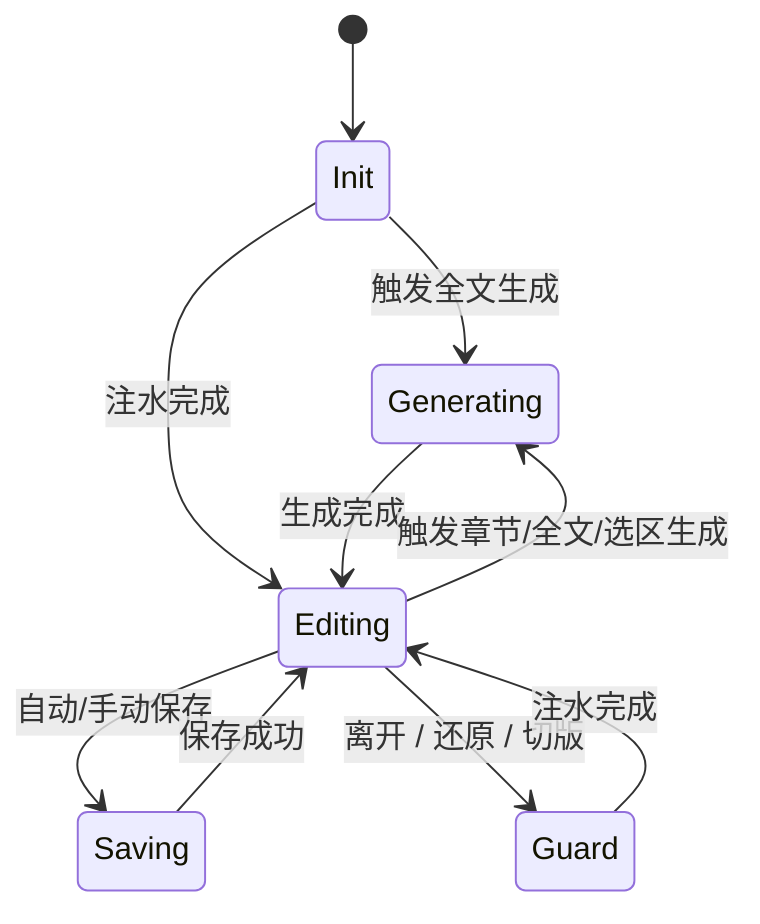

# 内容生命周期与交互控制（纵向·互斥编排）

> 纵向视角，聚焦"初始化 → 生成 → 编辑保存 → 退出/守卫"场景如何互斥衔接。数据层细节见 [data-layer-guide.md](./data-layer-guide.md)，展示层实现见 [../RPEditor/rendering-and-presentation-guide.md](../RPEditor/rendering-and-presentation-guide.md)。

## 1. 文档定位

- 目标：把报告正文在各场景中的入口、前置校验、执行链路和完成信号列成统一模板，便于核对互斥点。
- 依赖：数据三层指南（`data-layer-guide.md`）、展示层操作手册（`../RPEditor/rendering-and-presentation-guide.md`）、生成专篇（`full-generation-flow.md`）。
- 输出：每个场景说明“谁发起、何时只读、何时落盘”，并附上与横向文档的引用。

## 2. 互斥蓝图

- 生成与编辑互斥：生成开始前确保 `hasDirty = false`，期间编辑器 `readonly`；生成完成后直接写 Canonical 并注水恢复。
- 保存串行：只能在 `Editing` 态触发保存；保存进入 `Saving`，完成后恢复 `Editing`。
- 守卫场景（离开、还原、切版）与生成类似，都在入口处检查 `hasDirty` 与 `inFlight`。

## 3. 场景索引

| 场景             | 入口                                                           | 横向依赖                                                                                   |
| ---------------- | -------------------------------------------------------------- | ------------------------------------------------------------------------------------------ |
| 初始化 / 还原    | 打开报告、切换历史版本、刷新后回到页面                         | [data-layer-guide §1.2](./data-layer-guide.md#12-生命周期) / [../RPEditor/rendering-and-presentation-guide.md §6](../RPEditor/rendering-and-presentation-guide.md#6-更新与注水) |
| AIGC 生成        | 全文按钮 / 章节菜单 / 文内选区                                 | [full-generation-flow](./full-generation-flow.md) / [data-layer-guide §2.6](./data-layer-guide.md#26-与生成重生成的配合) |
| 用户编辑与保存   | 编辑器输入、自动保存、手动保存                                 | [data-layer-guide §2.3–§2.7](./data-layer-guide.md#23-规范化与文档级哈希)                   |
| 路由守卫 / 还原  | 离开页面、关闭标签、切换版本、恢复缺失章节                     | [data-layer-guide §4](./data-layer-guide.md#4-操作触发与防护横向视角)                      |
| 流式体验与视觉   | 生成流、注水状态、Loading/错误提示                             | [../RPEditor/rendering-and-presentation-guide.md §6](../RPEditor/rendering-and-presentation-guide.md#6-更新与注水)         |

## 4. 场景详解

每个场景遵循同一模板：入口 → 前置校验 → 执行 → 成功/失败处理 → 关键状态。

### 4.1 初始化 / 还原

- **入口**：打开报告、刷新页面、切换历史版本、缺失补齐完成后回到编辑器。
- **前置校验**：
  - 确认 Canonical 完整；若接口返回缺失章节，将章节标记 `pending` 并禁用编辑。
  - TinyMCE 尚未 ready → 保持 Loading，等编辑器 ready 再注水。
- **执行**：
  1. 渲染 Canonical（`renderFullDocument`） → 设置 `full-init` 注水任务。
  2. `useHydrationExecutor` 写入 TinyMCE，并在静默模式下完成 DOM 同步。
  3. `deriveLiveOutlineFromHtml` 解析最新 HTML，开启 `liveOutline.enabled = true`。
- **完成**：
  - `hasDirty = false`, `documentStatus = 'idle'`, Draft 清空。
  - 恢复滚动/光标缓存（若有），进入 `Editing` 态。
- **失败**：
  - 注水失败 → 保持只读并提示刷新。
  - 缺失章节长期未回填 → 允许手动重试或回退版本。

### 4.2 AIGC 生成（全文 / 章节 / 选区）

- **入口**：全文按钮、章节菜单、文内悬浮条。
- **前置校验**：
  - `hasDirty = true` → 触发保存并等待 ACK；失败则终止生成。
  - `inFlight = true` → 等待前一次保存完成。
  - 权限与上下文：只读模式、选区有效、目标章节存在。
- **执行**（详见 [full-generation-flow.md](./full-generation-flow.md)）：
  1. 设置 `globalOperation = full_generation | chapter_generation | selection_generation`。
  2. 清空目标章节内容并注入 Loading（展示层参见 §4.3）。
  3. useFullDocGeneration 按队列调用 AIGC，流式消息写入 `parsedRPContentMessages`，同步给流式预览。
  4. 每个章节完成时合并消息 → 写入 Canonical → 追加注水任务。
- **成功**：
  - Canonical 更新，`baselineDocHash` 刷新，Draft 保持空。
  - 生成消息清空（或未来迁移到 `generationSession`）。
  - 编辑器解除只读，恢复 `Editing`。
- **失败**：
  - Canonical/基线不变，`documentStatus = 'error'`（或维持 readonly 提示）。
  - 流式消息保留，方便调试或重试。

### 4.3 用户编辑与保存（单飞）

> 横向细节见 [data-layer-guide §2.3–§2.7](./data-layer-guide.md#23-规范化与文档级哈希)。本节只描述时间线。

- **入口**：TinyMCE 输入、自动保存、手动保存按钮、守卫提示“保存并离开”。
- **前置校验**：
  - 只有 `hasDirty = true` 且 `inFlight = false` 才能触发保存。
  - 自动保存需满足时间阈值（默认 30–60s）或用户离开意图。
- **执行**：
  1. TinyMCE 输入 → 规范化 HTML → 更新 `currentDocHash`，设置 `hasDirty = true`。
  2. 触发保存时构建全量快照（解析 DOM + Draft 元信息）。
  3. 进入单飞：`inFlight = true`, `documentStatus = 'saving'`，禁用下一次保存。
  4. 调用 `/doc/save`（全量上传），等待 ACK。
- **成功**：
  - 接收 `normalizedChapters`, `idMap`, `serverMeta`。
  - Canonical 刷新，`baselineDocHash = currentDocHash`。
  - Draft 清空，`hasDirty = false`，OutlineVM 应用 `idMap`。
- **失败**：
  - `documentStatus = 'error'`，保留 Draft 与编辑内容。
  - UI 给出重试按钮；下一次保存仍需等待 `inFlight` 释放。

### 4.4 路由守卫 / 还原 / 切换

- **入口**：浏览器关闭、路由跳转、切换版本、恢复缺失章节。
- **前置校验**：
  - `hasDirty = true` → 弹窗：保存并离开 / 放弃 / 留在页面。
  - `inFlight = true` → 等待保存完成或允许用户强制放弃。
- **执行**：
  - 用户选择“保存并离开” → 触发保存（参考 §4.3），成功后继续动作。
  - 选择“放弃草稿” → 清空 Draft，回到 `hasDirty = false`。
  - 选择“留在页面” → 中断操作。
- **特殊场景**：
  - 历史版本还原：保存/放弃后拉取目标 Canonical，并执行初始化流程。
  - 缺失章节补齐：后台拉取缺失列表，逐章注水；完成前禁用编辑。

## 5. 权限与门控

| 状态             | 允许操作                     | 禁止操作                          | 视觉反馈                          |
| ---------------- | ---------------------------- | --------------------------------- | --------------------------------- |
| `editable`       | 文本编辑、章节调整、AI 工具  | 无                                | 常规工具栏                        |
| `readonly`       | 导航、查看                   | 所有写操作（生成/保存期间）       | 工具栏禁用 + 顶部提示             |
| `saving`         | 继续输入                     | 再次保存                          | 顶部 Loading + 状态点             |
| `error`          | 重试保存、放弃草稿           | 生成（需先清理错误）              | 明显错误提示                      |

权限检查流程：1) 判断编辑器状态；2) 判断操作类型是否在白名单；3) 校验上下文（章节 ID、选区长度、角色权限）。任何失败都要给出明确提示。

## 6. 流式体验与视觉策略

- 章节状态枚举：`pending`（空白+骨架）、`receiving`（增量 DOM）、`finish`（最终渲染）。
- Loading 与正文 DOM 固定顺序，批量更新节流 50–100ms，避免滚动跳动。
- 保存成功仅更新状态指示，不重绘正文；初始化/生成完成时再执行注水。
- 流式更新与注水执行链路详见 [../RPEditor/rendering-and-presentation-guide.md §6](../RPEditor/rendering-and-presentation-guide.md#6-更新与注水)。

## 7. 监控与验收

- **核心指标**：保存成功率与延迟、自动保存触发频次、生成前置保存失败、生成成功率、注水失败次数。
- **日志建议**：记录 `docHash`, `txId`, payload 大小、耗时；生成记录模型、会话 ID、Correlation ID。
- **验收清单**：
  - 互斥状态可视且可追踪（DevTools 可见 `globalOperation`、`documentStatus`）。
  - 失败路径都有提示与重试；不会丢失用户输入。
  - Canonical/Draft/LiveOutline 的生命周期在日志中可对照。

## 8. 相关文档

- [数据层指南（横向）](./data-layer-guide.md)
- [渲染与展示层完整指南](../RPEditor/rendering-and-presentation-guide.md)
- [全文生成流程专篇](./full-generation-flow.md)
- （计划中）《编辑与保存场景》专篇

## 9. 相关代码

- [useLifecycleManager](../../../src/store/reportContentStore/hooks/useLifecycleManager.ts)
- [useFullDocGeneration](../../../src/store/reportContentStore/hooks/useFullDocGeneration.ts)
- [useRehydrationOrchestrator](../../../src/store/reportContentStore/hooks/useRehydrationOrchestrator.ts)
- [ReportEditor 组件](../../../src/components/ReportEditor/README.md)

> 核心原则：生成直接落入 Canonical 并刷新基线，编辑基于文档级哈希触发单飞保存；所有守卫和离开动作都以 `hasDirty` / `inFlight` 为入口条件，确保用户内容在任意场景下都安全、可恢复。
