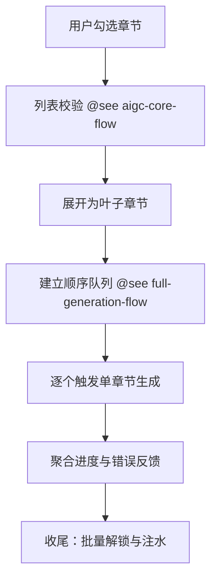

# 多章节顺序 AIGC 场景（纵向手册）

> 面向“批量但不全量”的生成诉求：用户勾选若干章节后，逐个调用 [单章节流程](./single-chapter-aigc-flow.md) 并复用 [全文流程](./full-generation-flow.md) 的队列与进度能力。

## 概览

- **范围**：章节列表校验、顺序调度、失败回退
- **目标用户**：前端开发者、需要定向生成几个章节的运营人员
- **关键任务**：
  1. 将用户勾选的章节列表转为顺序队列
  2. 逐个调用单章节生成并输出综合进度
  3. 在不中断队列的情况下处理失败/跳过

## 信息架构

## 页面蓝图

| 区域       | 显示内容                                     | 可操作              | 可见条件                                    |
| ---------- | -------------------------------------------- | ------------------- | ------------------------------------------- |
| 批量进度条 | 整体百分比、当前章节标题                     | 取消                | `globalOperation=multi_chapter_generation`  |
| 章节列表   | 每个章节状态（待处理/进行中/成功/失败/跳过） | 查看日志 / 单独重试 | 队列非空                                    |
| 队列控制区 | 跳过当前章节、重试失败合集                   | 批量操作            | `progress.failed>0` 或 `progress.skipped>0` |

## 任务流程

| 阶段     | 触发条件          | 关键状态                 | 核心动作                                         | 反馈               |
| -------- | ----------------- | ------------------------ | ------------------------------------------------ | ------------------ |
| 校验     | 接收 `chapterIds` | `selectionState`         | 过滤重复、展开父节点、按树顺序排序、排除锁定章节 | 队列预览           |
| 初始化   | 校验通过          | `multiChapterQueue` 建立 | 批量锁定并清空草稿                               | 章节显示 Loading   |
| 顺序执行 | 队列非空          | `progress.currentIndex`  | 调用单章节生成，按顺序 Streaming                 | 进度条与状态列同步 |
| 收尾     | 队列耗尽          | `multiChapterQueue` 为空 | 全量解锁并触发注水                               | 完成提示与失败列表 |

## 状态与数据

| 名称                | 类型                                                                      | 说明/限制                          | 来源                         |
| ------------------- | ------------------------------------------------------------------------- | ---------------------------------- | ---------------------------- |
| `chapters`          | `RPDetailChapter[]`                                                       | 章节列表，用于展开父节点和验证     | `ReportContentStore` (Redux) |
| `multiChapterQueue` | `string[]`                                                                | 队列内章节 ID，按树顺序排列        | 多选面板                     |
| `progress`          | `{ total:number; currentIndex:number; completed:number; failed:number; }` | 进度信息，驱动顶部进度条           | `ReportContentStore`         |
| `retryTargets`      | `Set<string>`                                                             | 失败章节集合，二次调用降级为单章节 | 队列收尾阶段                 |

## 调度原则

- 严格顺序：始终取队首章节调用单章节流程，保证用户排布的语义顺序。
- 弹性失败：默认跳过失败章节并继续队列，可选配置“失败即停”。
- 跳过策略：跳过的章节标记为 `skipped` 并写入 `retryTargets`，完成后引导用户一键重试。

## 与其他流程的关系

| 能力     | 多章节顺序               | 单章节       | 全文生成       |
| -------- | ------------------------ | ------------ | -------------- |
| 章节来源 | 用户勾选                 | 用户单选     | 自动遍历       |
| 调度逻辑 | 顺序遍历 + 单章节执行    | 无队列       | 队列自动遍历   |
| 失败处理 | 默认不中断，支持列表重试 | 原位重试     | 需重新构建队列 |
| 典型入口 | 章节多选面板             | 章节右键菜单 | 顶栏“生成全文” |

## 复用节点

- `@see ../../../src/store/reportContentStore/hooks/useMultiChapterGeneration.ts` – 队列状态管理。
- `@see ../../../src/store/reportContentStore/hooks/useChapterGeneration.ts` – 单章节 Streaming 复用。
- `@see ./full-generation-flow.md` – 进度聚合与注水策略。

## 相关文档

- [AIGC 核心流程](./aigc-core-flow.md) – 前置校验、异常收敛。
- [单章节 AIGC 场景](./single-chapter-aigc-flow.md) – 被复用的基本单元。
- [全文生成场景](./full-generation-flow.md) – 队列与注水基线。
- [数据层指南](./data-layer-guide.md#26-与生成重生成的配合) – 草稿与锁定策略。
