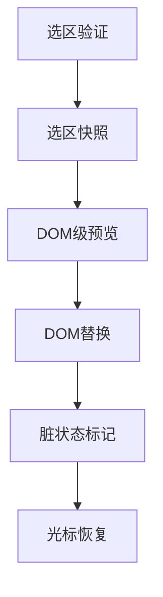

# 选中文本 AI 改写场景（纵向手册）

> 本文讲述选中文本 AI 改写的选区级实现，专注于选区管理、DOM 操作、光标恢复等选区特有的处理机制。基于 [AIGC 核心流程](./aigc-core-flow.md)，但采用 DOM 替代注水的渲染策略。

## 概览

- **范围**：选区验证、DOM 级内容替换、光标恢复、选区状态管理
- **目标用户**：前端开发者、选区级交互实现者
- **关键用例**：
  1. 选区有效性验证与快照
  2. DOM 级流式预览
  3. 选区内容替换与恢复
  4. 脏状态标记与保存触发

## 信息架构

## 页面蓝图

| 区域 | 显示内容 | 可操作 | 可见条件 |
| ----- | --------- | ------- | --------- |
| 选区提示区 | 选区有效性、字符统计、改写建议 | 触发改写、取消 | 用户选中内容时 |
| 改写预览区 | 实时生成内容预览 | 接受/撤销 | 改写进行中 |
| 状态指示器 | 改写进度、操作状态 | 取消操作 | `globalOperation=text_rewrite` |

## 任务流程

### 选区验证阶段

| 触发条件 | 关键状态 | 主要动作 | 反馈 |
| --------- | --------- | --------- | ----- |
| 用户选中内容 | `selectionRange`, `text.length` | 验证选区长度（10-2000字符）、位置、上下文 | 有效性提示、改写建议 |

### 选区快照阶段

| 触发条件 | 关键状态 | 主要动作 | 反馈 |
| --------- | --------- | --------- | ----- |
| 验证通过 | `textRewriteState.selection` | 保存 Range、前后文上下文、支持失败恢复 | 选区高亮锁定 |

### DOM 级流式阶段

| 触发条件 | 关键状态 | 主要动作 | 反馈 |
| --------- | --------- | --------- | ----- |
| 改写请求发送 | `parsedTextRewriteMessages` | 创建临时预览元素、实时更新内容 | 选区位置实时预览 |

### 完成替换阶段

| 触发条件 | 关键状态 | 主要动作 | 反馈 |
| --------- | --------- | --------- | ----- |
| 收到完成信号 | `textRewriteState.completed=true` | DOM 直接替换选区内容、设置脏状态 | 内容更新成功提示 |

## 核心设计

### 选区验证策略

**验证规则：**
- 长度限制：10-2000 字符
- 位置验证：必须在可编辑区域内
- 上下文检查：确保选区有足够的上下文信息

**验证设计思路：**
- 验证选区长度是否在有效范围内（10-2000字符）
- 检查选区位置是否在可编辑区域内
- 确保选区具有足够的上下文信息支持AI改写

### 选区快照机制

**快照内容：**
- 选区范围信息（start/end container + offset）
- 原始文本内容
- 前后文上下文（各 100 字符）
- 时间戳与有效性标记

**恢复策略：**
- 失败时自动恢复原始选区
- 支持用户手动撤销改写
- 保证编辑器状态一致性

### DOM 级替换策略

**与章节级对比：**
- 章节级：通过注水机制同步内容
- 选区级：直接 DOM 操作替换内容

**替换流程：**
1. 使用 TinyMCE selection API 直接替换
2. 光标定位到改写内容结尾
3. 标记文档为脏状态，触发保存流程

### 状态管理优化

**状态管理思路：**
- 维护选区改写的完整生命周期状态
- 保存选区快照和原始文本内容，支持失败恢复
- 跟踪改写进度和错误信息，提供实时反馈

## 性能优化

### 选区操作优化

**性能目标：**
- 选区创建：< 50ms
- 验证耗时：< 10ms
- 预览更新：< 100ms
- 替换操作：< 200ms

**内存管理：**
- 选区对象及时清理
- 预览元素完成后移除
- 避免选区缓存膨胀

### 用户体验增强

**智能选区扩展：**
- 自动扩展到完整句子
- 支持语义单元扩展
- 智能边界检测

**快捷键支持：**
- Ctrl+R/Cmd+R：触发改写
- Enter：接受结果
- Escape：取消操作

## 与章节级生成的对比

| 特性 | 文本改写 | 章节生成 |
| ---- | -------- | -------- |
| **操作粒度** | 选区级 | 章节级 |
| **渲染策略** | DOM 直接替换 | 注水机制同步 |
| **状态管理** | 选区快照 + 脏状态 | 章节锁定 + 基线更新 |
| **用户等待** | 极短 | 可能较长 |
| **恢复策略** | 选区级恢复 | 章节级注水 |
| **保存触发** | 立即设置 hasDirty | 生成完成后直接落盘 |

## 调试关注点

### 选区状态监控
- 选区有效性实时验证
- Range 位置变化跟踪
- DOM 操作结果确认

### 性能指标
- 选区操作响应时间
- 预览更新流畅度
- 替换操作成功率

## 相关文档

- [AIGC 核心流程](./aigc-core-flow.md) - 通用前置校验与流式处理
- [数据层指南](./data-layer-guide.md §2.3) - 规范化与文档级哈希
- [渲染与展示指南](../RPEditor/rendering-and-presentation-guide.md §7-8) - 选区操作与 DOM 更新

> 一句话总结：文本 AI 改写通过**选区精确管理**、**DOM 级操作**和**脏状态触发**，实现了最细粒度的智能编辑能力，是 AIGC 体系中用户交互最直接的功能。