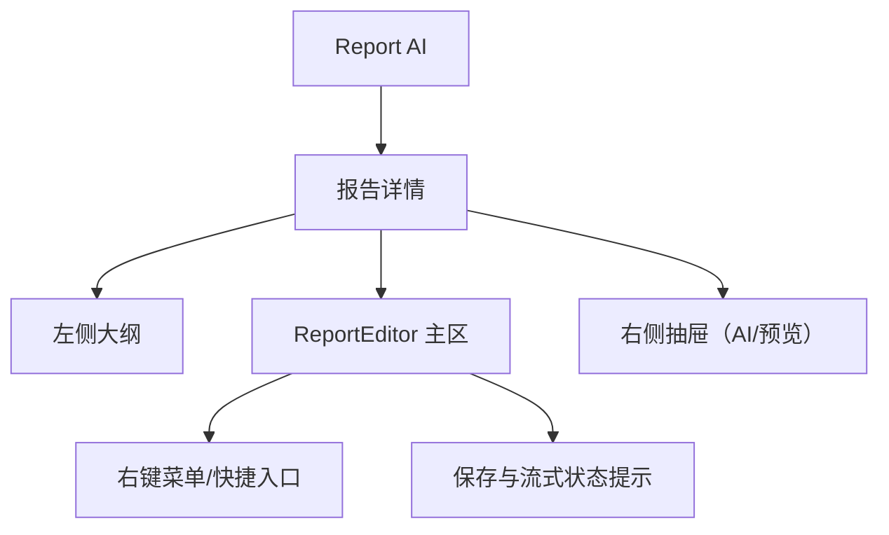
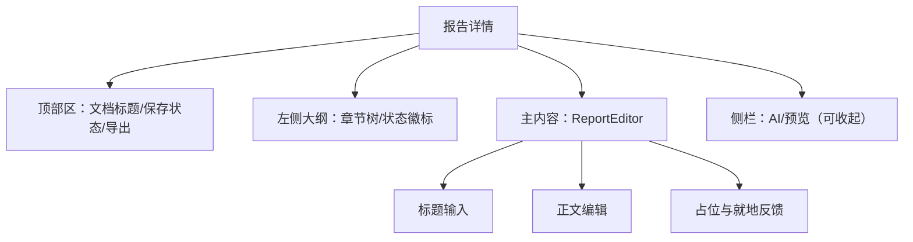
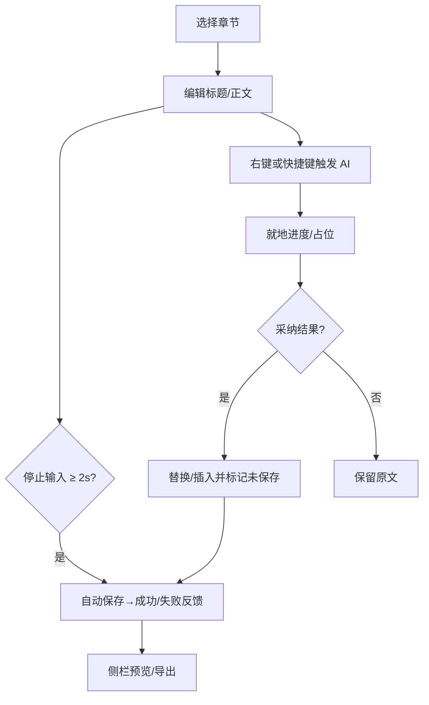
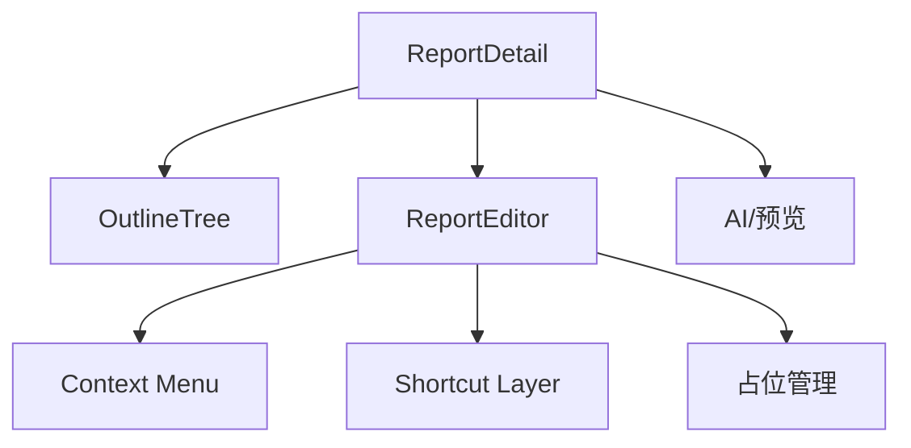

# ReportEditor 前端设计文档（布局与功能）

## 🧭 设计概览

- 功能范围：章节化编辑（标题/正文）、AI 辅助（润色/续写/翻译/摘要）、自动保存、外部渲染占位、导出、权限与冲突处理。
- 边界：不含样式与技术细节；不定义后端 API 契约；聚焦布局、功能与交互流程。
- 目标用户与场景：报告创作者在单页内完成多章节编辑与 AI 协作，保障内容安全与连续写作体验。
- 关键用例：
  - 浏览/定位章节 → 编辑标题/正文 → 自动保存反馈
  - 选区或光标触发 AI → 结果就地采纳/插入
  - 章内流式更新与 Loading/Citation 占位
  - 导出 Word/PDF/HTML

## 🗺 信息架构与导航

- 入口：从报告列表/大纲会话“生成全文”进入详情；定位到首个可编辑章节。
- 返回：返回报告列表或上游会话；未保存时提示。
- 导航规则：选中章节联动主区内容；侧栏承载 AI 与预览，不阻断编辑。

## 🧱 页面蓝图（报告详情 - 编辑视图）

- 目标与完成标准：在连续编辑体验下完成章节编辑、AI 协作与导出，并提供清晰的状态与错误反馈。

| 区域     | 职责           | 显示数据             | 允许操作               | 条件/可见性 |
| -------- | -------------- | -------------------- | ---------------------- | ----------- |
| 顶部区   | 标题与全局动作 | 文档标题、保存状态   | 导出、打开预览/AI      | 常显        |
| 左侧大纲 | 定位与导航     | 章节名、状态徽标     | 选择章节、折叠         | 常显        |
| 主内容   | 章节编辑       | 章节标题、正文、占位 | 编辑/撤销重做/右键菜单 | 常显        |
| 侧栏     | 辅助工作区     | AI 工具、预览        | 打开/关闭、执行任务    | 默认收起    |

- 状态与反馈：
  - 加载：首次与切换章节显示骨架/占位
  - 空：未选择章节时给出指引
  - 错误：保存/AI/网络异常就地提示与重试入口
  - 提交：自动保存/导出/AI 进行中禁重复触发
  - 保存：顶部 `SaveStatusIndicator` 展示当前保存进度、错误信息与「保存全部 / 重试」动作

## 🔄 交互流程与状态

| 触发条件    | 系统行为         | 用户反馈                | 可撤销       | 备注            |
| ----------- | ---------------- | ----------------------- | ------------ | --------------- |
| 停止输入    | 自动保存         | 底部/就地提示 成功/失败 | 否           | 失败可重试      |
| 右键/快捷键 | 展示菜单/执行 AI | 进度/占位与结果卡       | 是（不采纳） | 选区/光标态要求 |
| 导出开始    | 锁定导出面板     | 进度/完成/失败          | 否           | 导出格式三选    |

## 🧮 数据与本地状态（技术无关）

- 显示字段与约束：
  - 标题（必填 ≤ 60 字）
  - 正文（富文本，脚本类禁止）
  - 保存状态（saving/saved/failed）
  - 占位状态（running/paused/done）
- 数据来源：
  - 章节内容：按需加载与保存
  - AI 结果：流式/普通两类，结果就地展示
- 刷新与缓存：切换章节刷新主区；保存成功回写左侧状态；AI 结果历史保留在侧栏
- 并发与重复提交：保存/导出互斥；AI 可取消；失败不覆盖原文

## 🧩 组件分解与复用

- 组件职责：
- Context Menu：基于 TinyMCE 默认 context menu 承载 AI 与全部编辑命令，取代顶部 Toolbar
- Shortcut Layer：封装快捷键、自动弹出逻辑与命令分发
- 占位管理：Loading/Citation 等就地占位与还原

- 主上下文菜单采用横向布局，仅 `AI 改写` 维持纵向二级菜单，保持浏览效率

## 子专题设计（链接）

- Toolbar（停用策略）：./Toolbar/design.md
- Context Menu：./ContextMenu/design.md
- 样式方案：./Styles/design.md
- 章节内容渲染：./rendering-and-presentation-guide.md - 章节 HTML 生成、格式转换、流式更新
- 外部组件渲染：./external-component-rendering.md - Loading 占位、AIGC 按钮、文本改写预览
- 内容管理（编排/流式/状态/重试/版本）：../ContentManagement/README.md
- API 概览（仅作对接参考）：./API/overview.md

## 🚫 非目标与不包含

- 不含视觉样式规范（配色、字体、间距等）
- 不定义后端接口契约（另见 API 文档）

## ✅ 检查清单（布局与功能）

- [ ] 页面蓝图与区域职责明确
- [ ] 主要任务端到端流程完整
- [ ] 加载/空/错误/提交状态可见
- [ ] 导航与返回路径清晰
- [ ] 禁用/确认/撤销策略已定义
- [ ] 组件边界清晰并可复用
