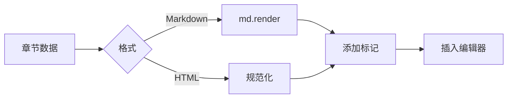

# 章节内容渲染设计

> 📖 本文档遵循 [设计文档编写规范](../../../docs/rule/design-doc.md)  
> ↩️ 回链：[ReportEditor 设计](./design.md)

## 🧭 设计概览

将章节树结构转换为 TinyMCE 可编辑的 HTML 内容，支持 Markdown/HTML 双格式，处理流式更新与内容规范化。

## 🗺 渲染流程



**核心步骤**：获取章节数据 → 格式转换 → 添加标记（loading/citation） → 插入编辑器 → 触发外部组件渲染。

## 🧱 渲染策略

| 场景     | 触发时机       | 实现方式                       | 代码位置                 |
| -------- | -------------- | ------------------------------ | ------------------------ |
| 初始渲染 | 进入/切换章节  | `editor.setContent(html)`      | `chapter/render.ts`      |
| 流式更新 | AI 生成内容    | 增量更新 DOM，保留光标         | `useStreamingPreview`    |
| 用户编辑 | 手动修改内容   | 监听 `change` 事件同步到 Redux | `ReportEditor/index.tsx` |
| 状态同步 | Redux 状态变化 | 对比差异，按需更新编辑器       | `useEditorDraftSync`     |

## 🏷 特殊标记

### Loading 占位

标识正在生成的章节，供外部组件渲染加载动画。

```html
<div data-chapter-id="xxx" data-chapter-loading="true">
  <!-- 章节内容 -->
</div>
```

### Citation 引用

标识引用来源，支持点击跳转。

```html
<span class="citation" data-ref-id="xxx" data-ref-type="file">[1]</span>
```

## 📋 数据格式

| 格式     | 来源     | 转换方式           | 备注             |
| -------- | -------- | ------------------ | ---------------- |
| Markdown | AI 生成  | `md.render()`      | 支持扩展语法     |
| HTML     | 用户编辑 | 规范化处理         | 清理不安全内容   |
| 空内容   | 新建章节 | 插入 `<p><br></p>` | 保证编辑器可聚焦 |

## 🔄 状态同步

**编辑器 → Redux**：监听 `editor.on('change')` → 获取 HTML → 回调更新 Redux → 触发自动保存。

**Redux → 编辑器**：监听 Redux 变化 → 对比内容 → 按需调用 `setContent()` 或增量更新 → 保留光标。

## 🛠 核心函数

### renderChapterToHtml

将章节数据转换为 HTML 字符串。

**代码**：`@/domain/reportEditor/chapter/render.ts`

---

### updateChapterContent

增量更新章节内容，用于流式更新。

**代码**：`@/domain/reportEditor/chapter/update.ts`

---

### normalizeChapterHtml

规范化 HTML：清理不安全标签、统一标题层级、添加章节容器。

**代码**：`@/domain/reportEditor/chapter/render.ts`

## 📋 错误处理

| 场景              | 处理策略           |
| ----------------- | ------------------ |
| Markdown 解析失败 | 降级显示原始文本   |
| HTML 注入风险     | 清理不安全标签     |
| 章节容器未找到    | 跳过更新，记录日志 |
| 编辑器未就绪      | 延迟渲染，等待就绪 |

**原则**：渲染失败不阻塞编辑器，优雅降级保证基本功能。

## 相关文档

- [ReportEditor 设计](./design.md)
- [外部组件渲染设计](./external-component-rendering.md)
- [内容管理架构](../ContentManagement/data-layer-guide.md)
