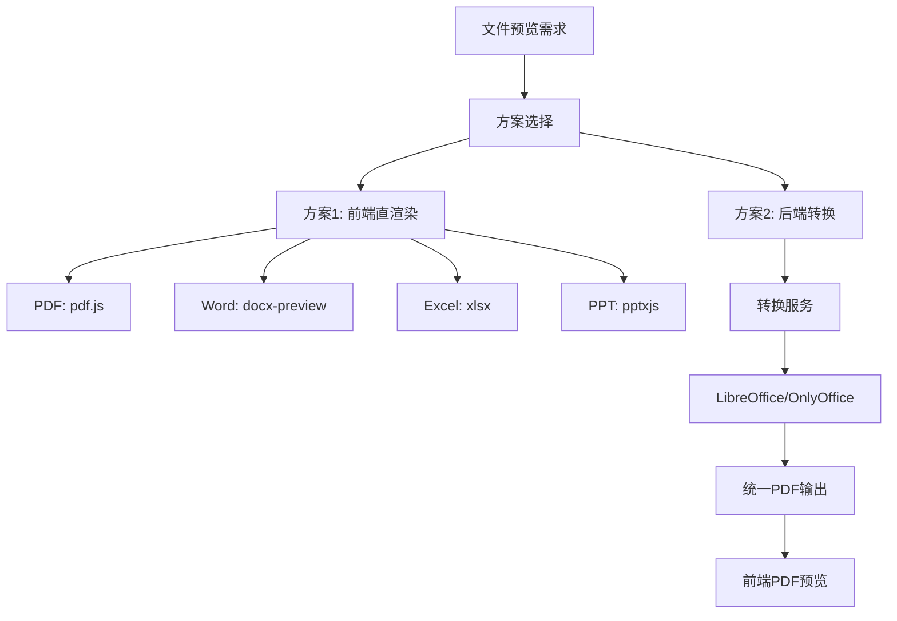
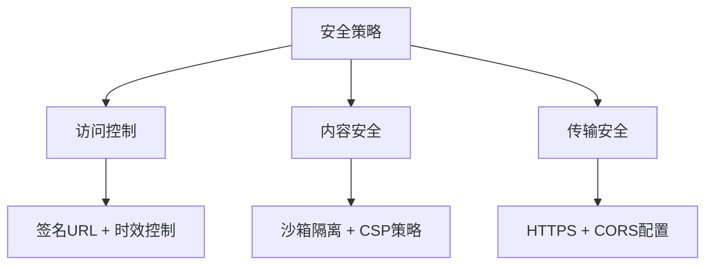
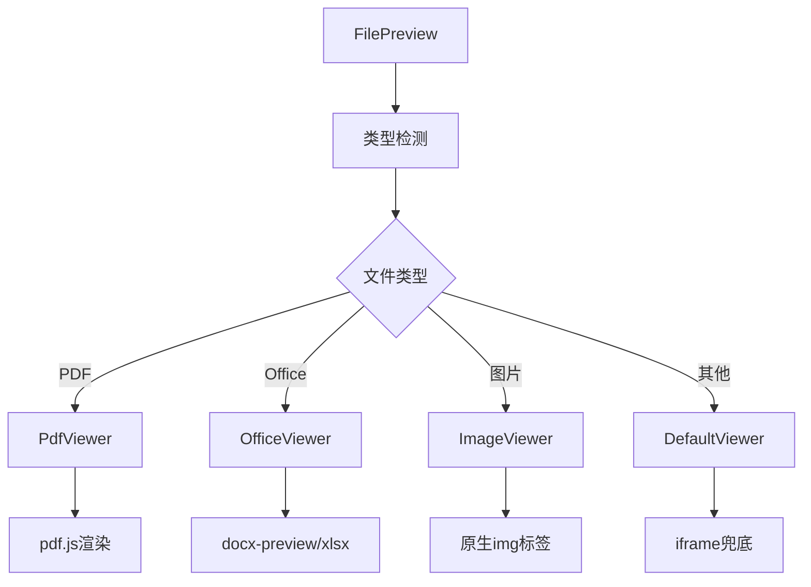
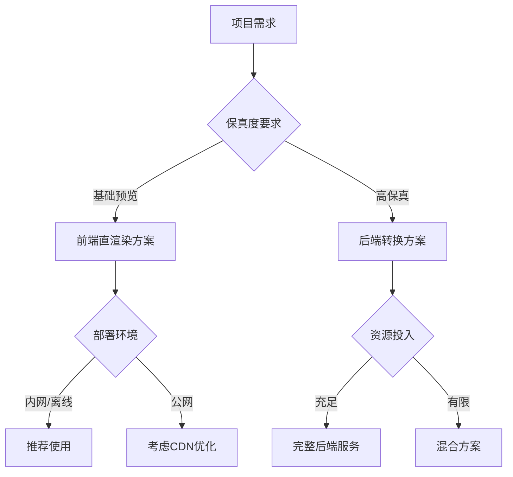

# 文件预览技术选型

## 概述

React应用中文件预览的技术方案选型指南，对比纯前端直渲染和后端转换两种主要方案。支持PDF、Office文档等多格式预览，外部链接新页面打开。

**方案对比**：前端直渲染 vs 后端转换统一
**适用场景**：内部系统、高保真预览、协作编辑等
**技术选择**：基于项目需求和资源约束的最优方案

## 方案对比

## 方案详解

### 方案1: 前端直渲染

| 文件类型  | 核心技术        | 保真度 | 功能特性       | 适用场景     |
| --------- | --------------- | ------ | -------------- | ------------ |
| **PDF**   | pdf.js + Canvas | 高     | 缩放/搜索/书签 | 完整PDF预览  |
| **Word**  | docx-preview    | 中等   | 基础样式/图片  | 简单文档预览 |
| **Excel** | xlsx + 表格组件 | 高     | 表格展示/公式  | 数据表格展示 |
| **PPT**   | pptxjs          | 一般   | 基础幻灯片     | 简单演示文档 |

**优势**：无后端依赖、快速集成、离线可用
**限制**：复杂格式保真度有限、字体支持受限

### 方案2: 后端转换

| 转换引擎        | 特点                 | 适用场景 | 部署复杂度 |
| --------------- | -------------------- | -------- | ---------- |
| **LibreOffice** | 免费开源，格式支持全 | 通用场景 | 中等       |
| **OnlyOffice**  | 高保真，企业级       | 商业项目 | 中等       |
| **Collabora**   | 协同编辑，高质量     | 协作场景 | 高         |

**优势**：高保真度、统一体验、权限控制、缓存优化
**限制**：需要后端服务、部署复杂、资源消耗大

## 性能优化

| 优化策略       | 实现方式       | 性能提升       | 适用场景     |
| -------------- | -------------- | -------------- | ------------ |
| **代码分割**   | 动态import加载 | 减少首屏包体积 | 大型预览库   |
| **Web Worker** | 后台文件解析   | 避免主线程阻塞 | PDF渲染处理  |
| **虚拟滚动**   | 可视区域渲染   | 减少DOM节点    | 长文档预览   |
| **缓存策略**   | 本地存储缓存   | 减少重复解析   | 重复访问文件 |

## 安全考虑

## 组件设计

## 技术选型决策

## 方案选择指南

| 需求场景         | 推荐方案   | 关键考虑因素       | 实现复杂度 |
| ---------------- | ---------- | ------------------ | ---------- |
| **内部文档预览** | 前端直渲染 | 快速集成、离线可用 | 低         |
| **高保真展示**   | 后端转换   | 版式准确、统一体验 | 中         |
| **企业级应用**   | 混合方案   | 性能与质量平衡     | 高         |
| **协作编辑**     | 商业SDK    | 功能完整性         | 中         |

## 技术依赖

### 前端核心库

| 文件类型  | 核心依赖               | 安装命令                                     |
| --------- | ---------------------- | -------------------------------------------- |
| **PDF**   | @react-pdf-viewer/core | `pnpm add @react-pdf-viewer/core pdfjs-dist` |
| **Word**  | docx-preview           | `pnpm add docx-preview`                      |
| **Excel** | xlsx + react-data-grid | `pnpm add xlsx react-data-grid`              |
| **PPT**   | pptxjs                 | `pnpm add pptxjs`                            |

### 后端转换服务

| 服务类型        | 技术栈           | 部署方式      | 特点                 |
| --------------- | ---------------- | ------------- | -------------------- |
| **LibreOffice** | Docker + Node.js | 容器化        | 免费开源，格式支持全 |
| **OnlyOffice**  | Document Server  | Docker/云服务 | 企业级，高保真       |

## 实施建议

基于现有Vite + monorepo结构，建议封装为独立的`packages/file-preview`包，供各应用复用。包含统一预览组件、类型定义和工具函数，支持本地文件和远程URL预览，具备后端转换兜底能力。

---

_文档版本: v1.0 | 更新时间: 2024年12月_

## 与置顶文件的关系

- 置顶文件（Top Files）使用与引用文件相同的预览管线与组件：`ReferenceItemFile` + `FilePreview`。
- 不引入新的预览库或转换策略，技术选型保持一致。
- 需要关注的唯一差异是状态叠加：在选择器层面通过 `pendingFileStatusMap` 对 `UPLOADED`、`OUTLINE_PARSED` 等可变状态进行实时覆盖，确保预览前的状态展示一致性。
