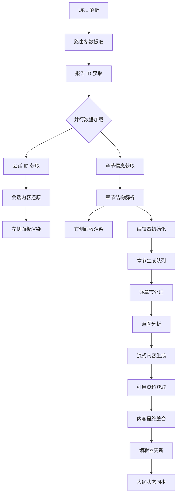
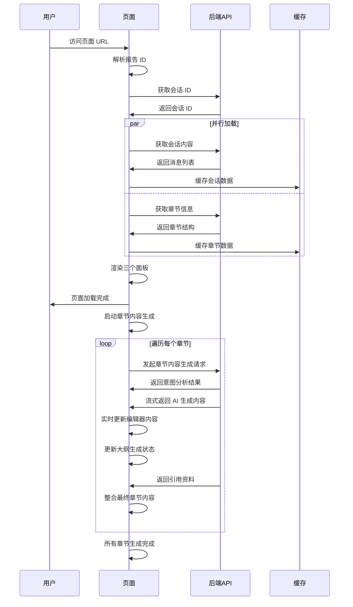
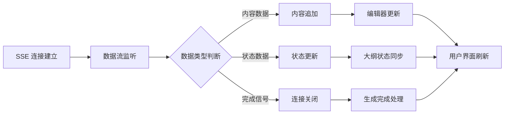
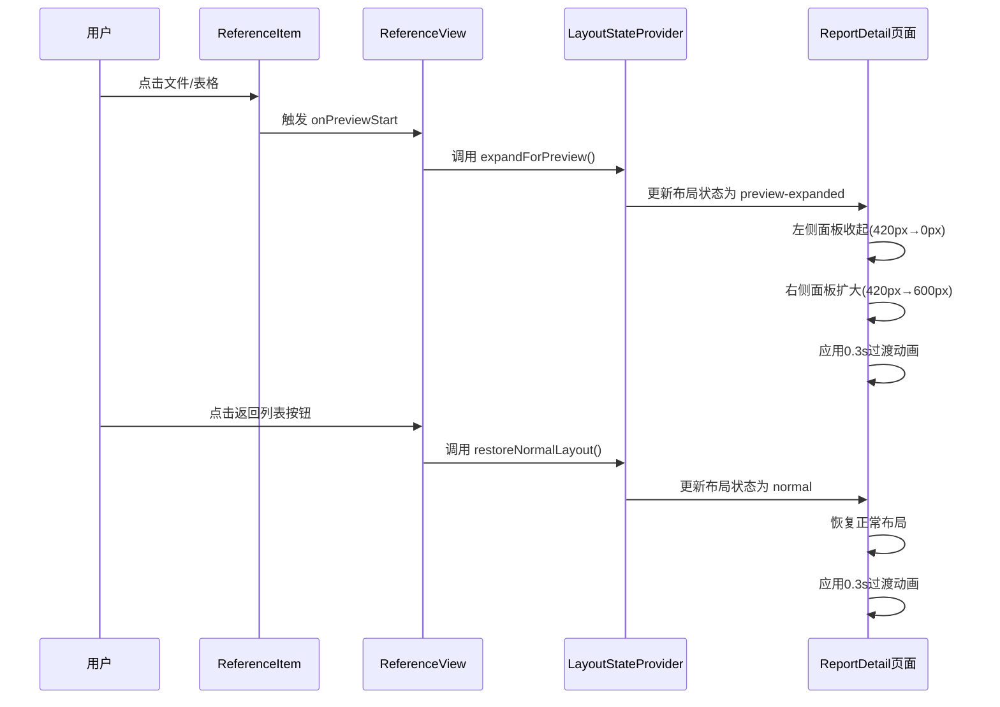

# AI 报告页面 - 技术设计总览

## 1. 项目概述

### 1.1 技术架构概览

AI 报告页面采用三栏布局设计，集成 AI 对话、报告编辑和大纲展示功能，基于 React + TypeScript 技术栈构建。

### 1.2 整体布局架构

```
┌─────────────────────────────────────────────────────────────────┐
│                        顶部导航栏                                │
├─────────────┬─────────────────────────────┬─────────────────────┤
│             │                             │                     │
│   左侧区域   │         中间区域             │      右侧区域        │
│             │                             │                     │
│  AI 对话面板 │      报告内容编辑器           │    大纲展示面板      │
│             │                             │                     │
│   - 会话历史  │    - TinyMCE 编辑器        │   - 章节结构树       │
│   - 消息列表  │    - 实时保存             │   - 生成状态指示      │
│   - 输入框   │    - AI 辅助功能          │   - 章节导航         │
│             │                             │                     │
├─────────────┴─────────────────────────────┴─────────────────────┤
│                        底部状态栏                                │
└─────────────────────────────────────────────────────────────────┘
```

## 2. 技术架构设计

### 2.1 组件架构设计

| 组件层级     | 组件名称     | 主要职责             | 子组件             | 状态管理                                           |
| ------------ | ------------ | -------------------- | ------------------ | -------------------------------------------------- |
| **页面层**   | ReportAIPage | 页面布局和路由       | 三个主要面板       | 全局状态                                           |
| **布局层**   | MainLayout   | 响应式布局管理       | 左中右三栏         | 布局状态                                           |
| **功能层**   | ChatPanel    | AI 对话功能          | 消息列表、输入框   | 会话状态                                           |
| **功能层**   | EditorPanel  | 报告编辑功能         | 编辑器、工具栏     | 编辑状态                                           |
| **功能层**   | OutlinePanel | 大纲展示功能         | 树形结构、状态指示 | 大纲状态                                           |
| **组件层**   | 各功能组件   | 具体业务逻辑         | 原子组件           | 局部状态                                           |
| **扩展功能** | OutlineChat  | 大纲生成、编辑、确认 | -                  | [查看详情](./AI对话%20-%20大纲生成技术设计文档.md) |

### 2.2 数据流架构



### 2.3 状态管理架构

| 状态模块     | 状态内容               | 数据来源 | 更新时机      | 影响组件 |
| ------------ | ---------------------- | -------- | ------------- | -------- |
| **报告状态** | 报告基本信息、生成状态 | API 获取 | 页面初始化    | 全局组件 |
| **会话状态** | 消息列表、输入状态     | 会话 API | 消息收发      | 左侧面板 |
| **章节状态** | 章节列表、生成进度     | 章节 API | 生成过程      | 右侧面板 |
| **编辑状态** | 编辑内容、保存状态     | 编辑器   | 内容变化      | 中间面板 |
| **布局状态** | 面板宽度、响应式状态   | 用户交互 | 布局调整      | 布局组件 |
| **预览状态** | 预览模式、布局模式     | 预览交互 | 预览开始/结束 | 全局布局 |

## 3. 核心功能技术设计

### 3.1 页面初始化设计



### 3.2 AI 内容生成技术流程

| 生成阶段     | 处理内容       | 技术方案      | 数据流向    | 状态更新   |
| ------------ | -------------- | ------------- | ----------- | ---------- |
| **意图分析** | 章节上下文分析 | 同步 API 调用 | 前端 → 后端 | 分析中状态 |
| **内容生成** | 流式内容输出   | SSE 长连接    | 后端 → 前端 | 生成中状态 |
| **引用获取** | 相关资料查找   | 异步 API 调用 | 前端 → 后端 | 处理中状态 |
| **内容整合** | 最终内容组装   | 前端数据合并  | 本地处理    | 完成状态   |

### 3.3 流式数据处理设计



### 3.4 实时同步机制设计

| 同步场景          | 触发条件      | 同步方式        | 数据传输      | 冲突处理 |
| ----------------- | ------------- | --------------- | ------------- | -------- |
| **编辑器 → 大纲** | 内容结构变化  | 解析标题层级    | 内存传递      | 重新解析 |
| **大纲 → 编辑器** | 点击章节导航  | 滚动定位        | 位置计算      | 平滑滚动 |
| **生成状态同步**  | AI 生成进度   | 状态广播        | 事件机制      | 状态覆盖 |
| **保存状态同步**  | 编辑内容保存  | 防抖保存        | HTTP 请求     | 重试机制 |
| **布局状态同步**  | 预览开始/结束 | Context状态管理 | React Context | 状态覆盖 |

### 3.5 动态布局设计



| 布局状态             | 左侧面板宽度 | 右侧面板宽度 | 中间区域 | 过渡时间 |
| -------------------- | ------------ | ------------ | -------- | -------- |
| **normal**           | 420px        | 420px        | flex: 1  | -        |
| **preview-expanded** | 0px (隐藏)   | 600px        | flex: 1  | 0.3s     |

## 5. 接口设计规范

### 5.1 数据接口定义

| 接口类型             | 接口路径                                       | 数据格式         | 响应结构                      |
| -------------------- | ---------------------------------------------- | ---------------- | ----------------------------- |
| **获取会话ID**       | `/api/reports/{reportId}/session`              | 路径参数         | `{ sessionId: string }`       |
| **获取报告章节信息** | `/api/reports/{reportId}/sections`             | 路径参数         | `{ sections: SectionInfo[] }` |
| **获取单个章节信息** | `/api/reports/{reportId}/sections/{sectionId}` | 路径参数         | `{ section: SectionContent }` |
| **更新单个章节信息** | `/api/reports/{reportId}/sections/{sectionId}` | JSON（章节内容） | `{ section: SectionContent }` |
