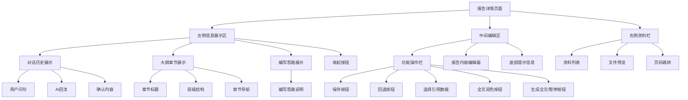
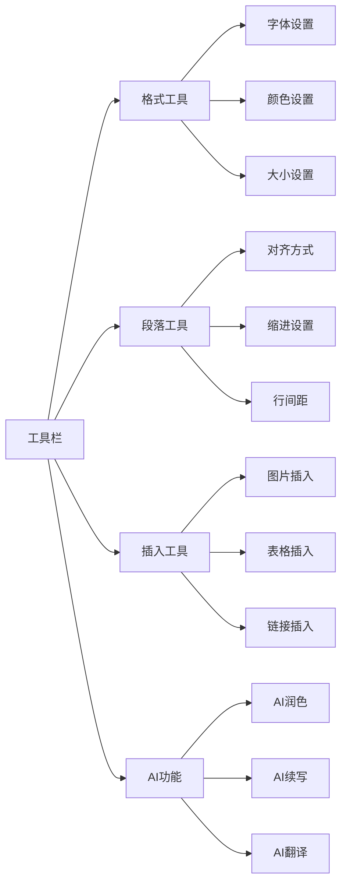

# 报告详情模块需求文档

## 模块概述

报告详情模块是Report AI系统的最终输出环节，采用三栏布局设计，提供报告生成、实时编辑、引用管理等功能。左侧为对话、大纲章节、章节编写思路展示区域，中间为报告编辑区域，右侧为引用资料管理区域。

## 功能需求

### 三栏布局设计

- **左侧信息展示区**:
  - **对话历史**: 显示用户初始问句和确认的大纲内容，带入上一页对话内容
  - **大纲章节**: 展示完整的报告大纲结构，标题不可编辑，仅作展示
  - **编写思路**: 显示各章节的编写思路，不可编辑，仅作展示
  - **收起功能**: 点击收起按钮可将左边栏收至左侧，引用素材页面变大
- **中间编辑区**: 报告生成和编辑的主要区域，分为上方功能操作和下方内容生成
- **右侧资料栏**: 引用资料和文件管理，支持文件预览和页码跳转

### 报告生成功能

- **自动生成**: 进入页面后自动根据大纲生成报告
- **流式生成**: 支持实时流式内容生成
- **暂停控制**: 生成过程中可随时暂停，暂停按钮样式参考Alice Writer
- **重新生成**: 支持重新生成全文或章节，鼠标悬停章节标题显示重新生成按钮
- **缺失数据提示**: 无法找回章节包含字段数据时，在段落末尾展示温馨提示，提示用户上传附件补充数据
- **操作按钮**: 提供保存、回退、选择引用数据、全文润色、生成全文等操作按钮

### 富文本编辑功能

- **格式编辑**: 支持字体、颜色、大小等格式编辑
- **段落编辑**: 支持段落对齐、缩进等段落编辑
- **内容编辑**: 支持文本内容的增删改查
- **撤销重做**: 支持编辑操作的撤销重做
- **选中操作**: 选中正文内容弹出操作工具栏：AI改写、标题层级、加粗、倾斜、下划线、字体颜色、段落、字体、字号、复制、剪切
- **AI改写**: 点击AI改写弹出输入框和11种快捷操作：调整文字表达、完善表达、翻译文字、调整文字长度、缩写内容、扩写内容、续写内容、总结并列举选中内容、总结标题、列举关键点、表格生成
- **Alice AI提示**: 每个正文章节段落末展示提示：在空行按下空格键唤出Alice AI；选中文字可AI改写

### 引用资料管理功能

- **资料展示**: 展示后端返回的引用资料列表，按类型分组显示
- **PDF预览**: 点击PDF文件可预览具体内容，支持页码跳转和缩放
- **表格预览**: 点击表格可预览表格数据内容
- **外部链接**: 点击外部链接在新页面打开
- **动态布局**: 预览时自动收起左侧面板，扩大右侧预览区域

## 用户流程

## 界面设计

### 页面布局

### 工具栏功能

## 业务规则

### 报告生成规则

- **自动生成**: 进入页面后自动根据大纲生成报告
- **流式生成**: 支持实时流式生成内容
- **暂停控制**: 生成过程中可随时暂停，正在生成中的报告，生成全文不可点击或点击无效
- **重新生成**: 支持重新生成全文或章节，鼠标悬停在章节标题展示重新生成按钮
- **引用数据选择**: 提供三种选择模式：引用附件数据用公开数据补充（默认）、只引用附件数据、只用公开数据补充
- **缺失数据提示**: 报告生成中如无法找回章节包含字段数据，在段落末尾展示温馨提示和上传建议，该提示在报告导出和模板保存中不展示
- **并发编辑限制**: 仅可同时编辑两份报告，超过则toast提示

### 底部提示信息

- **AI生成声明**: 报告生成页底部展示提示：内容由AI生成，请核查重要信息
- **缺失数据提示**: 在每个段落末尾展示温馨提示：根据当前引用数据范围，暂未找到该企业的【字段名称】数据，如果您有以上数据，您可以上传附件，我们将补充到报告中。该提示在报告导出和模板保存中不展示

### 编辑操作规则

- **格式编辑**: 支持字体、颜色、大小等格式编辑
- **段落编辑**: 支持段落对齐、缩进等段落编辑
- **内容编辑**: 支持文本内容的增删改查
- **撤销重做**: 支持编辑操作的撤销重做，点击回退按钮撤回上一步操作
- **只读内容**: 对话历史、大纲章节标题和编写思路不可编辑，仅作展示
- **选中操作**: 选中正文内容弹出AI改写、标题层级、加粗、倾斜、下划线、字体颜色、段落、字体、字号、复制、剪切等操作
- **AI改写功能**: 点击AI改写弹出输入框和11种快捷操作：调整文字表达、完善表达、翻译文字、调整文字长度、缩写内容、扩写内容、续写内容、总结并列举选中内容、总结标题、列举关键点、表格生成

### 引用资料管理规则

- **资料展示**: 按文件、表格、外部链接三种类型分组展示
- **PDF预览**: 仅支持PDF格式文件预览，其他文件提供下载
- **页码跳转**: PDF预览支持跳转到具体页码位置
- **表格预览**: 表格数据在右侧面板直接展示
- **外部链接**: 外部链接在新标签页打开，不影响当前页面
- **动态布局**: 点击收起按钮可将左边栏收至左侧，引用素材页面变大；预览时自动收起左侧面板，扩大右侧预览区域

## 交互规范

### AI对话交互

- **历史显示**: 显示用户初始问句和确认的大纲内容
- **素材管理**: 显示上传的素材，点击"X"可删除
- **生成控制**: 生成全文按钮控制报告生成，生成中时不可点击
- **暂停功能**: 正在生成时可点击暂停停止生成

### 大纲交互

- **大纲展示**: 展示完整的报告大纲结构
- **章节导航**: 点击章节可跳转到对应位置
- **进度指示**: 显示各章节的生成进度
- **状态区分**: 区分已生成、生成中、未生成状态

### 编辑交互

- **工具栏**: 提供字体、段落、插入等编辑工具
- **选择编辑**: 选中内容后显示Alice AI按钮
- **上下文生成**: 悬停段落标题显示生成上下文按钮
- **实时保存**: 编辑内容自动保存

### 资料管理交互

- **资料列表**: 显示后端返回的引用资料，按类型分组展示
- **PDF预览**: 点击PDF文件可预览具体内容，支持页码跳转和缩放
- **表格预览**: 点击表格可在右侧面板预览表格数据
- **外部链接**: 点击外部链接在新标签页打开
- **动态布局**: 进入预览时左侧面板收起(420px→0px)，右侧面板扩大(420px→600px)，包含0.3s平滑过渡动画
- **布局恢复**: 返回列表时自动恢复正常布局，保持良好的用户体验

## 异常处理

### 生成错误

- **生成失败**: 提示"生成失败，请重试"
- **网络错误**: 提示"网络连接失败，请检查网络"
- **服务异常**: 提示"AI服务暂时不可用，请稍后重试"

### 编辑错误

- **保存失败**: 提示"保存失败，请重试"
- **格式错误**: 提示"格式设置失败，请重试"
- **内容错误**: 提示"内容编辑失败，请重试"

### 资料管理错误

- **文件不存在**: 提示"引用文件不存在，已自动移除"
- **PDF预览失败**: 提示"PDF文件预览失败，请检查文件格式"
- **页码错误**: 提示"页码超出范围，请检查页码"
- **权限错误**: 提示"无权限访问该文件"

## 性能要求

### 响应时间

- **页面加载**: < 2秒
- **内容生成**: < 5秒
- **编辑操作**: < 200ms
- **保存操作**: < 1秒
- **PDF预览**: < 3秒

### 并发处理

- **多用户编辑**: 支持多用户同时编辑
- **实时保存**: 支持实时自动保存
- **状态同步**: 实时同步编辑状态

## 验收标准

### 功能完整性

- [ ] 三栏布局正常工作
- [ ] 左侧信息展示区功能正常（对话历史、大纲章节、编写思路）
- [ ] 报告生成功能稳定
- [ ] 富文本编辑功能完整
- [ ] 引用资料管理功能正常
- [ ] PDF预览和页码跳转功能正常
- [ ] 动态布局切换正常，预览时左侧收起、右侧扩大
- [ ] 布局过渡动画流畅，用户体验良好
- [ ] 操作按钮功能完整（保存、回退、引用数据选择、全文润色、生成全文）
- [ ] AI改写功能完整，支持11种快捷操作
- [ ] 缺失数据提示功能正常，导出时自动隐藏
- [ ] 并发编辑限制功能正常（最多2份报告）

### 交互体验

- [ ] 编辑操作流畅自然，选中文本弹出工具栏
- [ ] 悬停章节标题显示重新生成按钮
- [ ] 资料管理便捷，收起功能正常
- [ ] PDF预览体验良好
- [ ] 错误处理友好
- [ ] Alice AI提示功能正常，空行空格唤出功能

### 性能指标

- [ ] 页面加载速度快
- [ ] 内容生成及时，支持流式显示
- [ ] 编辑操作流畅，操作反馈及时
- [ ] PDF预览响应及时
- [ ] 系统稳定性良好，支持并发编辑

## 相关文档

### 子模块文档

- [AI对话模块](./AIChat/README.md) - AI对话功能的详细设计
  - [AI对话需求](./AIChat/requirements.md) - AI对话功能的详细需求
- [报告大纲模块](./Outline/README.md) - 报告大纲功能的详细设计
  - [报告大纲需求](./Outline/requirements.md) - 报告大纲功能的详细需求
- [右侧面板模块](./RightPanel/README.md) - 右侧资料管理面板的详细设计
  - [引用资料需求](./RightPanel/reference-requirements.md) - 引用资料管理的详细需求
  - [文件预览需求](./RightPanel/preview-requirements.md) - 文件预览功能的详细需求

### 编辑器文档

- [报告编辑器设计](./RPEditor/README.md) - 中间编辑区域的详细技术设计
- [编辑器架构设计](./RPEditor/03-编辑器架构设计.md) - 编辑器的技术架构
- [多章节内容获取设计](./RPEditor/04-多章节内容获取设计.md) - 内容获取机制
- [存储与同步设计](./RPEditor/05-存储与同步设计.md) - 数据存储和同步机制

---

_最后更新时间: 2024年12月_
