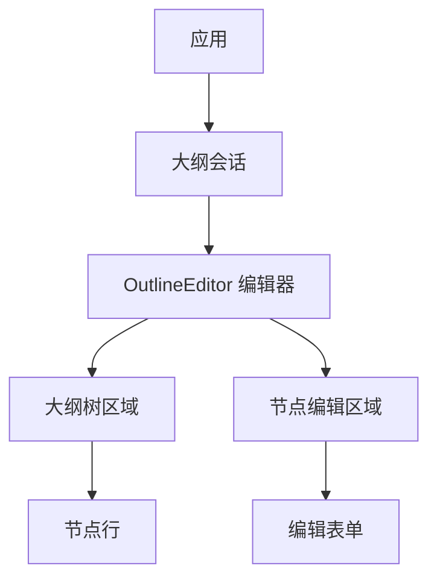
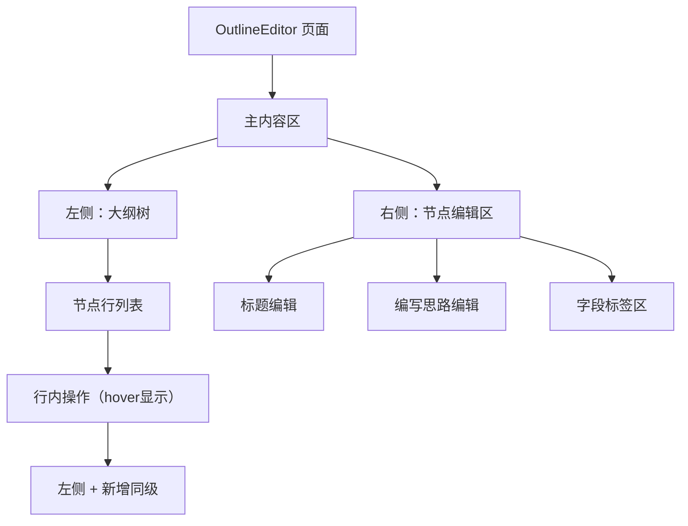
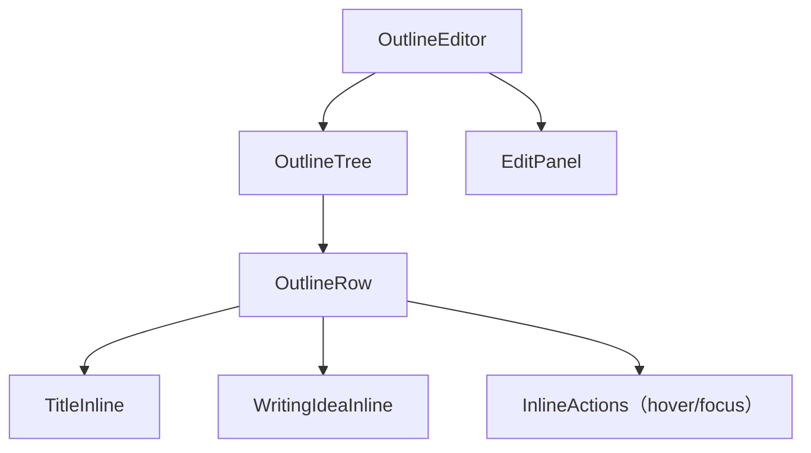
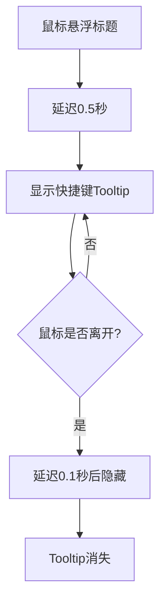

# OutlineEditor 前端设计文档（布局与功能）

## 🧭 设计概览

- 功能范围与边界：大纲树浏览与行内编辑、标题与"编写思路"编辑、同级/子级新增、删除、字段标签管理、可选的智能生成辅助
- 目标用户、角色与使用场景：
  - 内容创作者：搭建与调整报告大纲结构
  - 分析师：按逻辑层次梳理与修订思路
  - 研究人员：规范化撰写要点与编写思路
- 关键用例（3-5个一句话用例）：
  - 浏览大纲树并展开查看节点摘要信息
  - 通过行内操作快速新增同级或子级节点
  - 编辑节点标题并触发智能生成编写思路
  - 管理节点的字段标签和编写思路内容
  - 删除节点并获得即时的操作反馈

## 🗺 信息架构与导航

- 信息架构图（Mermaid 或 Markdown 列表）



- 路由与入口映射（路径、入口来源、返回路径）

  - 入口来源：大纲会话中的"编辑大纲"按钮或对话内编辑消息卡片
  - 返回路径：返回大纲会话主视图，保持当前编辑上下文状态
  - 路由策略：单页应用内导航，不涉及路由跳转

- 导航规则（主/次导航出现条件、面包屑/返回策略）
  - 主导航：树形结构浏览，通过节点选择进行导航
  - 次导航：节点内容编辑区域，与树形选择联动
  - 联动规则：选中节点即时联动右侧编辑区显示
  - 状态保持：切换节点时保留未保存内容的提示

- 使用模式
  - **编辑模式**：用于最后一条 agent 消息，允许用户修改大纲内容（readonly=false）
  - **预览模式**：用于历史消息，只读展示大纲内容（readonly=true）

## 🧱 页面蓝图（逐页）

### OutlineEditor 页面

- 页面目标与完成标准：完成节点的查看、编辑、新增、删除与可选的智能生成；在就地反馈下保存变更
- 布局结构图（Mermaid graph）



- 区域职责表

| 区域           | 职责                       | 显示数据                                     | 允许操作                                   | 条件/可见性               |
| -------------- | -------------------------- | -------------------------------------------- | ------------------------------------------ | ------------------------- |
| 左侧大纲树     | 展示层级结构与摘要         | 层级结构、各节点标题、编写思路摘要           | 选择节点、展开/折叠、定位当前编辑          | 常显                      |
| 节点行内操作   | 就近提供编辑/删除/新增入口 | 悬浮/聚焦时出现的编辑、删除、同级"+"入口     | 悬浮标题左侧"+"新增同级；编辑/删除当前节点 | 默认隐藏，hover/focus显示 |
| 右侧节点编辑区 | 编辑当前选中节点           | 标题输入、编写思路编辑（Markdown）、字段标签 | 编辑标题/思路、添加/删除字段               | 根据选中节点展示          |

- 状态与反馈
  - 加载：选择节点时编辑区载入该节点内容
  - 空：无选中节点时编辑区显示选择提示
  - 错误：就地显示错误提示，提供重试/撤销
  - 提交：保存中禁重复提交；成功/失败就地提示

## 🔄 交互流程与状态

- 主要用户任务流程（Mermaid flowchart）

```mermaid
flowchart TD
  S[选择节点] --> V[查看模式]
  V -->|悬浮标题| H[显示hover操作按钮]
  V -->|点击标题| E[进入编辑模式]

  H -->|点击编辑| E
  H -->|点击删除| DEL[二次确认删除]
  H -->|点击+| N1[新增同级节点]

  E --> E1[+按钮(序号左侧) | 序号 | 输入框 | ✓按钮]
  E1 -->|点击+| N2[保存当前并新增同级]
  E1 -->|点击✓| SAVE[保存并退出编辑]
  E1 -->|ESC键| CANCEL[取消编辑]
  E1 -->|修改内容| EDIT[实时编辑]

  SAVE --> V
  CANCEL --> V
  EDIT --> OPT[可选：触发智能生成]
  OPT --> E1

  N1 --> F[就地提示：成功/失败]
  N2 --> F
  DEL --> F
  F --> V
```

- 关键对象状态机（节点编辑状态）

  - 状态：未编辑 → 编辑中（标题/思路）→ 生成中（可选）→ 成功/失败 → 已保存
  - 进入：点击标题进入编辑模式，自动退出其他节点的编辑状态
  - 退出：保存成功、取消变更或点击其他节点标题
  - 全局约束：同一时刻只能有一个节点处于编辑状态

- 交互规则表（触发条件 → 系统行为 → 用户可见反馈）

| 触发条件               | 系统行为                                 | 用户反馈                                     | 可撤销         | 备注                   |
| ---------------------- | ---------------------------------------- | -------------------------------------------- | -------------- | ---------------------- |
| 悬浮标题（非编辑状态） | 在标题结束位置显示操作按钮               | 就地显示"编辑/删除/+"                        | 否             | 仅在查看模式下显示     |
| 点击标题               | 进入编辑模式，退出其他节点编辑           | +按钮在序号左侧，中间变输入框，右侧显示✓按钮 | 是（ESC取消）  | 全局只能编辑一个节点   |
| 编辑模式下点击+        | 新增同级并保存当前编辑，自动生成编写思路 | 新节点行出现，显示生成进度                   | 是（删除新建） | +按钮位于序号左侧      |
| 编辑模式下点击✓        | 调用接口保存并退出编辑模式               | 返回查看模式                                 | 否             | 只有内容变化才调用接口 |
| 编辑模式下按ESC        | 取消编辑，恢复原内容                     | 返回查看模式                                 | 否             | 不保存任何变更         |
| 编辑模式下按Enter      | 调用接口保存并退出编辑模式               | 返回查看模式                                 | 否             | 等同于点击✓按钮        |
| 修改标题               | 本地实时更新编辑状态                     | 输入框内容变化                               | 是（ESC恢复）  | 不立即调用接口         |
| 触发智能生成           | 进入生成中                               | 进度提示                                     | 是（取消）     | 失败保留原内容         |
| 删除节点               | 二次确认                                 | 结果就地提示                                 | 否             | 影响子级需提示         |
| 缩进节点               | 调整层级向右                             | 层级变化与结果提示                           | 否             | 受层级限制约束         |
| 取消缩进节点           | 调整层级向左                             | 层级变化与结果提示                           | 否             | 受层级限制约束         |

## 🧮 数据与本地状态（技术无关）

- 显示字段清单（列表/详情/表单）与格式要求（仅功能性，如必填/唯一/长度）

  - 标题：必填；建议≤200字符
  - 编写思路：建议≤5000字符；可为空
  - 字段标签：标签名建议≤50字符；支持增删

- 数据来源与依赖（远端/本地缓存/派生）

  - 大纲树：来自上层会话上下文
  - 编辑态：本地暂存，保存后刷新

- 刷新与缓存策略（何时刷新、手动/自动、失效条件）

  - 切换节点时刷新编辑区内容
  - 保存成功后更新树与编辑区

- 并发与重复提交处理（去抖/节流/互斥）、乐观更新/回滚规则
  - 保存过程禁重复提交
  - 智能生成可取消；失败不覆盖原内容

## 🧩 组件分解与复用

- 组件层级图（Mermaid graph）与职责边界



- 输入/输出（props/事件）以"功能语义"描述，不涉及类型/样式

  - OutlineTree：树展示与节点选择
  - OutlineRow：节点行展示与行内操作入口
  - TitleInline/WritingIdeaInline：编辑输入与就地反馈
  - EditPanel：集中编辑当前节点的标题/思路/标签

- 边界与错误处理（何处截获、何处呈现）
  - 就地错误提示，提供重试/撤销
  - 保存中禁重复提交；成功/失败就地提示

## ⌨️ 快捷键操作与提示

### 标题编辑快捷键

| 快捷键      | 功能           | 使用场景       | 可见反馈               | 备注               |
| ----------- | -------------- | -------------- | ---------------------- | ------------------ |
| Enter       | 保存编辑       | 标题编辑模式下 | 退出编辑，返回查看模式 | 保存当前标题内容   |
| Shift+Enter | 保存并新增同级 | 标题编辑模式下 | 创建新节点并进入编辑   | 保存当前编辑后执行 |
| Tab         | 当前标题降一级 | 标题编辑模式下 | 节点向右缩进           | 受最大层级限制     |
| Shift+Tab   | 当前标题升一级 | 标题编辑模式下 | 节点向左缩进           | 受最小层级限制     |
| ↓           | 修改下一标题   | 标题编辑模式下 | 焦点移至下一节点       | 保存当前编辑后执行 |
| ↑           | 修改上一标题   | 标题编辑模式下 | 焦点移至上一节点       | 保存当前编辑后执行 |
| Esc         | 取消编辑       | 标题编辑模式下 | 返回查看模式           | 恢复原内容，不保存 |

### 编写思路编辑快捷键

| 快捷键 | 功能         | 使用场景       | 可见反馈               | 备注           |
| ------ | ------------ | -------------- | ---------------------- | -------------- |
| Enter  | 保存编写思路 | 编写思路编辑时 | 立即保存到服务器       | 不退出编辑状态 |
| Esc    | 取消编辑     | 编写思路编辑时 | 恢复原内容，编辑器失焦 | 不保存任何变更 |

- 快捷键提示设计

  - 触发条件：hover标题时显示Tooltip
  - 显示位置：标题下方，左对齐
  - 显示内容：快捷键操作指南表格
  - 显示时机：鼠标悬浮0.5秒后显示，离开0.1秒后隐藏
  - 样式特点：使用kbd标签展示按键，清晰的视觉层次

- 快捷键提示流程



## 🌍 可访问性与国际化（可选）

- 关键交互的键盘路径与焦点顺序：
  - 键盘：上下移动选中、回车进入编辑、Esc 退出、Tab调整层级
  - 焦点管理：编辑状态下焦点保持在输入框，方向键导航后自动聚焦新节点
- 文案可变长度对布局的影响与溢出策略：
  - 文案长度：标题与思路溢出时提供展开/折叠
  - 快捷键提示：支持多语言，键盘符号保持一致

## 🚫 非目标与不包含

- 本文不含视觉样式规范（配色、字体、间距等）
- 不定义 API 契约与后端接口细节（另见 API 文档）

## ✅ 检查清单（布局与功能）

- [ ] 所有页面均有蓝图与区域职责表
- [ ] 所有主要任务均有端到端流程
- [ ] 列表/表单的加载、空、错误状态明确
- [ ] 路由、入口与返回路径可追踪
- [ ] 筛选/排序/分页规则明确且一致
- [ ] 禁用条件、确认/撤销策略已定义
- [ ] 组件拆分与复用边界清晰

## 🔄 快捷键交互补充说明

基于用户反馈，新增快捷键功能，改变原有的交互模式：

### 快捷键功能变更

- **键盘事件处理模式**：只在编辑模式下处理键盘事件，非编辑模式无焦点状态
- **Enter键功能调整**：编辑模式下Enter保存编辑，Shift+Enter保存并新增同级
- **层级调整功能**：Tab/Shift+Tab进行层级缩进调整（编辑模式下）
- **导航功能**：方向键进行节点间快速导航（编辑模式下）
- **提示系统**：编辑模式下输入框末尾显示?按钮，hover展示快捷键操作指南

### 快捷键与原有功能的协调

- **编辑状态管理**：只有编辑模式才有键盘事件处理，非编辑模式点击进入编辑
- **保存功能**：Enter键保存，Shift+Enter保存并新增，✓按钮保存
- **取消功能**：ESC键取消编辑并恢复原内容
- **新增功能**：Shift+Enter和+按钮都可新增同级，提供多种操作方式
- **导航功能**：方向键导航会自动保存当前编辑，确保数据不丢失

### 用户体验改进

- **操作提示**：hover标题时显示完整的快捷键操作指南
- **视觉反馈**：使用kbd标签清晰展示按键，层次分明
- **延时控制**：合理的显示和隐藏延时，避免误触发
- **多语言支持**：快捷键提示支持国际化，键盘符号保持一致

## 相关文档

- 技术设计：./outline-edit.md
- 组件需求文档：./requirement.md
- 上级模块需求：../requirement.md
- 上级模块设计：../design.md
