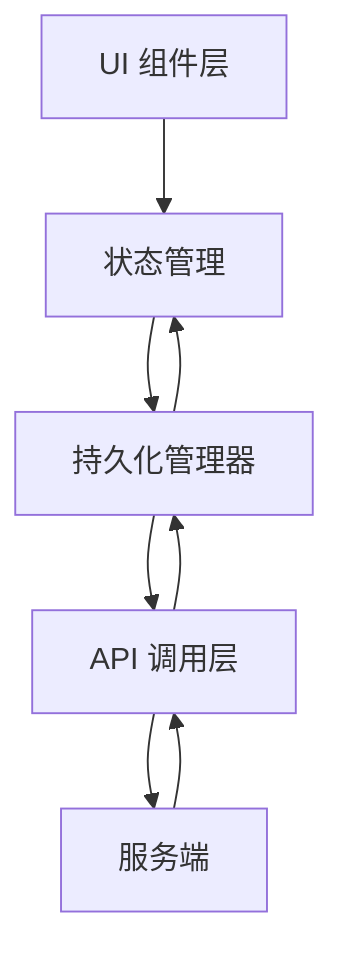
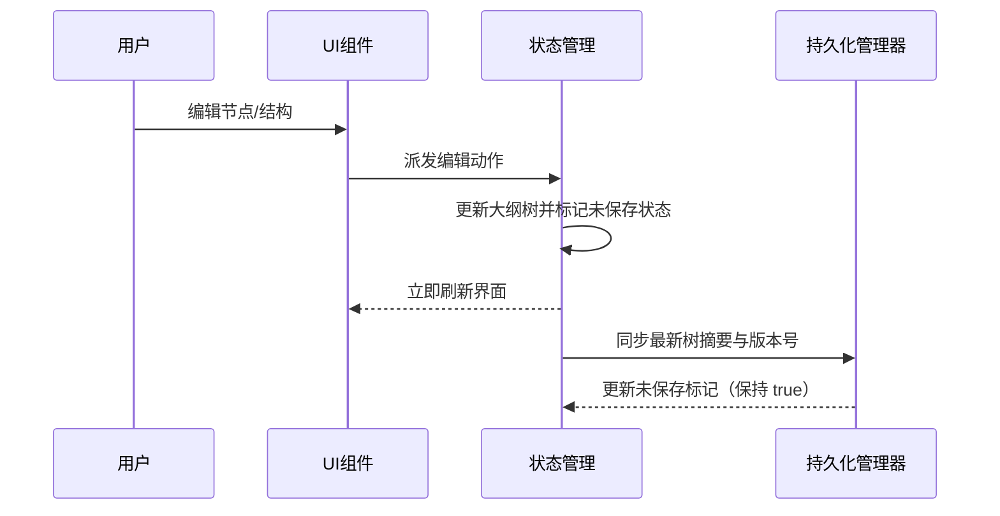
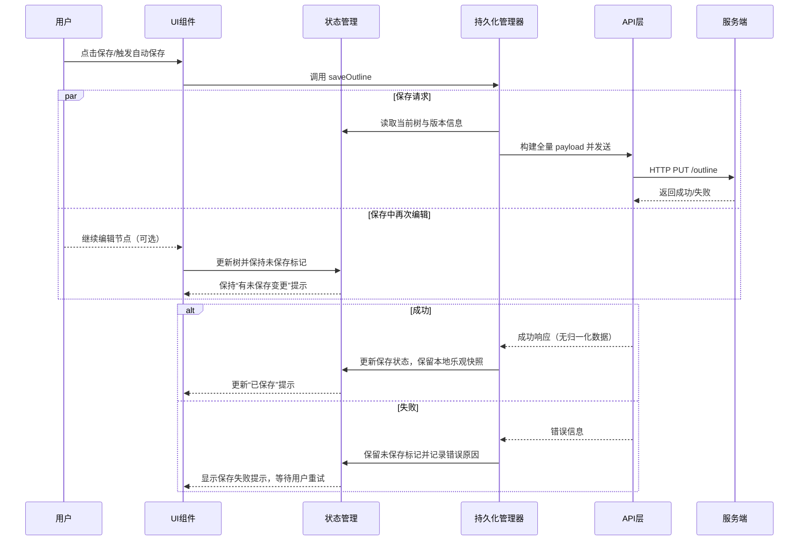
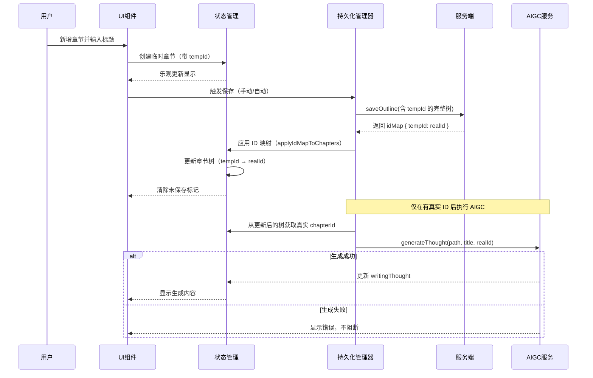
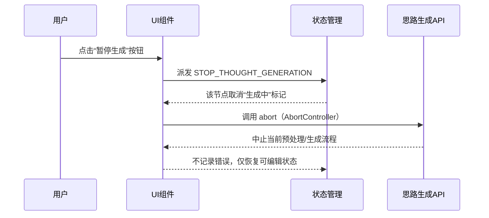
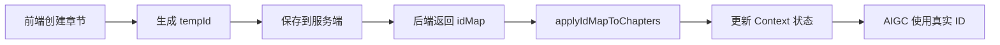
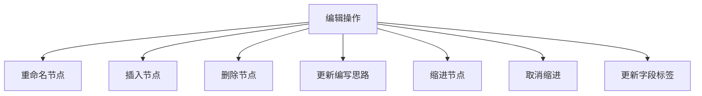
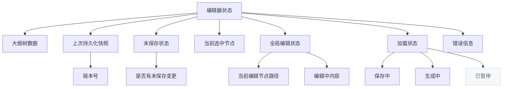
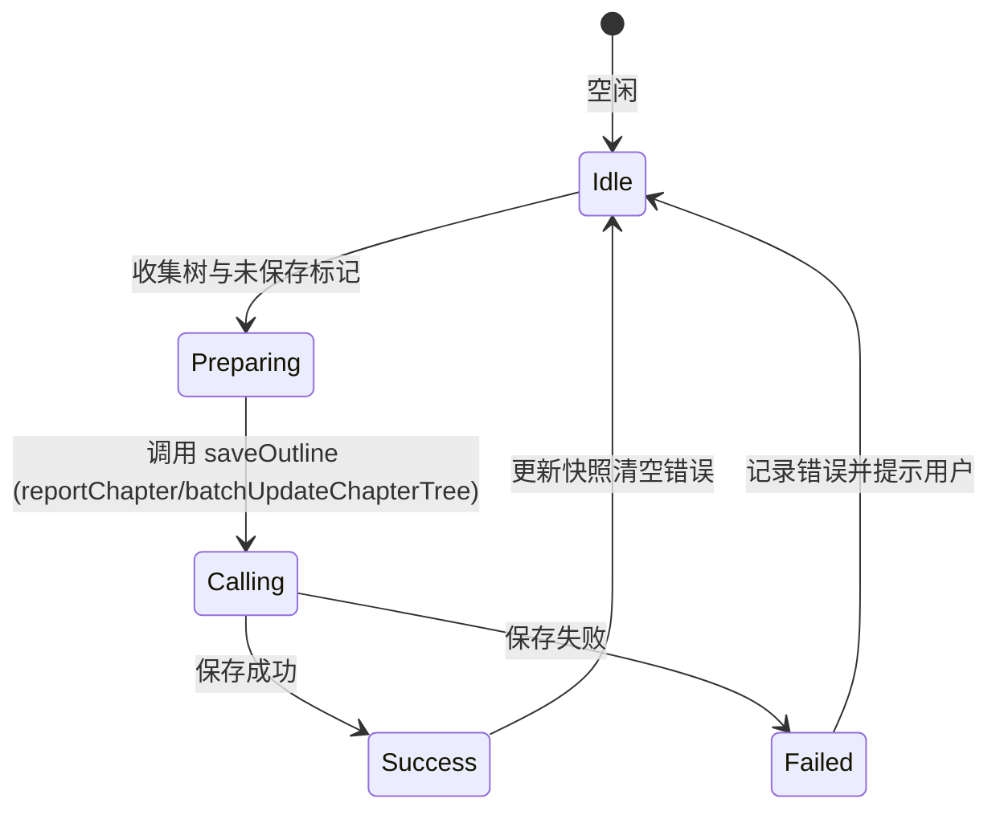

# OutlineEditor 技术设计

## 🧭 设计概览

- 功能范围：大纲编辑器的技术实现方案，支持本地实时编辑与统一全量保存接口
- 目标用户：前端开发者
- 关键用例：
  - 编辑过程中的本地实时反馈与未保存标记管理
  - 通过单一 `saveOutline` 接口提交完整大纲树
  - 保存失败时提示用户重试
- 自动保存策略：复用《[通用自动保存方案前端设计文档](../../shared/auto-save-design.md)》中定义的 SaveController 及单并发尾随逻辑。

## 📚 术语说明

- **未保存标记**：全局布尔状态，指示当前是否存在尚未提交到服务端的变更。
- **保存快照**：最近一次保存成功返回的完整大纲树副本，用于失败后的界面稳定性与再次保存比较。

## 🏗️ 简化架构设计

### 架构概览



### 核心职责

| 层级         | 职责                 | 特点                                                |
| ------------ | -------------------- | --------------------------------------------------- |
| UI           | 用户交互、状态展示   | React 组件，处理用户操作和状态渲染                  |
| Store        | 状态管理、未保存标记 | 本地状态管理，追踪未保存标记与上次持久化快照        |
| 持久化管理器 | 聚合保存、结果反馈   | 从 Store 读取最新树并构建全量 payload，协调保存状态 |
| API          | 网络请求、错误处理   | HTTP 请求封装，失败时返回统一错误信息               |

## 🔄 核心编辑流程

### 本地编辑与未保存标记流程



### 全量保存流程



#### 保存过程中的再次编辑策略

- 保存请求发起后不阻塞用户操作；新的编辑继续更新本地树结构，并持续保持未保存标记。
- 当前请求返回成功且期间有新编辑时，仅同步最新快照，不展示“已保存”提示，维持未保存标记提示用户再次保存。
- 若保存失败，则沿用原有错误提示；未保存标记保持为 true，用户可修改后重新点击保存。
- 若需要自动保存，可在请求完成后检测未保存标记并触发下一次保存，而无需等待用户手动操作。

### 新增章节完整流程（含 ID 映射与 AIGC）



### 思路生成的暂停/取消设计



#### 暂停语义与边界

- 暂停是“中止当前生成任务”的语义，不采集错误，不写入失败状态；仅移除该节点的“生成中”标记。
- 若再次触发生成（例如重命名标题或手动生成），将创建新的上下文并重新进入生成流程。
- 暂停对保存流程无影响：保存仍基于当前本地树进行；生成结果是异步补齐，暂停不会改变已保存的内容。

#### 技术实现要点

- 使用运行上下文的 `AbortController`：在生成前创建并注册至路径映射，点击暂停时调用 `abort()` 终止。
- 状态管理新增 `STOP_THOUGHT_GENERATION`：在 reducer 中移除该路径的 `thoughtGeneratingPaths` 记录，不写入错误。
- 生成 Hook（`useThoughtGeneration`）维护 `activeContextsRef`：按 `createPathKey(path)` 记录并在暂停/完成后清理引用。
- 预处理阶段（Preflight）与主流程均接入中止信号：避免继续拉取数据或解析流。

> ⚠️ 接口约束说明
>
> - 保存接口由前端生成章节 `id` 并提交完整树，后端仅返回是否成功，不回传归一化或派生字段。
> - 因忽略后端归一化结果，若未来服务端新增格式化、自动编号等逻辑，前端不会立即感知，可能出现状态漂移或提示与真实数据不一致。
> - 多端同时编辑时缺乏服务端版本号/冲突信息，需要依靠上层流程（例如轮询或显式刷新）发现潜在覆盖风险。
> - OutlineTreeEditor 在开发模式下会展示保存状态条（`保存中/失败/未保存/时间`）以便调试；线上默认隐藏，避免偏离需求稿视觉。

## 🆔 章节 ID 映射机制

### ID 类型说明

| ID 类型       | 格式                               | 使用场景             | 示例                       |
| ------------- | ---------------------------------- | -------------------- | -------------------------- |
| **tempId**    | `new-chapter-{timestamp}-{serial}` | 前端新增章节，保存前 | `new-chapter-1234567890-0` |
| **chapterId** | 后端分配的数字 ID                  | 后端保存成功后       | `456`                      |

### ID 映射流程



### 核心工具函数

**实现位置**: `src/domain/chapter/idMapping.ts`

| 函数                   | 用途                      | 关键逻辑                                              |
| ---------------------- | ------------------------- | ----------------------------------------------------- |
| `applyIdMapToChapters` | 递归替换树中所有 tempId   | 使用 `mapTree` 遍历，清理 `isTemporary`/`tempId` 标记 |
| `getRealChapterId`     | 获取真实 ID（优先 idMap） | 先查 idMap，再从树读取 chapterId                      |

### AIGC 操作前置条件

> ⚠️ **关键约束**：所有章节级 AIGC 操作（如 `generateThought`）必须使用真实 `chapterId`
>
> 详见：[章节保存流程](../../shared/chapter-save-flow.md#aigc-操作前置条件)

**正确流程**：

```typescript
// ✅ 在 afterSuccess 回调中，ID 映射已完成
afterSuccess: async (action, idMap) => {
  const realId = getRealChapterId(tempId, idMap, path);
  await generateThought(path, title, realId); // 使用真实 ID
};
```

**错误示例**：

```typescript
// ❌ 保存前使用 tempId
const tempId = chapter.tempId;
await generateThought(path, title, tempId); // 后端无法识别
```

## 🎯 编辑操作设计

### 操作类型定义



### 操作处理策略

| 操作类型      | 本地更新                   | 持久化策略                     | AIGC 触发时机                             | 特殊处理                               |
| ------------- | -------------------------- | ------------------------------ | ----------------------------------------- | -------------------------------------- |
| 进入编辑模式  | 仅切换视图状态             | 不触发保存                     | -                                         | 全局唯一编辑节点                       |
| 退出编辑模式  | 同步本地缓冲至树结构       | 若存在未保存标记，等待手动保存 | -                                         | 支持取消恢复原值                       |
| 重命名节点    | 即时写入树并保持未保存标记 | 汇总至下次 `saveOutline`       | 保存后，使用真实 ID 生成思路（modify）    | 保存前执行标题校验                     |
| 插入节点      | 本地创建节点（带 tempId）  | 汇总至下次 `saveOutline`       | ID 映射后，使用真实 ID 生成思路（create） | 自动编号，保存成功后触发思路生成       |
| 删除节点      | 本地移除并记录删除影子     | 汇总至下次 `saveOutline`       | -                                         | 删除确认后清除影子                     |
| 更新思路      | 本地更新 Markdown          | 汇总至下次 `saveOutline`       | -                                         | 支持空内容，生成服务异步补齐           |
| 缩进/取消缩进 | 本地更新父子关系           | 汇总至下次 `saveOutline`       | -                                         | 检查层级合法性；保存失败保持未保存状态 |
| 更新标签      | 本地更新标签集合           | 汇总至下次 `saveOutline`       | -                                         | 去重后入库                             |

#### 缩进操作细化

- **缩进（Indent）**：
  - 将目标节点本身移动至前一个兄弟节点的子节点列表末尾。
  - 目标节点的原有子节点也移动到同一个新父节点下，但绝对层级不变，不再是目标节点的子节点。
  - 若前一兄弟节点不允许新增子节点（层级上限或逻辑约束），操作被阻止并提示原因。
- **取消缩进（Unindent）**：
  - 将目标节点本身提升到父节点的同级，插入位置紧随原父节点之后。
  - 目标节点的原有子节点也提升到同一个新父节点下，但绝对层级不变，不再是目标节点的子节点。
- **子节点处理策略**：
  - 缩进和取消缩进操作移动目标节点及其子节点到新的父节点下。
  - 子节点的绝对层级不发生变化。
  - 子节点不再隶属于目标节点，成为与目标节点同级的兄弟节点。
  - 使用深拷贝机制确保操作后的节点与原节点完全独立，避免引用共享问题。

#### 操作示例

```
原始结构：
1. 章节A        (level 1)
2. 章节B        (level 1)
   2.1 子章节B1  (level 2)
   2.2 子章节B2  (level 2)
3. 章节C        (level 1)

对"章节B"执行缩进后：
1. 章节A        (level 1)
   1.1 章节B     (level 2) ← B移动到A下
   1.2 子章节B1  (level 2) ← B1也移动到A下，绝对层级不变
   1.3 子章节B2  (level 2) ← B2也移动到A下，绝对层级不变
2. 章节C        (level 1)

对"章节B"执行取消缩进后（假设B原本在A下）：
1. 章节A        (level 1)
2. 章节B        (level 1) ← B提升到根级别
3. 子章节B1     (level 2) ← B1也提升到根级别，但绝对层级不变
4. 子章节B2     (level 2) ← B2也提升到根级别，但绝对层级不变
5. 章节C        (level 1)
```

## 🔀 状态管理策略

### 状态结构



### 状态管理原则

| 状态类型     | 更新时机                    | 回滚条件                 | 用户反馈                                       |
| ------------ | --------------------------- | ------------------------ | ---------------------------------------------- |
| 树结构       | 操作后立即更新              | 保存失败保留当前状态     | 实时刷新内容                                   |
| 持久化快照   | 保存成功返回时更新          | 保存失败不更新           | 用于展示上次保存版本                           |
| 未保存状态   | 任意写操作后置为 true       | 保存成功且无新编辑时清空 | 展示未保存标识/提示                            |
| 选中节点     | 用户点击时                  | 无需回滚                 | 高亮显示                                       |
| 全局编辑状态 | 点击标题进入，确认/取消退出 | ESC键取消编辑            | 全局唯一编辑节点                               |
| 编辑内容     | 输入时本地更新              | 取消编辑时恢复           | 实时显示编辑内容                               |
| hover状态    | 鼠标进入/离开（仅查看模式） | 无需回滚                 | 显示/隐藏操作按钮                              |
| 保存中状态   | 调用 `saveOutline` 时       | 请求结束（成功/失败）    | 显示“保存中”；期间允许继续编辑并保持未保存提示 |
| 生成中状态   | 触发生成/预处理时           | 完成/失败/暂停           | 显示“生成中”；可点击暂停                       |
| 生成暂停     | 点击暂停按钮                | 用户再次触发生成         | 取消“生成中”标记，不记错误                     |

## ⚡ API 调用与错误处理

### API 接口规范

**接口路径**: `reportChapter/batchUpdateChapterTree`

**请求参数**:

```typescript
{
  reportId: string,      // 从 ReportOutlineData.outlineId 转换而来
  chapters: RPChapter[]  // 完整的章节树数组
}
```

**响应格式**:

```typescript
{
  ErrorCode: string,     // 成功时为 ApiCodeForWfc.SUCCESS
  message?: string       // 失败时的错误信息
}
```

**实现位置**: `apps/report-ai/src/components/ChatRPOutline/OutlineTreeEditor/core/transport.ts`

> Transport 底层复用 `apps/report-ai/src/domain/reportChapter/batchUpdateChapterTreeTransport.ts`，与正文保存共享 `reportChapter/batchUpdateChapterTree` 接口，实现统一的错误处理与日志。

### API 调用流程



### 错误处理策略

| 错误类型 | 检测方式          | 处理策略                     | 用户反馈                             |
| -------- | ----------------- | ---------------------------- | ------------------------------------ |
| 业务错误 | success: false    | 保留未保存标记，等待用户重试 | 原位错误提示 + 重试按钮              |
| 网络错误 | 请求超时/连接失败 | 记录错误原因，不做自动重试   | 弹出或原位提示"保存失败，请检查网络" |
| 参数错误 | 4xx 状态码        | 记录日志并阻断保存           | 面向用户提示"保存失败，请稍后再试"   |

## 🛠️ 实现策略

### 核心技术要点

- **本地未保存标记**: 本地维护编辑后的大纲树与未保存状态，确保 UI 即时反馈
- **统一全量保存**: 通过单一 `saveOutline` 接口提交组装后的完整树，避免多端点分裂
- **失败回执**: 保存失败时仅记录错误并提示用户，等待人工重试
- **保存中编辑容忍**: 保存请求与新的编辑互不阻塞，请求完成后根据未保存标记决定是否再次保存
- **状态隔离**: 不同节点的编辑状态互不干扰，生成思路异步运行

### 性能优化

- **延迟提交**: 聚合多次编辑后再触发保存，减少网络调用
- **序列化优化**: 保持树的全量序列化逻辑简单一致，避免差异化 payload
- **错误边界**: 单个节点编辑异常仅影响未保存标记，不阻断其他操作

### 用户体验

- **即时反馈**: 编辑立即生效并显示“未保存”提示
- **保存进度**: 保存中以按钮/顶部提示展示状态与剩余操作
- **保存中可继续编辑**: 保存按钮显示忙碌状态但输入不被禁用，新的编辑会直接标记为未保存
- **错误提示**: 保存失败提供重试提示，不做额外处理

## 🧪 测试策略

### 单元测试

- **组件测试**: 各UI组件的渲染和交互测试
- **Hook测试**: 状态管理逻辑和副作用测试
- **工具函数测试**: 数据处理和验证函数测试

### 集成测试

- **全量保存流程**: 覆盖编辑→单一接口保存→清除未保存标记
- **失败提示场景**: 模拟网络/业务失败，验证错误提示与重试入口
- **异步生成流程**: 验证保存成功后自动生成思路并回填

## 📋 实现检查清单

- [ ] 基础组件结构实现完成
- [ ] 状态管理Hook实现
- [ ] 未保存标记与快照机制实现
- [ ] API调用和错误处理
- [ ] 错误提示与重试入口
- [ ] 用户反馈界面完成
- [ ] 全量序列化与性能优化
- [ ] 单元测试覆盖核心逻辑
- [ ] 集成测试验证主要流程
