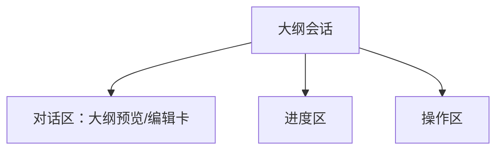
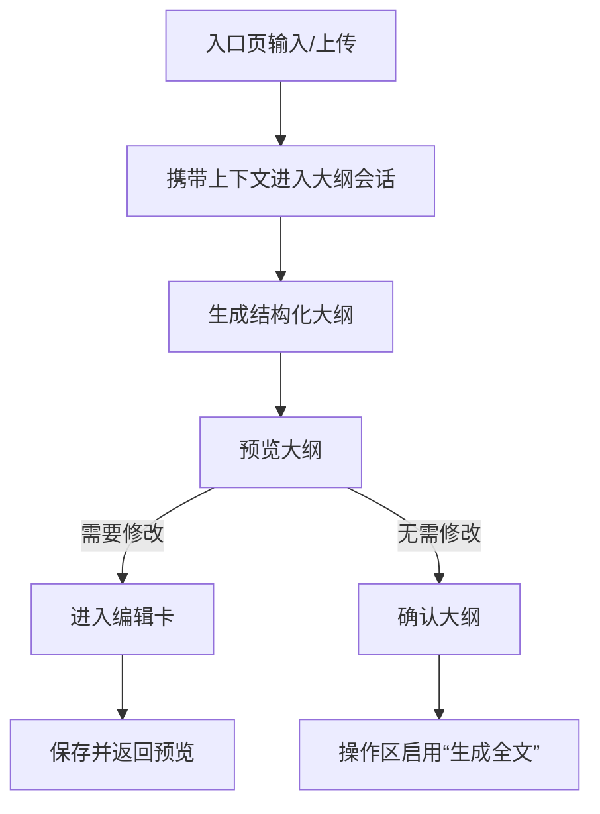

# 大纲会话模块

## 概述

大纲会话模块是 Report AI 的核心交互环节：与 AI 协作生成、预览、编辑并确认报告大纲；展示任务进度与文件解析状态，并在确认后进入“生成全文”。

## 功能特性

- **智能对话生成**：AI驱动的大纲内容生成和优化建议
- **结构化编辑**：支持树形大纲的可视化编辑和层级调整
- **编写思路管理**：为每个章节提供详细的编写指导和要点
- **智能思路生成**：标题修改后自动生成对应的编写思路，提升创作效率
- **文件引用能力**：支持上传文档并在对话中引用增强上下文
- **公司上下文绑定**：针对特定企业提供定制化大纲生成

## 文档导航

- 需求文档（业务/交互）：./requirement.md
- 设计文档（布局/功能）：./design.md
- 组件：
  - OutlineEditor 概览：./OutlineEditor/README.md
  - OutlineEditor 需求：./OutlineEditor/requirement.md
  - OutlineEditor 设计：./OutlineEditor/design.md

## 模块蓝图

> 说明：用户在入口页完成需求输入与文件上传，本页面消费传入上下文后继续大纲协作。

## 核心流程

## 相关文档

### 设计文档

- [需求文档](./requirement.md) - 业务需求与交互规则
- [设计文档](./design.md) - 布局与功能设计
- [大纲编辑器](./OutlineEditor/README.md) - 大纲编辑器完整设计
- [AI 对话核心流程](../../../packages/gel-ui/docs/biz/ai-chat/chat-flow-core-design.md) - AI 对话流程
- [AI 对话技术设计](../../../packages/gel-ui/docs/biz/ai-chat/chat-flow-technical-design.md) - AI 对话技术方案

### 代码实现

- [大纲组件](../../src/components/outline/README.md) - 大纲相关组件
- [OutlineTreeEditor](../../src/components/outline/OutlineTreeEditor/README.md) - 大纲树形编辑器
- [OutlineView](../../src/components/outline/OutlineView/README.md) - 大纲展示组件
- [ChatRPOutline](../../src/components/ChatRPOutline/README.md) - 大纲聊天组件
