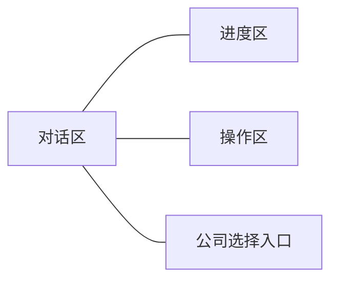
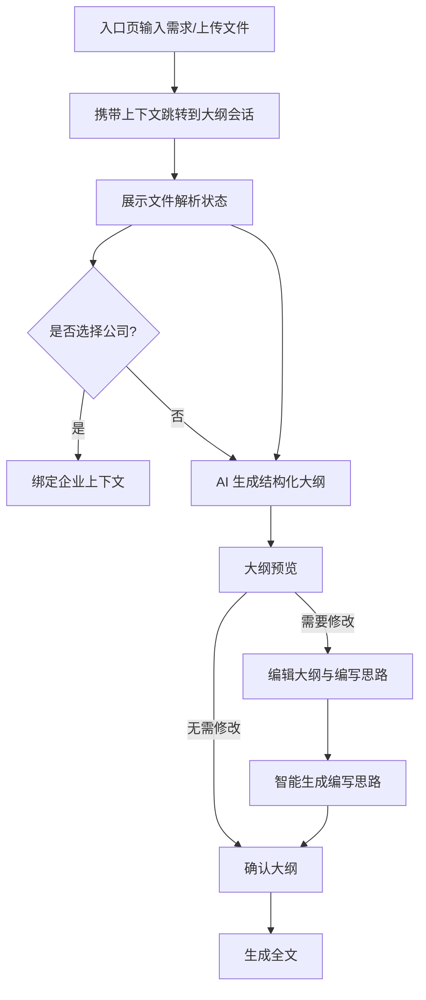

# 大纲会话模块需求文档

## 概述

大纲会话用于与 AI 协作生成并完善报告大纲。用户可查看大纲、编辑标题与编写思路、跟踪生成进度，并在确认后进入全文生成。

## 页面布局

| 区域         | 展示内容                                         | 默认状态         | 可执行操作                       |
| ------------ | ------------------------------------------------ | ---------------- | -------------------------------- |
| 对话区       | 历史消息、大纲预览/编辑、文件解析状态            | 展开             | 查看大纲、进入编辑、查看文件状态 |
| 进度区       | 分析问题/文件解析/深度思考/生成大纲 的步骤与状态 | 展开             | 查看当前步骤、重试（如提供）     |
| 公司选择入口 | 对话区消息泡展示当前公司                         | 可用             | 根据后端返回的候选进行选择       |
| 操作区       | 返回上一步、重新生成大纲、生成全文               | 生成全文默认禁用 | 点击执行对应动作                 |

> 说明：用户在进入本页面前已于入口页完成需求输入与文件上传，本页面仅消费并展示这些上下文。

## 操作流程

| 步骤     | 用户操作                         | 页面反馈                 |
| -------- | -------------------------------- | ------------------------ |
| 外部输入 | 在入口页输入需求、上传文件并提交 | 本页面通过参数接收上下文 |
| 进度查看 | 查看右侧步骤状态                 | 显示进行中/完成/未开始   |
| 预览大纲 | 查看树形结构与编写思路摘要       | 节点可展开/折叠          |
| 编辑大纲 | 进入编辑视图，修改标题与编写思路 | 支持行内编辑与手动保存   |
| 确认大纲 | 点击确认                         | 启用“生成全文”按钮       |
| 生成全文 | 点击生成全文                     | 进入报告生成流程         |

## 数据信息

### 展示类数据

| 数据项           | 显示位置           | 刷新规则                 | 备注                                         |
| ---------------- | ------------------ | ------------------------ | -------------------------------------------- |
| 大纲树（含层级） | 对话区             | 生成/编辑后刷新          | 支持展开/折叠                                |
| 节点编写思路摘要 | 对话区             | 节点展开时展示           | 展开可查看全文                               |
| 文件解析状态     | 对话区（消息下方） | 上传后/解析变化时        | 解析中/成功/失败                             |
| 任务进度         | 进度区             | 步骤变化时               | 四步：分析问题、文件解析、深度思考、生成大纲 |
| 消息历史         | 对话区             | 新消息追加               | 倒序或顺序显示均可                           |
| 当前公司         | 对话区消息泡       | 后端返回或重新选择时更新 | 展示已选公司名称，无清除按钮                 |

### 用户输入数据

| 输入来源     | 字段                         | 约束/校验                                             |
| ------------ | ---------------------------- | ----------------------------------------------------- |
| 入口上下文   | 初始消息、文件、深度思考参数 | 由首页拼装并通过路由/参数传入                         |
| 大纲编辑     | 章节标题                     | 必填；层级与编号需合理                                |
| 大纲编辑     | 编写思路                     | 建议填写；与标题匹配                                  |
| 公司选择入口 | corpId、corpName             | corpId 必填唯一；仅支持从候选列表中单选，无搜索与清除 |
| 操作区       | 动作选择                     | 返回/重生/生成全文                                    |

## 交互反馈

### 状态与提示

| 场景       | 反馈类型      | 展示位置      | 描述                        |
| ---------- | ------------- | ------------- | --------------------------- |
| 任务执行中 | 步骤状态      | 进度区        | 显示进行中/完成/未开始      |
| 文件解析中 | 状态标识/进度 | 对话区        | 动态更新解析状态            |
| 解析失败   | 错误提示      | 对话区        | 不中断大纲生成，可继续      |
| 大纲预览   | 树形+摘要     | 对话区        | 支持展开/折叠与进入编辑     |
| 大纲编辑   | 行内编辑状态  | 对话区        | 手动保存；保存成功/失败提示 |
| 确认完成   | 成功提示      | 对话区/操作区 | 启用“生成全文”按钮          |

### 交互规则

| 条件           | 页面表现                         | 目的                 |
| -------------- | -------------------------------- | -------------------- |
| 入口上下文缺失 | 展示占位提示并允许用户返回入口页 | 避免在无上下文下生成 |
| 大纲不完整     | 禁用“确认/生成全文”              | 保证基本完整性       |
| 文件解析失败   | 保留失败状态但不阻断流程         | 降低中断             |
| 正在编辑未保存 | 提示保存或保留编辑态             | 避免内容流失         |
| 切换预览/编辑  | 模式明确可见                     | 保持认知一致         |
| 已选择公司     | 在对话与生成时注入公司上下文     | 增强生成针对性       |

## 检查要点

- [ ] 功能说明清楚
- [ ] 界面布局明确
- [ ] 操作流程完整
- [ ] 数据要求具体

## 相关文档

- 大纲编辑器需求文档：./OutlineEditor/requirement.md
- AI 对话核心流程：../../../../packages/gel-ui/docs/biz/ai-chat/chat-flow-core-design.md
- AI 对话技术设计：../../../../packages/gel-ui/docs/biz/ai-chat/chat-flow-technical-design.md

---

最后更新：2025-09  
更新说明：文档结构调整为图表优先，精简技术信息，修复文档链接。
