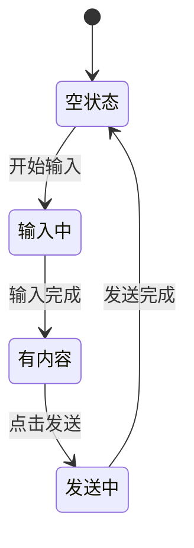
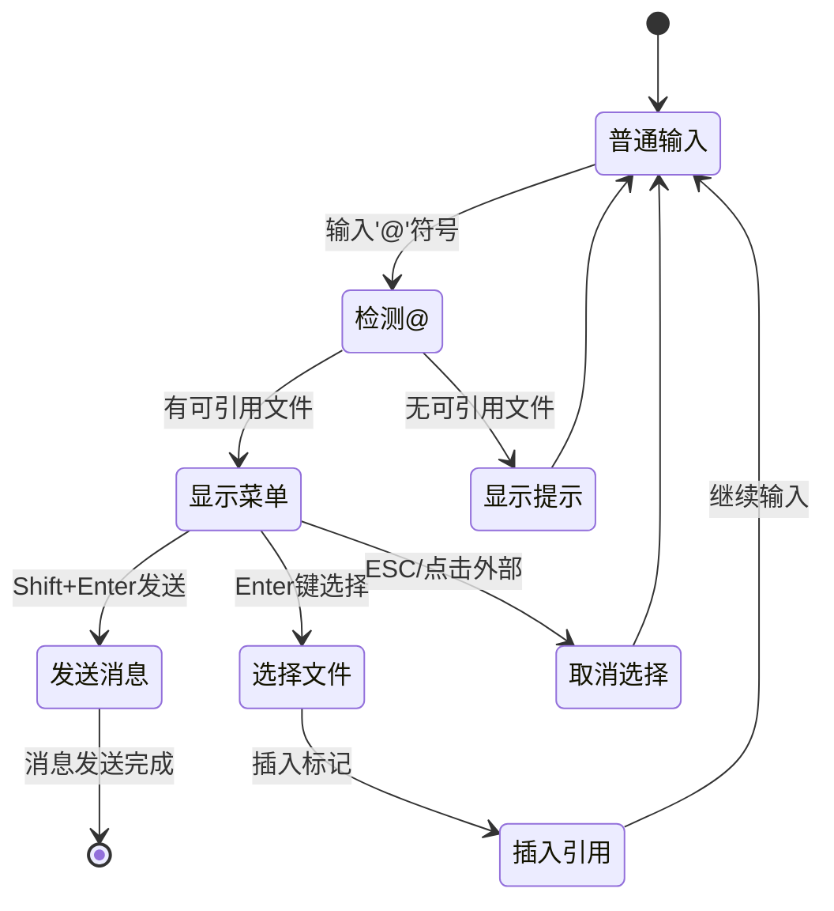
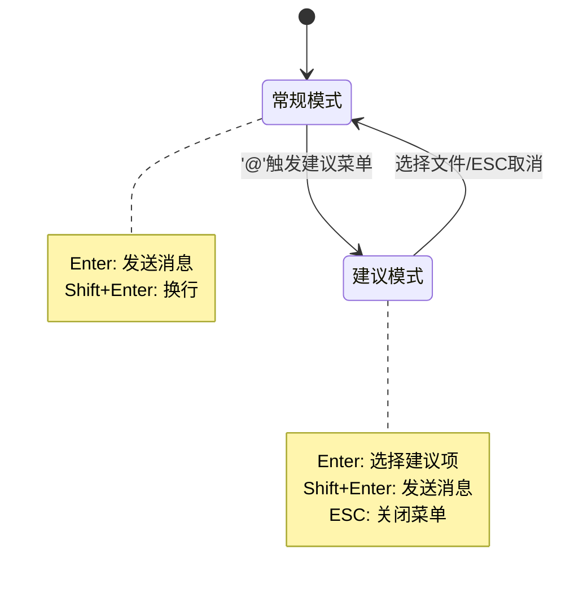
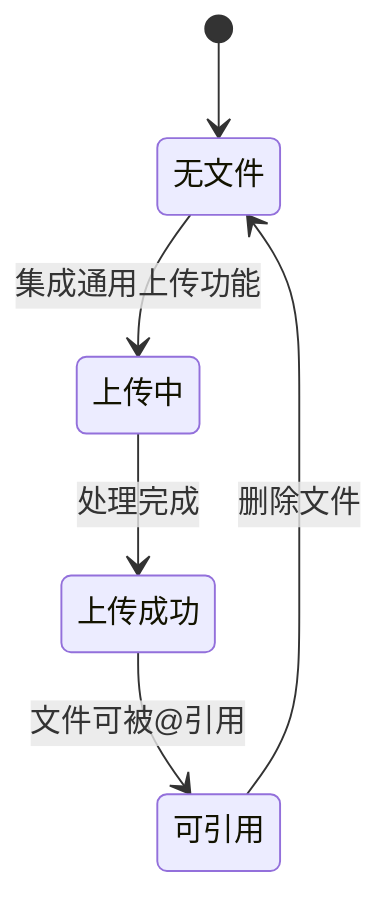

# ChatSenderReport 交互设计

## 设计概述

聊天发送组件遵循简洁、直观、高效的设计原则，提供统一的文件上传入口和'@'引用交互，确保用户体验流畅一致。

## 组件结构设计

```mermaid
graph TD
    A[ChatSenderReport] --> B[输入区域]
    A --> C[底部操作区]
    B --> D[文本输入框]
    B --> E[@文件选择菜单]
    C --> F[上传按钮]
    C --> G[文件列表]
    C --> H[发送按钮]
```

## 交互状态设计

### 输入交互流程



### '@'引用交互流程



### 智能快捷键切换机制



### 文件上传状态

ChatSenderReport集成通用的文件上传功能，详细的状态管理请参考[文件上传交互设计](../../shared/FileUpload/design.md#状态管理设计)。



## 数据接口设计

### '@'引用数据流

```mermaid
graph LR
    A[用户输入@引用] --> B[解析文本标记]
    B --> C[提取文件ID]
    C --> D[构建发送数据]
    D --> E[后端API]

    D --> F[message: 原始文本]
    D --> G[files: 上传文件]
    D --> H[refFiles: 引用文件]

    E --> I[QueryReferencePayload]
```

### 接口数据映射

| 前端字段 | 后端字段    | 说明                                      |
| -------- | ----------- | ----------------------------------------- |
| message  | rawSentence | 包含@[文件名称]格式的完整原始文本         |
| files    | fileIds     | 直接上传的文件ID数组                      |
| refFiles | refFileIds  | @引用的文件对象数组，包含fileID等完整信息 |

### 数据示例

```json
{
  "message": "请基于@[年报.pdf]和@[财务数据.xlsx]生成分析报告",
  "files": [{ "fileId": "f1", "fileName": "模板.docx", "uploadTime": "2024-01-01" }],
  "refFiles": [
    { "fileId": "f2", "fileName": "年报.pdf", "uploadTime": "2024-01-02" },
    { "fileId": "f3", "fileName": "财务数据.xlsx", "uploadTime": "2024-01-03" }
  ]
}
```

## 视觉状态规范

### 核心状态定义

| 状态 | 边框色  | 背景色  | 说明     |
| ---- | ------- | ------- | -------- |
| 默认 | #E9ECEF | #FFFFFF | 初始状态 |
| 聚焦 | #1890FF | #FFFFFF | 获得焦点 |
| 错误 | #F5222D | #FFF1F0 | 验证失败 |
| 禁用 | #F5F5F5 | #F5F5F5 | 不可交互 |

### '@'菜单状态

| 状态       | 样式     | 说明              |
| ---------- | -------- | ----------------- |
| 默认项     | 白底黑字 | 普通菜单项        |
| 悬停项     | 蓝底白字 | 鼠标悬停/键盘选中 |
| 无文件提示 | 黄底灰字 | 暂无可引用文件    |

### 引用标记样式

| 状态     | 样式           | 说明             |
| -------- | -------------- | ---------------- |
| 有效引用 | 蓝色圆角标签   | 文件存在且可用   |
| 无效引用 | 灰色删除线标签 | 文件已删除或无效 |

## 响应式设计

### 断点适配

| 设备   | 断点       | 布局调整               |
| ------ | ---------- | ---------------------- |
| 移动端 | < 768px    | 垂直布局，按钮适配触摸 |
| 平板端 | 768-1024px | 自适应布局             |
| 桌面端 | > 1024px   | 水平布局，支持快捷键   |

## 无障碍设计

### 键盘导航

- `Tab`: 元素间切换
- `Enter`: 发送消息/选择建议文件（根据建议菜单状态动态切换）
- `Shift+Enter`: 建议菜单打开时发送消息
- `Escape`: 关闭建议菜单
- `↑↓`: '@'菜单导航

### 辅助技术支持

- 语义化HTML标签
- 适当的ARIA属性
- 状态变化通知
- 清晰的错误描述
