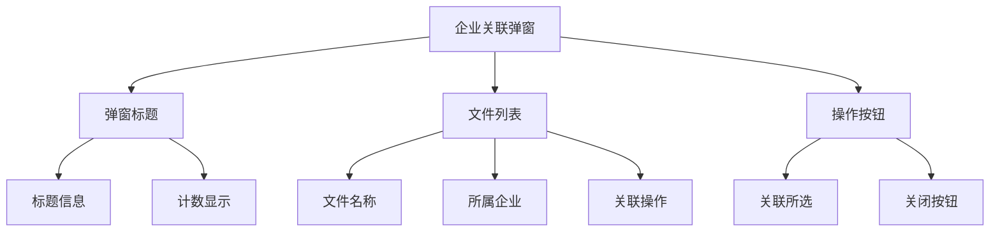
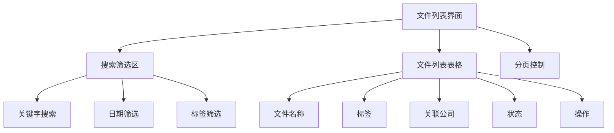

# 文件管理模块需求文档

## 模块概述

文件管理模块为用户提供完整的文件生命周期管理，包括文件搜索筛选、批量上传、标签管理、文件操作等功能。界面采用上下分区布局，上半部分为搜索筛选区域，下半部分为文件列表和上传入口。

## 界面布局

### 整体布局结构

- **上半部分**: 搜索和筛选功能区域
- **下半部分**: 文件列表展示和上传文件入口

## 搜索筛选模块

### 功能特性

- **关键字搜索**: 支持文件名和企业名关键字搜索
- **日期搜索**: 支持添加日期范围筛选
- **标签筛选**: 支持按标签类型进行筛选，默认不限，支持多选
- **筛选重置**: 支持一键清空所有筛选条件

### 交互规范

- **关键字搜索**: 支持实时搜索，输入后自动触发搜索
- **日期筛选**: 提供日期选择器，支持日期范围选择
- **标签筛选**: 提供多选下拉框，默认显示"不限"
- **筛选重置**: 提供清空按钮，一键重置所有筛选条件

## 文件上传模块

### 功能特性

- **文件选择**: 点击文件上传按钮弹窗选择文件
- **数量限制**: 一次最多选择5份文件
- **超量提示**: 超过5份文件时显示toast提示"每次最多选择5份文件"
- **拖拽上传**: 支持文件拖拽到上传区域
- **上传进度**: 实时显示上传进度和状态

### 交互规范

- **上传限制**: 选择超过5个文件时显示toast提示
- **上传进度**: 显示每个文件的上传进度条
- **上传状态**: 区分上传中、上传成功、上传失败状态

### 异常处理

- **文件数量超限**: 显示toast提示"每次最多选择5份文件"
- **文件格式不支持**: 提示"不支持该文件格式"
- **文件大小超限**: 提示"文件大小超过限制"

## 文件列表模块

### 功能特性

- **列表字段**: 展示文件名称（文件号）、标签、关联公司、上传日期、状态、操作
- **排序规则**: 按照上传时间倒序展示
- **分页展示**: 默认展示10条/页，可选择20条/页
- **状态显示**: 展示文件解析状态（等待中、进行中、已完成、解析失败）

### 交互规范

- **分页控制**: 提供页码导航和每页条数选择（10条/20条）
- **排序显示**: 按上传时间倒序排列，最新上传的文件在顶部
- **状态展示**: 不同状态使用不同颜色和图标区分
- **操作按钮**: 根据文件状态显示对应的操作按钮

### 状态规则

| 状态     | 显示内容 | 可执行操作             |
| -------- | -------- | ---------------------- |
| 等待中   | 灰色文字 | 查看、下载、删除       |
| 进行中   | 进度条   | 查看、下载、删除       |
| 已完成   | 绿色图标 | 查看、下载、编辑、删除 |
| 解析失败 | 红色警告 | 查看、下载、删除       |

## 标签管理模块

### 功能特性

- **标签类型**: 财务、市场、法律、产品、运营、战略、项目、其他（共8种）
- **多标签支持**: 一个文件可对应多个标签
- **标签样式**: 参考UI切图设计标签展示样式
- **标签筛选**: 支持按标签类型进行多选筛选

## 文件操作模块

### 功能特性

- **查看功能**: 点击查看按钮，弹窗展示文件内容
- **下载功能**: 点击下载按钮，下载文件到本地
- **编辑功能**: 点击编辑按钮，弹窗修改关联公司和标签
- **删除功能**: 点击删除按钮，弹窗确认删除操作

### 交互规范

- **查看文件**: 点击查看按钮弹出模态框展示文件内容
- **下载文件**: 点击下载按钮直接下载文件到本地
- **编辑文件**: 点击编辑按钮弹出编辑表单，可修改关联公司和标签
- **删除确认**: 点击删除按钮弹出确认对话框

### 操作按钮逻辑

| 按钮 | 显示条件   | 功能                   |
| ---- | ---------- | ---------------------- |
| 查看 | 所有状态   | 弹窗查看文件内容       |
| 下载 | 所有状态   | 下载文件到本地         |
| 编辑 | 已完成状态 | 弹窗修改关联公司和标签 |
| 删除 | 所有状态   | 弹窗确认删除文件       |

## 企业关联模块

### 功能特性

- **智能识别**: 自动识别文件名/内容中的企业名称
- **批量关联**: 支持用户对上传的文件集中关联企业
- **手动修正**: 允许用户修改预填的企业名称
- **状态区分**: 明确标识已确认和待操作的关联状态

### 交互规范

- **智能识别**: 自动识别文件名中的企业名称
- **搜索联想**: 输入企业名称时显示匹配的企业列表
- **批量操作**: 支持批量确认关联关系
- **状态提示**: 清晰显示每个文件的关联状态

### 异常处理

- **企业未找到**: 提示"未找到该企业，请检查名称或手动添加企业"
- **关联失败**: 提示"关联失败，请重试"
- **网络超时**: 提示"网络超时，请检查网络连接"

## 用户流程

## 界面设计

### 企业关联弹窗

### 文件列表界面

## 异常处理

### 网络异常

- **网络中断**: 本地缓存已输入信息，恢复后自动提交
- **上传失败**: 提示"上传失败，请重试"
- **服务异常**: 提示"服务器异常，请稍后重试"

## 性能要求

### 响应时间

- **文件上传**: < 5秒
- **搜索筛选**: < 2秒
- **分页加载**: < 3秒
- **文件操作**: < 2秒

### 并发处理

- **批量上传**: 支持最多5个文件同时上传
- **分页加载**: 支持大量文件的分页展示
- **搜索筛选**: 支持实时搜索响应

## 验收标准

### 功能完整性

- [ ] 搜索筛选功能正常工作（关键字、日期、标签筛选）
- [ ] 文件上传功能正常工作（5个文件限制、toast提示）
- [ ] 文件列表展示完整（分页、排序、状态显示）
- [ ] 标签管理功能完整（8种标签类型、多标签支持）
- [ ] 文件操作功能完整（查看、下载、编辑、删除）
- [ ] 企业关联功能完整可用

### 交互体验

- [ ] 搜索筛选操作便捷直观
- [ ] 文件列表展示清晰有序
- [ ] 文件操作交互流畅
- [ ] 上传限制提示及时
- [ ] 文件状态展示清晰
- [ ] 错误提示友好准确

### 性能指标

- [ ] 文件上传速度达标
- [ ] 搜索筛选响应及时
- [ ] 分页加载流畅
- [ ] 文件操作响应迅速

---

_最后更新时间: 2024年12月_
