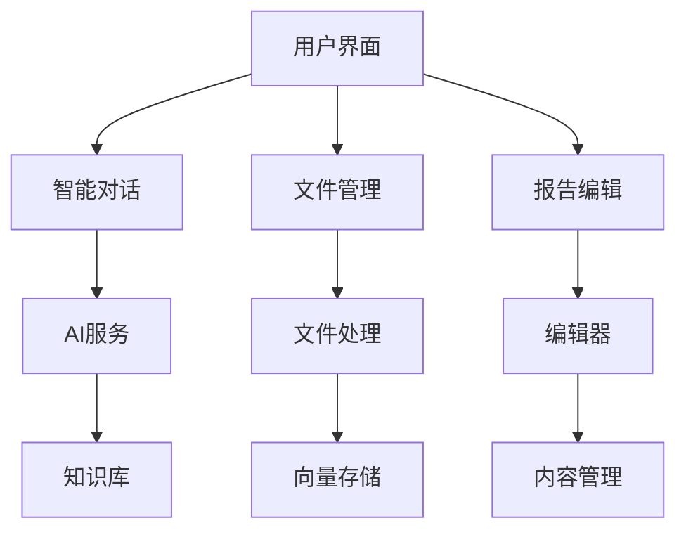

# Report AI 项目需求文档

## 项目概述

Report AI 是一个基于人工智能技术的智能报告生成系统，旨在为用户提供高效、专业的报告创作体验。系统集成了文件管理、AI对话、大纲生成、报告编辑等核心功能，通过智能化的流程帮助用户快速生成高质量的报告。

## 核心功能目标

### 智能报告生成

- **AI辅助写作**: 通过智能对话生成报告大纲和内容
- **模板管理**: 提供标准模板和自定义模板
- **实时编辑**: 支持富文本编辑和格式调整
- **引用管理**: 管理报告中的引用素材

### 文件管理系统

- **批量上传**: 支持多文件批量上传
- **企业关联**: 智能识别企业并建立关联关系
- **文件解析**: 自动识别文件类型并提取内容
- **向量化处理**: 将文件内容转换为向量存储

### 用户交互体验

- **三栏布局**: 左侧对话、中间编辑、右侧大纲
- **智能对话**: 支持自然语言交互
- **实时生成**: 基于大纲实时生成报告内容
- **状态管理**: 清晰的状态指示和进度展示

## 系统架构

## 用户流程

## 功能模块

### 首页模块

- **智能对话**: 用户输入写作需求，AI智能回复
- **文件上传**: 单一上传入口，支持多文件上传
- **模板管理**: 提供标准模板和自定义模板
- **历史报告**: 展示历史生成的报告列表

### 文件管理模块

- **文件上传**: 支持拖拽上传和批量上传
- **企业关联**: 智能识别企业并建立关联关系
- **文件解析**: 自动识别文件类型并提取内容
- **向量化处理**: 将文件内容转换为向量存储

### 大纲会话模块

- **AI对话**: 智能对话和内容生成
- **大纲预览**: 结构化展示报告大纲
- **大纲编辑**: 支持大纲的修改和调整
- **大纲确认**: 确认最终的大纲结构

### 报告详情模块

- **三栏布局**: 左侧对话、中间编辑、右侧大纲
- **实时生成**: 基于大纲实时生成报告内容
- **富文本编辑**: 支持格式化和内容编辑
- **引用管理**: 管理报告中的引用素材

## 技术需求

### 前端技术

- **React 18**: 前端框架
- **TypeScript 5**: 类型系统
- **Redux Toolkit**: 状态管理
- **Ant Design**: UI组件库
- **TinyMCE**: 富文本编辑器

### AI集成

- **智能对话**: 大语言模型API集成
- **内容生成**: 基于上下文的智能内容生成
- **文件解析**: 自动识别文件类型和内容提取
- **向量化处理**: 文本向量化和相似度计算

### 数据处理

- **文件存储**: 支持多种文件格式
- **数据同步**: 实时数据同步和冲突解决
- **缓存机制**: 智能缓存策略提升性能
- **错误处理**: 完善的错误处理和恢复机制

## 性能要求

### 响应时间

- **页面加载**: < 2秒
- **交互响应**: < 200ms
- **AI服务**: < 3秒
- **文件上传**: < 5秒

### 并发处理

- **同时用户**: 支持100+并发用户
- **文件处理**: 支持批量文件并行处理
- **AI服务**: 支持多用户同时调用

## 安全要求

### 数据安全

- **用户认证**: JWT Token认证
- **数据加密**: 传输和存储加密
- **权限控制**: 基于角色的权限管理
- **数据脱敏**: 敏感信息脱敏处理

### 应用安全

- **输入验证**: 前后端双重验证
- **XSS防护**: 内容安全策略
- **CSRF防护**: Token验证机制
- **操作审计**: 完整的日志记录

## 用户体验

### 界面设计

- **响应式布局**: 适配不同屏幕尺寸
- **直观操作**: 清晰的操作流程和提示
- **状态反馈**: 实时的状态指示和进度展示
- **错误处理**: 友好的错误提示和恢复建议

### 交互体验

- **智能提示**: 基于上下文的智能提示
- **快捷操作**: 支持快捷键和批量操作
- **自动保存**: 实时自动保存防止数据丢失
- **版本控制**: 支持内容版本管理和历史回溯

## 验收标准

### 功能完整性

- [ ] 所有核心功能模块正常工作
- [ ] AI对话和内容生成功能稳定
- [ ] 文件上传和处理功能完整
- [ ] 报告编辑和导出功能正常

### 性能指标

- [ ] 页面加载时间符合要求
- [ ] 交互响应时间满足标准
- [ ] AI服务响应时间达标
- [ ] 并发处理能力满足需求

### 用户体验

- [ ] 界面设计符合设计规范
- [ ] 操作流程清晰易懂
- [ ] 错误处理友好有效
- [ ] 响应式布局适配良好

---

_最后更新时间: 2024年12月_
