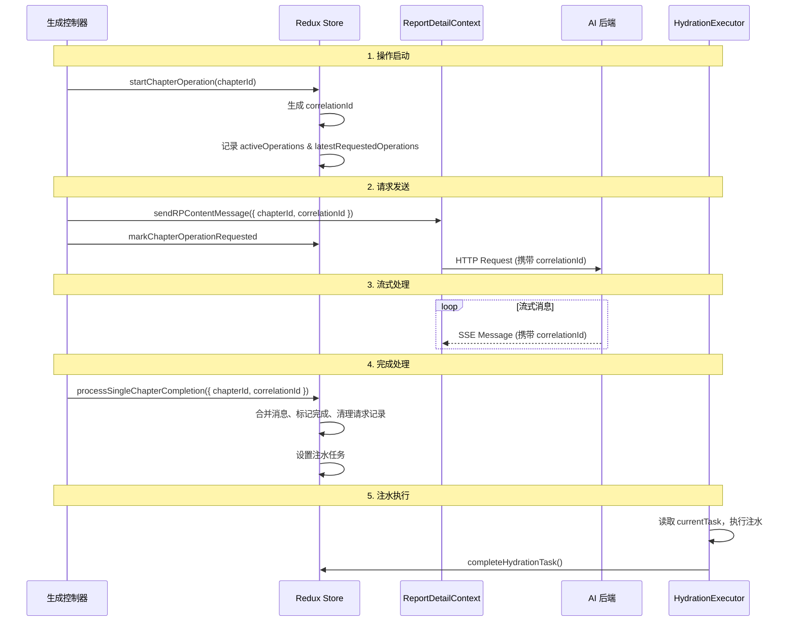

# Correlation ID 设计文档

> 阐述 Correlation ID 机制的设计理念、生命周期管理以及在各个 AIGC 场景中的应用。

## 1. 设计动机

### 1.1 核心问题

1. **多次生成追踪**：同一章节可能被多次生成/重生成，需要区分每次操作
2. **并发操作识别**：多个章节可能同时进行生成，需要准确追踪每个操作
3. **跨模块协作**：从请求发起 → 流式处理 → 消息合并 → 注水执行，需要统一的标识符串联整个链路
4. **调试与监控**：出现问题时，需要通过日志快速定位是哪次操作、哪个章节出现了问题

### 1.2 设计目标

- **唯一性**：每次操作都有全局唯一的标识符
- **可追踪性**：从操作开始到结束，所有环节都能通过 correlationId 关联
- **幂等性**：支持重复请求检测，避免同一操作被多次触发
- **可调试性**：日志中包含 correlationId，便于问题排查

## 2. 核心概念

### 2.1 什么是 Correlation ID

Correlation ID（关联 ID）是一个全局唯一的字符串标识符，用于追踪单次章节操作的完整生命周期。

**格式**：`corr_{timestamp}_{random}`  
**示例**：`corr_1699876543210_a3f8k2m9x`

**组成部分**：

- `corr_` - 固定前缀，便于识别
- `{timestamp}` - 毫秒级时间戳，保证时序性
- `{random}` - 9 位随机字符串，保证唯一性

**生成位置**：`apps/report-ai/src/domain/chat/correlation.ts`

### 2.2 核心数据结构

| 结构                           | 作用     | 关键字段                                        |
| ------------------------------ | -------- | ----------------------------------------------- |
| `ChapterOperation`             | 操作记录 | `correlationId`, `chapterId`, `status`          |
| `ChapterOperationRequestState` | 请求追踪 | `correlationId`, `requested`（幂等控制）        |
| `RPHydrationState`             | 注水状态 | `activeOperations`, `latestRequestedOperations` |

**类型定义位置**：`apps/report-ai/src/types/report/generation.ts`

## 3. 生命周期管理

### 3.1 完整生命周期



### 3.2 五个关键阶段

| 阶段            | 触发时机          | 关键动作                               | 状态变化                                        |
| --------------- | ----------------- | -------------------------------------- | ----------------------------------------------- |
| **1. 操作启动** | 用户点击生成      | 生成 correlationId，锁定章节，清空内容 | `activeOperations` 新增记录，`requested: false` |
| **2. 请求发送** | Hook 检测到未发送 | 发送 API 请求，标记已发送              | `requested: true`                               |
| **3. 流式处理** | 接收 SSE 消息     | 解析并存储消息                         | `parsedRPContentMessages` 累积                  |
| **4. 完成处理** | 检测到完成消息    | 合并消息到章节，设置注水任务           | `status: 'completed'`，清理请求记录             |
| **5. 注水执行** | Executor 读取任务 | 写入 TinyMCE，完成任务                 | `currentTask: 'idle'`                           |

### 3.3 关键实现位置

| 阶段     | 实现位置                                                                        |
| -------- | ------------------------------------------------------------------------------- |
| 操作启动 | `reducers/aigc/chapterOperation.ts` - `startChapterOperation`                   |
| 请求发送 | `hooks/utils/generationUtils.ts` - `shouldSendRequest`, `sendGenerationRequest` |
| 流式处理 | `context/ReportDetailContext` - SSE 消息解析                                    |
| 完成处理 | `utils/chapterProcessing.ts` - `processSingleChapterCompletion`                 |
| 注水执行 | `hooks/rehydration/useHydrationExecutor.ts`                                     |

## 4. 场景应用

### 4.1 单章节重生成

**特点**：单个 correlationId，直接处理，快速完成

**GlobalOperation 数据**：

```typescript
{
  kind: 'chapter_regeneration',
  data: {
    type: 'chapter_regeneration',
    chapterId: 'chapter_123',
    correlationId: 'corr_1699876543210_a3f8k2m9x',
  }
}
```

**实现位置**：`hooks/useChapterRegeneration.ts`

### 4.2 全文生成

**特点**：批量创建 correlationId（每个叶子章节一个），顺序处理，逐章节注水

**correlationId 存储示例**：

```typescript
{
  hydration: {
    activeOperations: {
      'corr_xxx_001': { chapterId: 'chapter_1', status: 'completed' },
      'corr_xxx_002': { chapterId: 'chapter_2', status: 'pending' },
      'corr_xxx_003': { chapterId: 'chapter_3', status: 'pending' },
    },
    latestRequestedOperations: {
      'chapter_1': { correlationId: 'corr_xxx_001', requested: true },
      'chapter_2': { correlationId: 'corr_xxx_002', requested: true },
      'chapter_3': { correlationId: 'corr_xxx_003', requested: false },
    }
  }
}
```

**实现位置**：`hooks/useFullDocGeneration.ts`, `hooks/useFullDocGenerationController.ts`

### 4.3 多章节顺序生成

**特点**：用户自选章节，保持选择顺序，支持失败重试

**失败处理**：

```typescript
{
  globalOp: {
    kind: 'multi_chapter_generation',
    data: {
      queue: ['chapter_1', 'chapter_2', 'chapter_3'],
      currentIndex: 2,
      failedChapters: ['chapter_2'],  // 记录失败的章节
    }
  }
}
```

**实现位置**：`hooks/useMultiChapterGeneration.ts`

## 5. 幂等性保证

### 5.1 三层幂等控制

| 层级         | 机制               | 实现方式                                     |
| ------------ | ------------------ | -------------------------------------------- |
| **请求幂等** | `requested` 标记   | 发送前检查，发送后标记为 `true`              |
| **完成幂等** | correlationId 匹配 | 检查是否为当前操作，处理后清理记录           |
| **注水幂等** | 状态机控制         | 使用 `currentTask` 状态，执行后重置为 `idle` |

### 5.2 幂等检查示例

**请求发送前检查**：

```typescript
const latest = latestRequestedOperations[chapterId];
if (!latest || latest.requested) {
  return; // 已发送，跳过
}
```

**完成处理时检查**：

```typescript
const latest = latestRequestedOperations[chapterId];
if (!latest || latest.correlationId !== correlationId) {
  return; // 不是当前操作，忽略
}
```

## 6. 兜底策略

### 6.1 三级兜底机制

| 场景                   | 策略               | 说明                                         |
| ---------------------- | ------------------ | -------------------------------------------- |
| **缺失 correlationId** | 强约束 + 警告      | 要求必须提供，否则记录警告并跳过             |
| **操作记录不存在**     | 继续处理 + 警告    | 记录警告但不阻断流程                         |
| **请求记录不匹配**     | 使用最新 ID + 警告 | 优先使用 `latestRequestedOperations` 中的 ID |

### 6.2 兜底实现位置

- `utils/chapterProcessing.ts` - `processSingleChapterCompletion` 中的兜底逻辑
- `hooks/utils/generationUtils.ts` - `shouldSendRequest` 中的检查逻辑

## 7. 调试指南

### 7.1 关键日志点

| 阶段     | 日志标识                              | 关键信息                             |
| -------- | ------------------------------------- | ------------------------------------ |
| 操作启动 | `[ChapterOperation] Started`          | `chapterId`, `correlationId`         |
| 请求发送 | `[ChapterOperation] Request sent`     | `chapterId`, `correlationId`         |
| 消息接收 | `[ChapterOperation] Message received` | `chapterId`, `correlationId`, `type` |
| 完成处理 | `[ChapterOperation] Completed`        | `chapterId`, `correlationId`         |
| 注水执行 | `[ChapterOperation] Hydrated`         | `chapterId`, `correlationId`         |

### 7.2 Redux DevTools 检查

**检查点**：

- `state.reportContent.hydration.activeOperations` - 查看所有进行中的操作
- `state.reportContent.hydration.latestRequestedOperations` - 查看请求状态
- `state.reportContent.hydration.currentTask` - 查看当前注水任务

### 7.3 常见问题排查

| 问题                     | 排查步骤                                                                                                                                                                      |
| ------------------------ | ----------------------------------------------------------------------------------------------------------------------------------------------------------------------------- |
| **章节生成后未注水**     | 1. 检查 `activeOperations` 是否有记录<br>2. 检查 `processSingleChapterCompletion` 是否被调用<br>3. 检查 `currentTask` 是否正确设置<br>4. 检查 `useHydrationExecutor` 是否触发 |
| **重复发送请求**         | 1. 检查 `requested` 是否为 `true`<br>2. 检查 `markChapterOperationRequested` 是否被调用<br>3. 检查是否有多个 Hook 实例                                                        |
| **correlationId 不匹配** | 1. 检查请求发送时的 correlationId<br>2. 检查后端返回的 correlationId<br>3. 检查完成处理接收的 correlationId<br>4. 检查是否有并发操作覆盖                                      |

## 8. 最佳实践

### 8.1 开发规范

| 规范                               | 说明                                                    |
| ---------------------------------- | ------------------------------------------------------- |
| **始终使用 startChapterOperation** | 不要手动生成 correlationId                              |
| **完成时必须传递 correlationId**   | `processSingleChapterCompletion` 必须包含 correlationId |
| **检查幂等性**                     | 发送请求前使用 `shouldSendRequest` 检查                 |
| **及时清理**                       | 完成后立即删除 `latestRequestedOperations` 记录         |

### 8.2 测试建议

- **单元测试**：测试 correlationId 生成的唯一性
- **集成测试**：测试完整生命周期的 correlationId 传递
- **并发测试**：测试多个章节同时生成时的 correlationId 隔离
- **失败测试**：测试 correlationId 缺失时的兜底逻辑

## 9. 相关文档

### 设计文档

- [内容管理模块总览](./README.md) - 整体架构与流程蓝图
- [数据与状态管理](./data-layer-guide.md) - Canonical/Draft 分层、哈希判定、保存流程
- [生命周期与交互控制](./lifecycle-flow.md) - AIGC 生成与用户编辑的互斥编排
- [Hydration 运行手册](../../../src/store/reportContentStore/hooks/rehydration/HYDRATION.md) - 注水机制详解

### AIGC 流程

- [AIGC 核心流程](./aigc-core-flow.md) - 通用 AIGC 流程
- [全文生成流程](./full-generation-flow.md) - 批量 correlationId 管理
- [多章节顺序生成流程](./multi-chapter-sequential-aigc-flow.md) - 灵活队列管理
- [单章节生成流程](./single-chapter-aigc-flow.md) - 单一 correlationId 处理

### 代码实现

- `reducers/aigc/chapterOperation.ts` - correlationId 创建与管理
- `utils/chapterProcessing.ts` - 完成处理逻辑
- `domain/chat/correlation.ts` - correlationId 生成函数
- `hooks/utils/generationUtils.ts` - 幂等控制工具

---

**文档版本**：v1.0  
**最后更新**：2024-11-11  
**维护者**：AI Assistant
