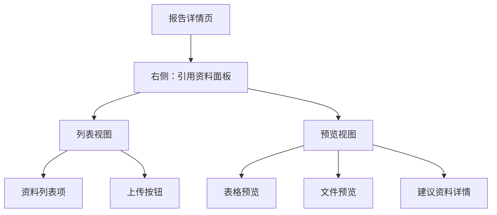
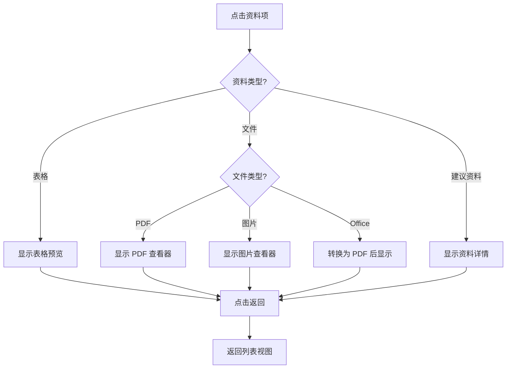
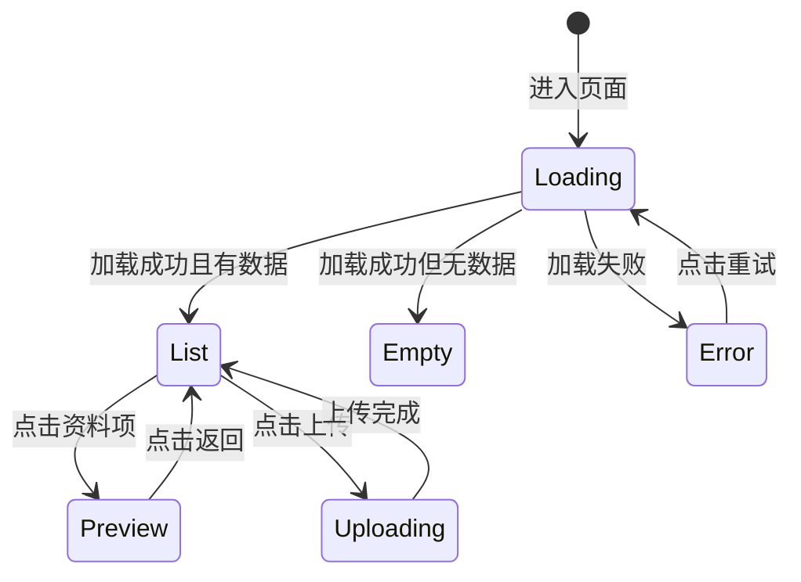
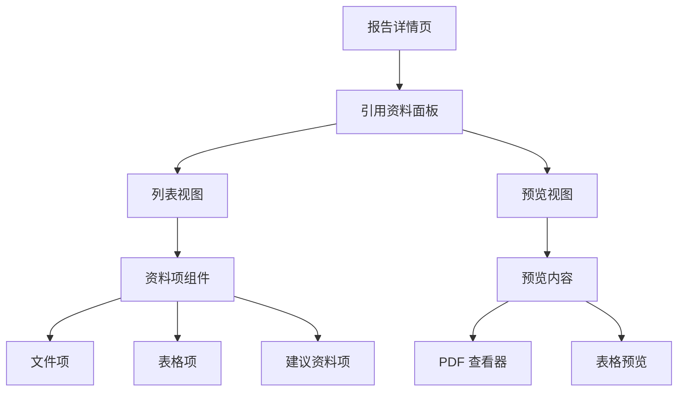

# 引用资料模块 - 前端设计文档

> 参考规范：`docs/rule/doc-design-rule.md`

## 📂 代码关联

| 功能模块         | 代码位置                                   | 说明                             |
| ---------------- | ------------------------------------------ | -------------------------------- |
| **引用资料组件** | `../../src/components/Reference/`          | 资料列表、预览、文件项等通用组件 |
| **页面集成**     | `../../src/pages/RPDetail/Reference/`      | 报告详情页中的引用资料面板       |
| **PDF 查看器**   | `../../src/components/File/PDFViewer/`     | PDF 文档预览组件                 |
| **数据管理**     | `../../src/domain/reportEditor/reference/` | 引用资料数据处理与排序           |
| **Redux Store**  | `../../src/store/reportEditor/`            | 报告编辑器状态管理               |

> 代码变更时请同步更新本文档

## 🧭 设计概览

### 功能范围与边界

引用资料模块负责展示和管理报告中所有引用的资料（数据表格、建议资料、文件），提供统一的列表视图和预览功能，支持文件上传和删除。

**边界**：

- ✅ 资料展示、预览、上传、删除
- ❌ 资料内容编辑（只读预览）
- ❌ 资料权限管理（由后端控制）

### 关键用例

1. 查看报告中所有引用资料列表
2. 预览表格数据（滚动查看）
3. 预览 PDF 文件（翻页、缩放）
4. 上传新文件到报告
5. 删除不需要的文件

> 详细需求与验收标准见 `01-requirement.md`

## 🗺 信息架构

**导航规则**：

- 无独立路由，嵌入在报告详情页右侧面板
- 列表视图 ↔ 预览视图通过点击资料项或返回按钮切换

## 🧱 页面蓝图

### 列表视图

**区域职责**：

| 区域             | 职责               | 显示数据                   | 允许操作       | 条件           |
| ---------------- | ------------------ | -------------------------- | -------------- | -------------- |
| 顶部标题栏       | 显示标题和操作入口 | "全部参考资料"             | 点击上传       | 始终显示       |
| 资料列表         | 展示所有资料       | 序号、图标、名称、引用次数 | 点击预览、删除 | 有资料时显示   |
| 加载/空/错误状态 | 状态提示           | 加载动画/空提示/错误信息   | 重试（错误时） | 对应状态时显示 |

### 预览视图

**区域职责**：

| 区域     | 职责         | 显示数据           | 允许操作         | 条件             |
| -------- | ------------ | ------------------ | ---------------- | ---------------- |
| 返回按钮 | 返回列表     | "返回"             | 点击返回         | 预览时显示       |
| 预览区   | 显示资料内容 | 表格/文件/资料详情 | 滚动、翻页、缩放 | 预览时显示       |
| 操作区   | 控制预览     | 页码、缩放比例     | 翻页、缩放、下载 | 根据资料类型显示 |

> 详细布局与状态反馈见 `01-requirement.md`

## 🔄 交互流程

### 预览资料流程

### 资料面板状态机

## 🧮 数据管理

### 数据来源

| 数据         | 来源                            | 依赖             | 刷新时机                |
| ------------ | ------------------------------- | ---------------- | ----------------------- |
| 引用资料列表 | Redux (selectSortedReferences)  | 章节数据         | 章节数据更新时          |
| 引用资料 Map | Redux (selectReferenceMap)      | sortedReferences | sortedReferences 更新时 |
| 全局引用索引 | Redux (selectReferenceIndexMap) | sortedReferences | sortedReferences 更新时 |

### 排序规则

1. 按章节顺序排序（第一个章节的所有引用在最前面）
2. 章节内按类型排序：表格（DPU）> 建议资料（RAG）> 文件（File）
3. 同类型内保持默认顺序（文件按上传时间降序）
4. 全局序号由 Redux selector 自动计算

### 缓存策略

- Redux selector 使用 memoization，避免重复计算
- 章节数据变化时，缓存自动失效

## 📌 置顶文件设计

**目标**：展示未被章节引用的报告级文件，便于发现和清理。

**数据来源**：

- 基础数据：`selectFileUnifiedMap`（已聚合的统一文件映射）
- 派生选择器：`selectTopReportFiles`
- 计算规则：`src/domain/reportReference/topFiles.ts`
- 判断依据：`refChapter` 为空或长度为 0 的文件即为未被章节引用的置顶文件

**组件实现**：

- 列表区块：`src/components/Reference/TopFilesSection/`
- 列表项：复用 `ReferenceItemFile`

## 🧩 组件分解

### 组件层级

### 核心组件

| 组件                           | 职责                   | 代码位置                                               |
| ------------------------------ | ---------------------- | ------------------------------------------------------ |
| **ReferenceView**              | 容器组件，管理视图切换 | `src/components/Reference/ReferenceView/`              |
| **RPReferenceListWithChapter** | 展示资料列表           | `src/components/Reference/RPReferenceListWithChapter/` |
| **ReferenceItemFile**          | 文件资料项             | `src/components/Reference/ReferenceItemFile/`          |
| **ReferenceItemTable**         | 表格资料项             | `src/components/Reference/ReferenceItemTable/`         |
| **ReferenceItemSuggest**       | 建议资料项             | `src/components/Reference/ReferenceItemSuggest/`       |
| **ReferencePreviewContent**    | 预览内容               | `src/components/Reference/ReferencePreviewContent/`    |
| **FilePreviewRenderer**        | 文件预览渲染器         | `src/components/Reference/FilePreviewRenderer/`        |
| **DPUPreviewRenderer**         | 表格预览渲染器         | `src/components/Reference/DPUPreviewRenderer/`         |
| **PDFViewer**                  | PDF 查看器             | `src/components/File/PDFViewer/`                       |
| **TopFilesSection**            | 置顶文件区块           | `src/components/Reference/TopFilesSection/`            |

### PDFViewer 组件

**代码位置**: `src/components/File/PDFViewer/`

**功能特性**:

- 支持 URL、Blob、自定义加载函数
- 懒加载优化
- 缩放控制（25%-200%）
- 旋转功能（90° 增量）
- 分页导航
- 文本选区高亮
- 智能降级

**详细文档**: `src/components/File/PDFViewer/README.md`

### 错误处理边界

| 错误类型     | 捕获位置                   | 处理方式           | 代码位置                                               |
| ------------ | -------------------------- | ------------------ | ------------------------------------------------------ |
| 数据加载错误 | RPReferenceListWithChapter | 显示错误提示       | `src/components/Reference/RPReferenceListWithChapter/` |
| 预览加载错误 | ReferencePreviewContent    | 显示错误提示和重试 | `src/components/Reference/ReferencePreviewContent/`    |
| PDF 加载错误 | PDFViewer                  | 切换到降级方案     | `src/components/File/PDFViewer/`                       |
| 上传错误     | UploadFileBtn              | Toast 提示         | `src/components/UploadFileBtn/`                        |

## ✅ 检查清单

- [x] 页面蓝图与区域职责明确
- [x] 主要任务流程完整
- [x] 加载、空、错误状态明确
- [x] 路由与导航规则清晰
- [x] 排序规则明确
- [x] 组件拆分与复用边界清晰
- [x] 错误处理边界明确
- [x] 数据来源和刷新策略清晰
- [x] 代码位置已标注

