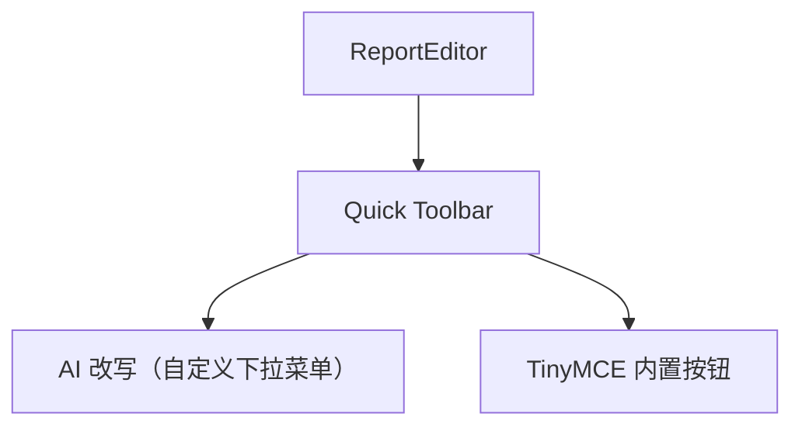
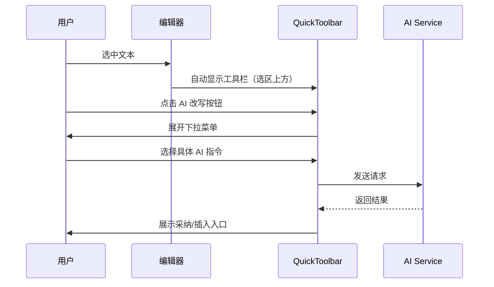
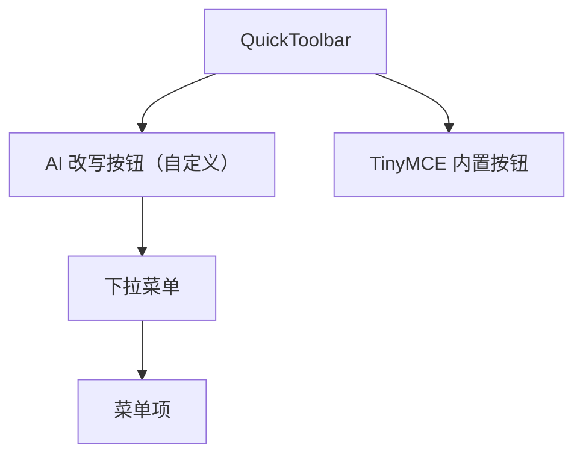

# Quick Toolbar 前端设计文档（布局与功能）

> **相关代码**：
>
> - `src/components/ReportEditor/config/editorConfig.ts` - 编辑器主配置
> - `src/components/ReportEditor/config/menu/` - AI 菜单和快捷键注册
> - `src/components/ReportEditor/config/README.md` - 配置模块说明
>
> **相关文档**：
>
> - [Context Menu 问题记录](../../issues/context-menu-issues.md) - 为什么改用 Quick Toolbar
> - [TypeScript 规范](../../../../docs/rule/code-typescript-style-rule.md)
> - [React 规范](../../../../docs/rule/code-react-component-rule.md)

## 🧭 设计概览

- 目标：Quick Toolbar 成为 ReportEditor 唯一的编辑入口，统一承载 AI 能力与所有基础排版命令。
- 范围：工具栏结构（按钮分组）、定位策略、状态反馈；不包含视觉主题细节。
- 用例：
  - 选中文本自动浮现工具栏，执行 AI 改写、文本格式、段落排版等操作
  - 快捷键触发工具栏，快速调用常用命令
- 工具栏采用横向按钮组布局，支持下拉菜单展开更多选项

## 🗺 信息架构与导航

- 工具栏首个按钮为 `AI 改写`（自定义实现），点击展开下拉菜单（文本优化/内容控制/内容分析）。
- 其他编辑按钮使用 TinyMCE 内置功能，具体配置参考代码实现。
- 工具栏支持键盘 Tab 键导航；下拉菜单支持方向键选择。

## 🧱 结构与内容

### AI 改写（自定义下拉菜单）

| 功能分组 | 说明                             | 可见性/前置条件                  |
| -------- | -------------------------------- | -------------------------------- |
| 文本优化 | 改写、润色、扩写、缩写等 AI 能力 | 有选区时启用；无选区时禁用并提示 |
| 内容控制 | 语气调整、专业度控制等           | 有选区时启用；无选区时禁用并提示 |
| 内容分析 | 总结、提取关键点等               | 有选区时启用；无选区时禁用并提示 |

### 其他编辑工具

其他编辑工具（文本样式、标题、颜色、列表、对齐等）使用 TinyMCE Quick Toolbar 内置功能，具体配置和按钮列表参考代码实现。

## 🎛 布局与呈现

- 基于 TinyMCE Quick Toolbar 插件，横向按钮组布局，使用分隔符分组。
- 选中文本自动触发，工具栏浮现在选区上方；支持快捷键手动唤起。
- `AI 改写` 使用自定义下拉按钮，点击展开纵向菜单列表。
- 按钮支持图标 + 文字或纯图标模式；下拉菜单项显示文字 + 快捷键提示。

## 📐 定位策略

- 水平方向：工具栏水平居中对齐选区（`left: 50%` + `translateX(-50%)`），避免遮挡文本。
- 垂直方向：默认显示在选区上方（`rect.top - toolbarHeight - 8px`）；若上方空间不足则显示在下方（`rect.bottom + 8px`）。
- 视口边界检测：工具栏超出视口时自动调整位置，确保完整可见（左右各预留 12px）。
- 下拉菜单默认在按钮下方展开；空间不足时自动向上展开。

## 🔄 交互流程与状态

| 触发条件     | 系统行为              | 用户反馈                        | 可撤销       | 备注                   |
| ------------ | --------------------- | ------------------------------- | ------------ | ---------------------- |
| 选区为空     | 禁用 AI 改写按钮      | tooltip 提示需先选中文本        | 否           | 其他按钮保持可用       |
| 执行编辑命令 | 调用 TinyMCE 内置指令 | 文本/段落即时变化，按钮状态更新 | 是（撤销）   | 与 Undo 栈一致         |
| 执行 AI 命令 | 按钮显示加载状态      | 工具栏或正文出现进度与结果      | 是（不采纳） | 失败可重试             |
| 取消选区     | 工具栏自动隐藏        | 无额外提示                      | -            | 重新选中文本后再次显示 |
| 点击外部     | 工具栏自动隐藏        | 无额外提示                      | -            | 保持编辑器焦点         |

## 🧮 数据与状态

- 输入：选区范围、当前格式状态、可用命令列表。
- 本地状态：工具栏可见性、AI 任务状态（idle/running/success/error）、按钮激活状态。
- 输出：执行 TinyMCE 命令或触发 `onAIAction` 回调，不直接持久化。

## 🧩 组件分解

- `AI 改写` 按钮为自定义实现，使用 TinyMCE 的 `addButton` API 注册。
- 下拉菜单使用自定义组件，支持分组和快捷键显示。
- 其他按钮通过 `quickbars_selection_toolbar` 配置字符串注册。

**代码实现**：

- AI 菜单注册：`src/components/ReportEditor/config/menu/aiMenus.ts`
- 快捷键注册：`src/components/ReportEditor/config/menu/shortcuts.ts`
- 运行时绑定：`src/components/ReportEditor/config/editorConfig.ts` - `bindEditorRuntime`

## 🚫 非目标

- 不覆盖视觉主题（阴影、圆角、字体、按钮样式）。
- 不涉及 AI 接口细节、结果渲染模板。
- 不处理键盘快捷键定义（见 Shortcut 文档）。
- 不实现右键菜单功能（完全由 Quick Toolbar 替代）。

## ✅ 检查清单

- [ ] 工具栏首个按钮为 `AI 改写`，下拉菜单功能完整
- [ ] 选中文本时工具栏自动显示在选区上方，水平居中
- [ ] AI 指令无选区时禁用并给出 tooltip 提示
- [ ] 取消选区或点击外部时工具栏自动隐藏
- [ ] 按钮状态实时反映当前格式
- [ ] 工具栏在视口边界自动调整位置，确保完整可见

