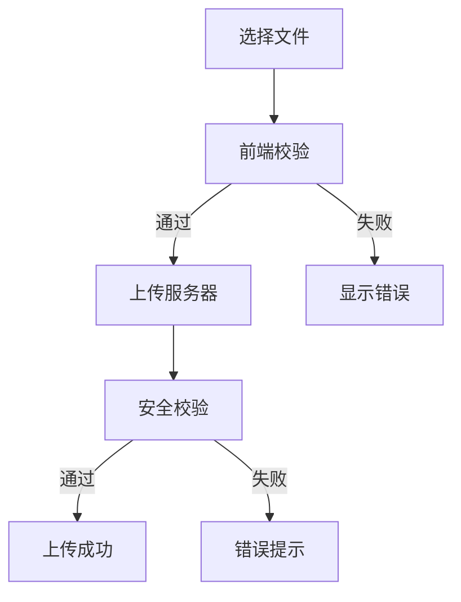

# 文件上传功能

报告 AI 系统的文件上传模块，为报告生成过程提供各类参考文档和资料的上传能力。

## 功能特性

- **多种上传方式**: 点击、拖拽、粘贴
- **文件类型支持**: PDF、DOC/DOCX、TXT、图片、Excel等
- **三层校验机制**: 前端校验 + 服务端校验 + 安全校验
- **状态管理**: 完整的上传状态流转
- **智能错误处理**: 基于错误码的精准用户提示

## 使用场景

| 场景 | 文件类型 | 用途 | 组件 |
| ---- | ---- | ---- | ---- |
| 聊天发送器 | 参考文档、数据文件 | 为AI提供报告生成素材 | UploadFileBtn |
| 文件管理 | 企业资料、财务报表 | 批量素材管理和企业关联 | UploadFileBtn |
| 报告详情页 | 补充材料、模板文件 | 完善报告内容的参考资料 | UploadFileBtn |
| 报告引用资料 | 补充参考文件 | 为已生成报告补充引用 | ReferenceView |

## 核心组件

| 组件 | 职责 |
| ---- | ---- |
| useFileUploadService | 统一文件上传服务 Hook |
| UploadFileBtn | 通用上传按钮组件 |
| DragUpload | 拖拽上传容器组件 |

## 上传流程

## 文档结构

### 核心文档

- [requirements.md](./requirements.md) - 功能需求和验收标准
- [design.md](./design.md) - 交互设计和开发规范
- [api.md](./api.md) - API 接口文档

### 关联实现

- @see ../../src/hooks/useFileUploadService.ts - 统一上传服务
- @see ../../src/components/UploadFileBtn - 上传组件
- @see ../../pages/FileManagement - 文件管理页面

## 关联引用

- @see ../fileStatus-polling.md - 文件状态轮询机制
- @see ../../RPDetail/Reference/README.md - 报告引用资料模块
- @see ../../components/ChatSenderReport/README.md - 聊天发送器
