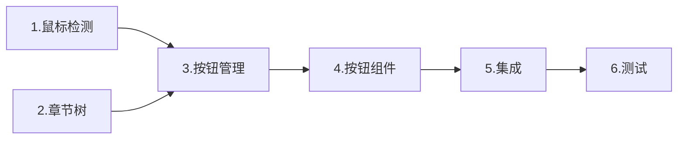

# 实施拆解 - 章节标题悬停 AIGC 按钮

> 📖 [返回任务概览](./README.md) | 遵循 [Spec 文档编写规范](../../../../../docs/rule/doc-spec-rule.md)

## 子任务列表

| 序号 | 子任务              | 负责人 | 关联代码目录                        | 预计交付   | 状态 |
| ---- | ------------------- | ------ | ----------------------------------- | ---------- | ---- |
| 1    | 实现鼠标检测 Hook   | Kiro   | `hooks/useMouseChapterDetector.tsx` | 2025-11-06 | 🔄   |
| 2    | 实现章节树 Hook     | Kiro   | `hooks/useChapterTree.tsx`          | 2025-11-06 | 🔄   |
| 3    | 实现按钮管理 Hook   | Kiro   | `hooks/useAIGCButtonManager.tsx`    | 2025-11-07 | ⏸️   |
| 4    | 实现按钮组件        | Kiro   | `components/ChapterAIGCButton/`     | 2025-11-07 | ⏸️   |
| 5    | 集成到 ReportEditor | Kiro   | `components/ReportEditor/`          | 2025-11-08 | ⏸️   |
| 6    | 编写单元测试        | Kiro   | `__tests__/`                        | 2025-11-09 | ⏸️   |

## 子任务详情

### 1. 实现鼠标检测 Hook 🔄

**目标**：监听鼠标移动，检测当前悬停的章节 ID

**核心职责**：

- 监听 mousemove 事件
- 使用 elementFromPoint 检测元素
- 向上查找标题元素（h1-h6）
- 返回 chapterId

**验收标准**：

- ✅ 准确识别带有 data-chapter-id 的标题
- ✅ RAF 节流，16ms 一次
- ✅ 正确清理事件监听

### 2. 实现章节树 Hook 🔄

**目标**：提供章节树结构，判断是否为 leaf chapter

**核心职责**：

- 构建章节树结构
- 提供 isLeafChapter(id) 方法
- 缓存章节关系

**验收标准**：

- ✅ 正确判断 leaf chapter
- ✅ 支持章节树更新

### 3-6. 其他子任务

详细说明待补充，参考 [方案设计](./spec-design-v1.md)。

## 依赖关系

## 更新记录

| 日期       | 修改人 | 更新内容                   |
| ---------- | ------ | -------------------------- |
| 2025-11-05 | Kiro   | 简化子任务，聚焦核心功能   |
| 2025-11-XX | Codex  | 更新悬停检测目标与验收标准 |
| 2025-10-29 | Kiro   | 从主文档拆分实施拆解       |

