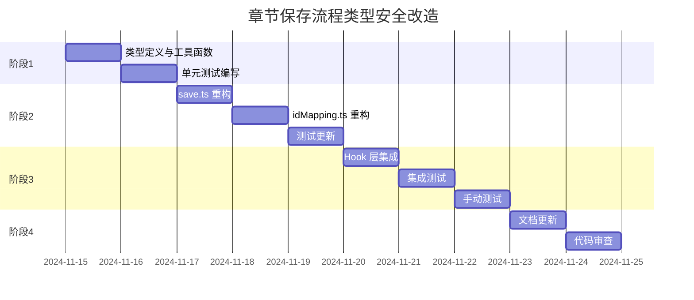

# 章节保存流程类型安全改造 - 实施计划

> 回链：[任务概览](./README.md) | 状态：📝 待实施 | 版本：v1.0

## 1. 任务拆解

### 1.1 总体时间线



**总工期**：3-5 个工作日

### 1.2 任务列表

| 任务 ID | 任务名称               | 负责人 | 预计工时 | 依赖   | 状态      |
| ------- | ---------------------- | ------ | -------- | ------ | --------- |
| T1      | 创建类型定义文件       | 待分配 | 0.5d     | -      | 📝 待开始 |
| T2      | 实现 ID 工具函数       | 待分配 | 0.5d     | T1     | 📝 待开始 |
| T3      | 编写类型守卫与验证     | 待分配 | 0.5d     | T1     | 📝 待开始 |
| T4      | 单元测试（类型与工具） | 待分配 | 0.5d     | T2, T3 | 📝 待开始 |
| T5      | 重构 save.ts           | 待分配 | 1d       | T4     | 📝 待开始 |
| T6      | 重构 idMapping.ts      | 待分配 | 0.5d     | T5     | 📝 待开始 |
| T7      | 更新相关测试           | 待分配 | 0.5d     | T5, T6 | 📝 待开始 |
| T8      | 集成 Hook 层           | 待分配 | 0.5d     | T7     | 📝 待开始 |
| T9      | 集成测试与手动测试     | 待分配 | 1d       | T8     | 📝 待开始 |
| T10     | 文档更新与代码审查     | 待分配 | 0.5d     | T9     | 📝 待开始 |

## 2. 详细实施步骤

### 阶段 1：类型定义与工具函数（1.5 天）

#### T1: 创建类型定义文件（0.5 天）

**目标**：建立新的类型系统基础

**交付物**：

- `apps/report-ai/src/domain/chapter/types/save.ts`
- `apps/report-ai/src/domain/chapter/types/guards.ts`
- `apps/report-ai/src/domain/chapter/types/index.ts`

**关键代码**：

```typescript
// save.ts
export interface TempChapterPayload {
  /* ... */
}
export interface PersistedChapterPayload {
  /* ... */
}
export type ChapterSavePayload = TempChapterPayload | PersistedChapterPayload;

// guards.ts
export function isTempChapter(chapter: ChapterSavePayload): chapter is TempChapterPayload;
export function isPersistedChapter(chapter: ChapterSavePayload): chapter is PersistedChapterPayload;
```

**验收标准**：

- [ ] 类型定义完整，包含所有必需字段
- [ ] 导出类型可被其他模块正确引用
- [ ] 类型守卫函数签名正确

**参考**：@see [spec-design-v1.md](./spec-design-v1.md#21-类型系统重构)

---

#### T2: 实现 ID 工具函数（0.5 天）

**目标**：统一 ID 处理逻辑

**交付物**：

- `apps/report-ai/src/domain/chapter/utils/idUtils.ts`
- `apps/report-ai/src/domain/chapter/utils/index.ts`

**关键函数**：

- `chapterIdToString()`
- `stringToChapterId()`
- `isValidChapterId()`
- `isTempId()`
- `generateTempId()`

**验收标准**：

- [ ] 所有工具函数实现完整
- [ ] 边界情况处理正确（undefined、NaN、负数等）
- [ ] 导出接口清晰

**参考**：@see [spec-design-v1.md](./spec-design-v1.md#23-id-处理统一)

---

#### T3: 编写类型守卫与验证（0.5 天）

**目标**：实现运行时类型检查

**交付物**：

- `apps/report-ai/src/domain/chapter/utils/validation.ts`（可选）
- `apps/report-ai/src/domain/chapter/errors/ChapterValidationError.ts`

**关键代码**：

```typescript
// guards.ts 实现
export function isTempChapter(chapter: ChapterSavePayload): chapter is TempChapterPayload {
  return chapter.isTemporary === true && 'tempId' in chapter;
}

// validation.ts（可选，使用 Zod）
export const ChapterSavePayloadSchema = z.union([...]);
export function validateChapterSavePayload(data: unknown): ChapterSavePayload;
```

**验收标准**：

- [ ] 类型守卫逻辑正确
- [ ] 自定义错误类实现完整
- [ ] Zod Schema 定义完整（如果使用）

**参考**：@see [spec-design-v1.md](./spec-design-v1.md#24-运行时验证可选)

---

#### T4: 单元测试（类型与工具）（0.5 天）

**目标**：确保基础设施正确性

**交付物**：

- `apps/report-ai/src/domain/chapter/types/__tests__/guards.test.ts`
- `apps/report-ai/src/domain/chapter/utils/__tests__/idUtils.test.ts`
- `apps/report-ai/src/domain/chapter/utils/__tests__/validation.test.ts`

**测试覆盖**：

- 类型守卫：临时章节、持久章节、边界情况
- ID 工具：转换、验证、边界情况
- 验证函数：有效数据、无效数据、错误信息

**验收标准**：

- [ ] 测试覆盖率 ≥ 90%
- [ ] 所有边界情况有测试
- [ ] 测试通过

---

### 阶段 2：核心模块重构（2 天）

#### T5: 重构 save.ts（1 天）

**目标**：消除 `any` 类型，使用新类型系统

**修改文件**：

- `apps/report-ai/src/domain/chapter/transforms/save.ts`

**重构函数**：

1. `convertDocumentChaptersToSaveFormat`
2. `mergeSavedChaptersWithCanonical`

**关键改动**：

```typescript
// 重构前
return saveChapter as any; // ❌

// 重构后
if (docChapter.isTemporary) {
  if (!docChapter.tempId) {
    throw new ChapterValidationError(/* ... */);
  }
  return { ...basePayload, tempId: docChapter.tempId, isTemporary: true };
} else {
  if (!docChapter.chapterId) {
    throw new ChapterValidationError(/* ... */);
  }
  return { ...basePayload, chapterId: docChapter.chapterId };
}
```

**验收标准**：

- [ ] 移除所有 `as any`
- [ ] 使用判别联合类型
- [ ] 添加运行时检查
- [ ] 使用 ID 工具函数
- [ ] 类型检查通过（`tsc --noEmit`）

**参考**：@see [spec-design-v1.md](./spec-design-v1.md#31-convertdocumentchapterstosaveformat-重构)

---

#### T6: 重构 idMapping.ts（0.5 天）

**目标**：使用新类型系统，增强类型安全

**修改文件**：

- `apps/report-ai/src/domain/chapter/transforms/idMapping.ts`

**重构函数**：

- `applyIdMapToChapters`

**关键改动**：

```typescript
if (isTempChapter(chapter)) {
  const newId = idMap[chapter.tempId];
  if (!newId) return chapter;
  if (!isValidChapterId(newId)) {
    throw new ChapterValidationError(/* ... */);
  }
  const { tempId, isTemporary, ...rest } = chapter;
  return { ...rest, chapterId: newId };
}
```

**验收标准**：

- [ ] 使用类型守卫
- [ ] 添加 ID 验证
- [ ] 类型转换安全
- [ ] 类型检查通过

**参考**：@see [spec-design-v1.md](./spec-design-v1.md#33-applyidmaptochapters-重构)

---

#### T7: 更新相关测试（0.5 天）

**目标**：确保重构后功能正确

**修改文件**：

- `apps/report-ai/src/domain/chapter/transforms/__tests__/save.test.ts`
- `apps/report-ai/src/domain/chapter/transforms/__tests__/idMapping.test.ts`

**测试场景**：

- 临时章节转换
- 持久章节转换
- 混合章节树
- ID 映射（单个、批量、部分）
- 错误情况（缺失字段、无效 ID）

**验收标准**：

- [ ] 所有现有测试通过
- [ ] 新增错误场景测试
- [ ] 测试覆盖率 ≥ 85%

---

### 阶段 3：集成与验证（1.5 天）

#### T8: 集成 Hook 层（0.5 天）

**目标**：更新 Hook 使用新类型

**修改文件**：

- `apps/report-ai/src/store/reportContentStore/hooks/useReportContentPersistence.ts`

**关键改动**：

- 更新导入语句
- 使用新类型定义
- 确保类型推断正确

**验收标准**：

- [ ] Hook 类型检查通过
- [ ] 无类型错误或警告
- [ ] 功能行为不变

---

#### T9: 集成测试与手动测试（1 天）

**目标**：验证端到端流程

**集成测试场景**：

1. 新增章节保存（临时 ID → 持久 ID）
2. 编辑章节保存（持久章节）
3. 混合保存（新增 + 编辑）
4. 保存失败恢复
5. ID 映射应用

**手动测试场景**：

1. 创建新章节 → 保存 → 验证 ID 替换
2. 编辑现有章节 → 保存 → 验证内容更新
3. 创建嵌套章节 → 保存 → 验证树结构
4. 触发保存错误 → 验证错误提示
5. 网络失败 → 重试 → 验证恢复

**验收标准**：

- [ ] 所有集成测试通过
- [ ] 手动测试场景全部通过
- [ ] 无回归问题
- [ ] 错误信息清晰

---

### 阶段 4：文档与清理（0.5 天）

#### T10: 文档更新与代码审查（0.5 天）

**目标**：完善文档，准备上线

**文档更新**：

- 更新函数 JSDoc 注释
- 更新 [data-layer-guide.md](../../RPDetail/ContentManagement/data-layer-guide.md)
- 更新 [edit-and-save-flow.md](../../RPDetail/ContentManagement/edit-and-save-flow.md)
- 创建迁移指南（如需要）

**代码清理**：

- 移除废弃代码
- 统一代码风格
- 优化导入语句

**代码审查检查项**：

- [ ] 所有 `any` 已移除
- [ ] 类型定义完整
- [ ] 错误处理完善
- [ ] 测试覆盖充分
- [ ] 文档更新完整
- [ ] 无性能回归

**验收标准**：

- [ ] 代码审查通过
- [ ] 文档更新完整
- [ ] 准备好合并到主分支

---

## 3. 验收标准

### 3.1 功能验收

| 场景         | 验收标准                  | 测试方法            |
| ------------ | ------------------------- | ------------------- |
| 新增章节保存 | 临时 ID 正确替换为持久 ID | 集成测试 + 手动测试 |
| 编辑章节保存 | 内容正确更新，元数据保留  | 集成测试 + 手动测试 |
| 混合保存     | 新增和编辑同时成功        | 集成测试            |
| 保存失败     | 错误信息清晰，状态可恢复  | 单元测试 + 手动测试 |
| ID 映射      | 所有临时 ID 正确映射      | 单元测试 + 集成测试 |

### 3.2 质量验收

| 指标       | 目标                  | 验证方法                  |
| ---------- | --------------------- | ------------------------- |
| 类型安全   | 0 个 `any` 类型       | 代码审查 + `tsc --noEmit` |
| 测试覆盖率 | ≥ 85%                 | Jest/Vitest 报告          |
| 编译通过   | 无类型错误            | CI 检查                   |
| 性能影响   | < 5% 性能下降         | 性能测试                  |
| 文档完整性 | 所有公开 API 有 JSDoc | 代码审查                  |

### 3.3 非功能验收

| 项目       | 验收标准               |
| ---------- | ---------------------- |
| 向后兼容   | 现有功能不受影响       |
| 错误处理   | 所有错误有清晰提示     |
| 代码可读性 | 符合 TypeScript 规范   |
| 可维护性   | 类型定义清晰，易于扩展 |

---

## 4. 风险管理

### 4.1 技术风险

| 风险           | 概率 | 影响 | 缓解措施                  | 负责人 |
| -------------- | ---- | ---- | ------------------------- | ------ |
| 类型定义不兼容 | 中   | 高   | 保持 API 契约，添加适配层 | 待分配 |
| 运行时错误增加 | 低   | 中   | 充分测试，添加错误边界    | 待分配 |
| 性能下降       | 低   | 低   | 性能测试，优化关键路径    | 待分配 |
| 测试覆盖不足   | 中   | 中   | 制定测试计划，代码审查    | 待分配 |

### 4.2 进度风险

| 风险     | 概率 | 影响 | 缓解措施               |
| -------- | ---- | ---- | ---------------------- |
| 工期延误 | 中   | 中   | 预留缓冲时间，及时沟通 |
| 需求变更 | 低   | 高   | 冻结需求，变更走评审   |
| 资源不足 | 低   | 高   | 提前分配资源，备用方案 |

---

## 5. 上线计划

### 5.1 上线前检查

- [ ] 所有测试通过（单元 + 集成）
- [ ] 代码审查通过
- [ ] 文档更新完整
- [ ] 性能测试通过
- [ ] 无已知 P0/P1 问题

### 5.2 上线步骤

1. **合并代码**：合并到主分支
2. **部署测试环境**：验证功能
3. **灰度发布**：10% → 50% → 100%
4. **监控指标**：错误率、性能、用户反馈
5. **回滚准备**：保留回滚方案

### 5.3 上线后监控

| 指标       | 监控方式 | 告警阈值   |
| ---------- | -------- | ---------- |
| 保存成功率 | 日志分析 | < 95%      |
| 保存耗时   | APM      | P95 > 2s   |
| 类型错误   | Sentry   | > 10 次/天 |
| 用户反馈   | 工单系统 | > 5 个/天  |

---

## 6. 回滚方案

### 6.1 回滚触发条件

- 保存成功率 < 90%
- 出现 P0 级别 Bug
- 性能下降 > 20%
- 用户投诉激增

### 6.2 回滚步骤

1. 停止灰度发布
2. 回滚到上一个稳定版本
3. 分析问题原因
4. 修复后重新上线

---

## 7. 相关文档

- [任务概览](./README.md)
- [设计方案](./spec-design-v1.md)
- [分析报告](../../RPDetail/ContentManagement/save-flow-analysis.md)
- [TypeScript 规范](../../../docs/rule/code-typescript-style-rule.md)
- [测试规范](../../../docs/rule/code-testing-vitest-storybook-rule.md)

---

## 更新记录

| 日期       | 修改人 | 更新内容                         |
| ---------- | ------ | -------------------------------- |
| 2024-11-14 | Kiro   | 初始版本，完成任务拆解与实施计划 |

