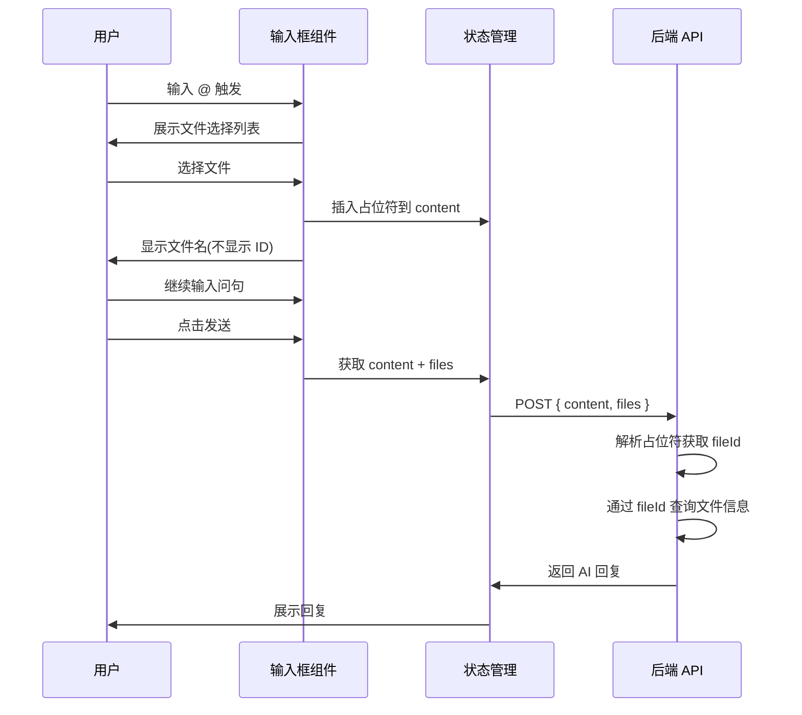

# AI 对话文件引用功能 - 设计文档

[← 返回任务概览](./README.md)

## 1. 数据结构设计

文件引用信息通过占位符嵌入在 content 中,无需单独传递:

```typescript
// 占位符中的文件引用信息
interface FileReference {
  fileId: string // 文件唯一标识,对应 RPFileIdIdentifier
  fileName: string // 文件显示名称,用于前端展示
}

// 消息发送数据(简化版)
// @see apps/report-ai/src/components/ChatCommon/Sender/type.ts
interface SendMessageData {
  content: string // 包含占位符的消息内容,如 "请分析 <file:abc123 name='报告.pdf'> 的内容"
  files: RPFileUploaded[] // 上传的文件列表
  // 注意: refFiles 可以移除,因为引用信息已在 content 的占位符中
}
```

## 2. 占位符规则

- 格式:`<file:${fileId} name='${fileName}'>`
- 示例:`<file:abc123 name='报告.pdf'>`
- 位置:嵌入在 content 字符串中,标记文件引用的位置
- 唯一性:同一文件可多次引用,每次都生成独立占位符
- 字段说明:
  - `fileId`: 文件唯一标识,后端通过此 ID 查询文件信息
  - `fileName`: 仅用于前端显示,后端可忽略此字段

## 3. 交互流程



## 4. 前端模块设计

| 模块       | 职责                                  | 关键方法/Hook            | 代码位置            |
| ---------- | ------------------------------------- | ------------------------ | ------------------- |
| 输入框组件 | 处理 @ 触发、文件选择、显示文件标签   | `Suggestion` 组件        | `Sender/index.tsx`  |
| 文件建议   | 管理 @ 建议菜单、选择文件后插入占位符 | `useFileSuggestion`      | `Sender/hooks`      |
| 占位符管理 | 插入/删除占位符到 content 字符串      | `handleSelectSuggestion` | `useFileSuggestion` |
| 消息发送   | 提取 content 和 files 并发送          | `useSendMessage`         | `Sender/hooks`      |

### 4.1 占位符工具函数

```typescript
// 插入占位符
function insertPlaceholder(content: string, cursorPos: number, file: FileReference): string

// 解析占位符
function parsePlaceholders(content: string): Array<{ fileId: string; fileName: string; position: number }>

// 移除占位符
function removePlaceholder(content: string, fileId: string): string
```

## 5. 后端模块设计

| 模块       | 职责                                 | 关键方法                | 输入/输出                     |
| ---------- | ------------------------------------ | ----------------------- | ----------------------------- |
| 消息解析   | 解析占位符,提取文件 ID 和位置        | `parsePlaceholders`     | content → fileIds + positions |
| 文件查询   | 根据 fileId 从数据库查询完整文件信息 | `queryFilesByIds`       | fileIds → files               |
| 上下文构建 | 将文件内容注入 AI 上下文             | `buildContextWithFiles` | files → AI context            |

### 5.1 占位符解析正则

```typescript
// 正则表达式: /<file:([^\\s]+) name='([^']+)'>/g
const PLACEHOLDER_REGEX = /<file:([^\s]+) name='([^']+)'>/g
```

## 6. 关键算法

### 6.1 前端占位符插入

1. 用户选择文件后,获取当前光标位置
2. 构造占位符字符串 `<file:${fileId} name='${fileName}'>`
3. 在光标位置插入占位符
4. 更新输入框内容

### 6.2 后端占位符解析

1. 使用正则表达式匹配所有占位符
2. 提取每个占位符的 fileId 和位置信息
3. 批量查询文件信息
4. 构建文件上下文并注入 AI

## 更新记录

| 日期       | 修改人 | 更新内容   |
| ---------- | ------ | ---------- |
| 2025-11-18 | Kiro   | 初始化设计 |

## 相关

- [需求文档](./spec-require-v1.md)
- [实施计划](./spec-implementation-plan-v1.md)
- [React 规范](../../rule/react-rule.md)
- [TypeScript 规范](../../rule/typescript-rule.md)
