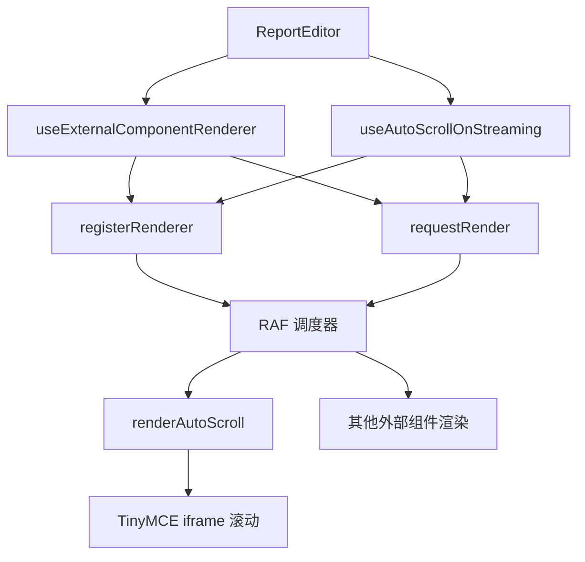

# AIGC 流式生成自动滚动优化 - 核心方案 v1

> ↩️ 回链：[任务总览](./README.md) ｜ 阶段：需求 + 设计 + 实施 ｜ 作者：Kiro ｜ 更新：2024-11-18

## 1. 需求背景

### 1.1 业务场景

在报告编辑器中，用户触发 AIGC 生成章节内容时，内容以流式方式逐步生成。为了提升用户体验，需要自动滚动页面，让用户始终能看到正在生成的内容。

### 1.2 现状问题

| 问题             | 表现                                                   | 影响                                    |
| ---------------- | ------------------------------------------------------ | --------------------------------------- |
| 自动滚动未生效   | 生成内容超出视口后，用户需要手动滚动才能看到新内容     | 体验割裂，用户不知道生成是否在继续      |
| 滚动目标计算错误 | 使用外部页面坐标判断 iframe 内部滚动，导致逻辑失效     | 滚动判断不准确，可能过度或不足滚动      |
| 滚动位置不合理   | 生成内容紧贴视口底部，用户无法看到上下文               | 阅读体验差，无法理解生成内容的上下文    |
| 缺少统一调度     | 滚动逻辑未接入外部组件渲染器，与其他组件渲染时机不一致 | 可能与 Loading 指示器等组件产生竞争条件 |

### 1.3 用户期望

- **默认自动跟随**：生成开始时，如果用户未手动滚动过，自动滚动跟随生成内容
- **尊重用户意图**：一旦用户手动滚动，停止自动滚动，避免打断用户操作
- **手动恢复**：提供"跳转到生成位置"按钮，让用户可以随时回到生成内容处
- **舒适位置**：生成内容保持在视口下方 3/4 处，方便查看上下文
- **流畅体验**：滚动平滑，与其他 UI 更新（Loading 指示器、AIGC 按钮）协调一致

## 2. 方案设计

### 2.1 架构集成



### 2.2 核心流程

| 步骤 | 触发条件              | 执行逻辑                                                   | 输出                  |
| ---- | --------------------- | ---------------------------------------------------------- | --------------------- |
| 1    | `activeChapters` 变化 | 更新 ref，调用 `requestRender()`                           | 触发 RAF 调度         |
| 2    | RAF 执行              | 调用 `renderAutoScroll()`                                  | 开始滚动判断          |
| 3    | 计算目标元素          | 找到所有生成中章节的最底部元素，获取其在 iframe 内的坐标   | `{ element, bottom }` |
| 4    | 判断是否滚动          | 检查用户视口底部是否接近生成内容（阈值 120px）             | `true/false`          |
| 5    | 执行滚动              | 计算目标位置（元素底部位于视口 3/4 处），调用 `scrollTo()` | iframe 内部平滑滚动   |

### 2.3 关键设计点

#### 2.3.1 用户滚动意图检测

```typescript
// 监听用户手动滚动
const editorWindow = editor.getDocument().defaultView;
editorWindow.addEventListener('scroll', handleUserScroll, { passive: true });

const handleUserScroll = () => {
  // 只有在生成过程中的手动滚动才标记
  if (hasActiveChapters()) {
    setUserHasScrolled(true);
  }
};

// 生成开始时重置标记
useEffect(() => {
  if (activeChapters.length > 0 && !prevHasActiveChapters) {
    setUserHasScrolled(false); // 新一轮生成开始，重置标记
  }
}, [activeChapters]);
```

#### 2.3.2 滚动目标计算

```typescript
// 使用 iframe 内部坐标系统
const rect = element.getBoundingClientRect(); // 相对于 iframe 视口
const bottomInIframe = rect.bottom;
```

#### 2.3.3 滚动位置优化

```typescript
// 让生成内容底部位于视口下方 3/4 处（距离顶部 75%）
const targetScrollY = bottomInIframe - editorWindow.innerHeight * 0.75;

// 只向下滚动，避免向上滚动打断用户
if (targetScrollY > editorWindow.scrollY) {
  editorWindow.scrollTo({ top: targetScrollY, behavior: 'smooth' });
}
```

#### 2.3.4 手动跳转按钮

```typescript
// 提供跳转到生成位置的方法
const scrollToGenerating = () => {
  setUserHasScrolled(false); // 重置标记，恢复自动滚动
  requestRender(); // 立即触发滚动
};

// 在 ReportEditor 中暴露此方法
useImperativeHandle(ref, () => ({
  ...otherMethods,
  scrollToGenerating,
}));
```

#### 2.3.5 统一调度集成

```typescript
// 注册到外部组件渲染器
useEffect(() => {
  const unregister = registerRenderer({
    id: 'auto-scroll-on-streaming',
    render: renderAutoScroll,
  });
  return unregister;
}, [registerRenderer, renderAutoScroll]);
```

### 2.4 技术约束

| 约束项              | 说明                                                   | 应对策略                                     |
| ------------------- | ------------------------------------------------------ | -------------------------------------------- |
| TinyMCE iframe 隔离 | 编辑器在 iframe 中，需要使用 iframe 内部的 window 对象 | 通过 `editor.getDocument().defaultView` 获取 |
| 坐标系统差异        | iframe 内外坐标系统不同                                | 统一使用 iframe 内部坐标，避免偏移计算       |
| 多章节并发生成      | 可能同时生成多个章节                                   | 找到最底部的生成元素作为滚动目标             |
| 用户手动滚动        | 用户可能在生成过程中手动滚动到其他位置                 | 智能判断：仅在用户接近生成内容时自动滚动     |

## 3. 实施拆解

### 3.1 任务列表

| 序号 | 任务                      | 关键文件                           | 负责人 | 状态      |
| ---- | ------------------------- | ---------------------------------- | ------ | --------- |
| 1    | 导出渲染器注册接口        | `useExternalComponentRenderer.tsx` | Kiro   | ✅ 已完成 |
| 2    | 修复滚动目标计算          | `useAutoScrollOnStreaming.ts`      | Kiro   | ✅ 已完成 |
| 3    | 优化滚动位置至视口 3/4 处 | `useAutoScrollOnStreaming.ts`      | Kiro   | ✅ 已完成 |
| 4    | 完善代码注释与文档        | `useAutoScrollOnStreaming.ts`      | Kiro   | ✅ 已完成 |
| 5    | 验收与调优                | 报告编辑页面                       | Kiro   | 🟡 进行中 |

### 3.2 关键改动

#### 3.2.1 导出渲染器接口

**文件**：`apps/report-ai/src/components/ReportEditor/hooks/useExternalComponentRenderer.tsx`

```typescript
return {
  renderComponents,
  initializeHoverDetection,
  registerRenderer, // 新增：允许外部 hook 注册渲染函数
  requestRender, // 新增：允许外部 hook 触发渲染
};
```

#### 3.2.2 修复滚动逻辑

**文件**：`apps/report-ai/src/components/ReportEditor/hooks/useAutoScrollOnStreaming.ts`

**改动点**：

1. 使用 iframe 内部的 `window` 对象
2. 使用 `getBoundingClientRect()` 获取 iframe 内部坐标
3. 滚动位置优化至视口 3/4 处
4. 移除过度设计的 `policy` 参数

#### 3.2.3 正确传递依赖

**文件**：`apps/report-ai/src/components/ReportEditor/index.tsx`

```typescript
const { registerRenderer, requestRender } = useExternalComponentRenderer(...);

useAutoScrollOnStreaming(editorFacadeRef, {
  activeChapters: aigcLoadingChapters,
  registerRenderer,
  requestRender,
});
```

## 4. 验收标准

### 4.1 功能验收

| 场景                   | 操作                               | 预期结果                                    |
| ---------------------- | ---------------------------------- | ------------------------------------------- |
| 单章节生成             | 触发单个章节 AIGC 生成             | 页面自动滚动，生成内容保持在视口下方 3/4 处 |
| 多章节并发生成         | 同时生成多个章节                   | 滚动跟随最底部的生成章节                    |
| 用户在查看生成内容附近 | 用户滚动到生成内容附近（120px 内） | 自动滚动跟随                                |
| 用户在查看其他内容     | 用户滚动到页面其他位置（>120px）   | 不自动滚动，避免打断用户                    |
| 生成完成               | 章节生成完成                       | 停止自动滚动                                |
| 流畅性                 | 观察滚动动画                       | 平滑滚动，无卡顿                            |

### 4.2 技术验收

- [ ] 使用 iframe 内部的 `window` 对象进行滚动
- [ ] 坐标计算基于 iframe 内部坐标系统
- [ ] 滚动位置让生成内容保持在视口下方 3/4 处
- [ ] 监听用户手动滚动，设置标记停止自动滚动
- [ ] 新一轮生成开始时重置滚动标记
- [ ] 提供手动跳转按钮，可恢复自动滚动
- [ ] 与其他外部组件（Loading 指示器、AIGC 按钮）在同一 RAF 中渲染
- [ ] 代码注释完整，逻辑清晰

### 4.3 待优化问题

| 问题           | 表现                                   | 优先级 |
| -------------- | -------------------------------------- | ------ |
| 滚动触发时机   | 可能需要调整触发阈值（当前 120px）     | P2     |
| 滚动位置       | 3/4 处是否最佳，可能需要根据反馈调整   | P2     |
| 多章节滚动策略 | 当前跟随最底部章节，是否需要更智能策略 | P3     |

## 5. 相关文件

- `apps/report-ai/src/components/ReportEditor/hooks/useAutoScrollOnStreaming.ts` - 自动滚动 hook
- `apps/report-ai/src/components/ReportEditor/hooks/useExternalComponentRenderer.tsx` - 外部组件渲染器
- `apps/report-ai/src/components/ReportEditor/index.tsx` - 报告编辑器组件
- `apps/report-ai/src/components/ReportEditor/hooks/utils/editorDomUtils.ts` - DOM 工具函数

## 更新记录

| 日期       | 修改人 | 更新内容                                                   |
| ---------- | ------ | ---------------------------------------------------------- |
| 2024-11-18 | Kiro   | 创建核心方案文档，完成需求、设计、实施拆解                 |
| 2024-11-18 | Kiro   | 更新需求：基于用户滚动意图的自动滚动策略，增加手动跳转按钮 |
